## 说一下 JVM 的主要组成部分及其作用？

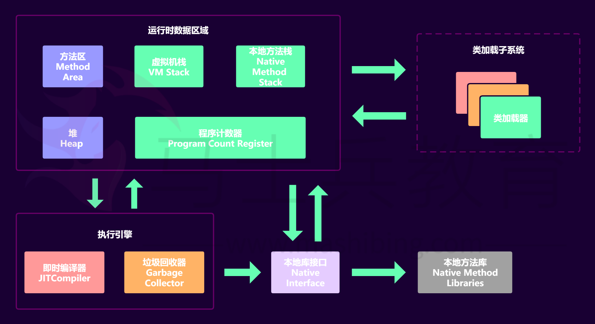

JVM包含两个子系统和两个组件，两个子系统为Class loader(类装载)、 Execution engine(执行引擎)；两个组件为Runtime data area(运行时数据区)、Native Interface(本地接口)。 

- Class loader(类装载)：根据给定的全限定名类名(如： java.lang.Object)来装载class文件到Runtime data area中的method area。 
- Execution engine（执行引擎）：执行classes中的指令。 
- Native Interface(本地接口)：与native libraries交互，是其它编程语 言交互的接口。 
- Runtime data area(运行时数据区域)：这就是我们常说的JVM的内 存。 

**作用 ：**首先通过编译器把 Java 代码转换成字节码，类加载器（ClassLoader） 再把字节码加载到内存中，将其放在运行时数据区（Runtime data area）的方法区内，而字节码文件只是 JVM 的一套指令集规范，并不能直接交给底层操作系统去执行，因此需要特定的命令解析器执行引擎（Execution Engine），将字节码翻译成底层系统指令，再交由 CPU 去执行，而这个过程中需要调用其他语言的本地库接口（Native Interface）来实现整个程序的功能。 

**下面是Java程序运行机制详细说明 **

Java程序运行机制步骤 

首先利用IDE集成开发工具编写Java源代码，源文件的后缀为.java； 

再利用编译器(javac命令)将源代码编译成字节码文件，字节码文件的后缀名 为.class； 

运行字节码的工作是由解释器(java命令)来完成的。

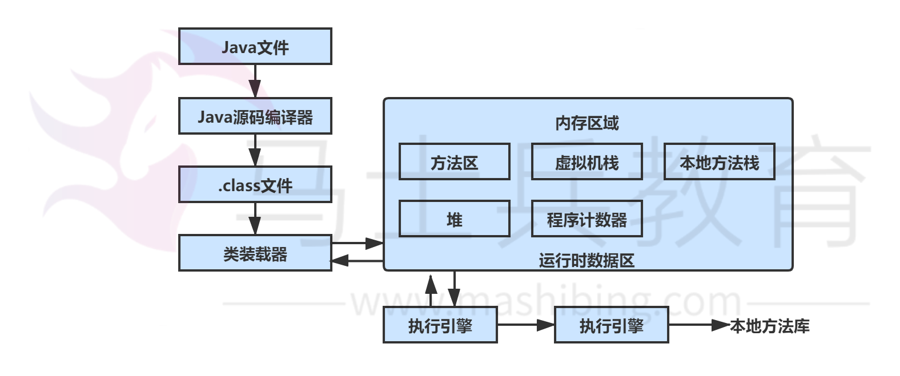

从上图可以看，java文件通过编译器变成了.class文件，接下来类加载器又将这 些.class文件加载到JVM中。 

其实可以一句话来解释：类的加载指的是将类的.class文件中的二进制数据读入到内存中，将其放在运行时数据区的方法区内，然后在堆区创建一个  java.lang.Class对象，用来封装类在方法区内的数据结构。 

## 说一下 JVM 运行时数据区 

**Java 虚拟机在执行 Java 程序的过程中会把它所管理的内存区域划分为若干个 不同的数据区域。**这些区域都有各自的用途，以及创建和销毁的时间，有些区域 随着虚拟机进程的启动而存在，有些区域则是依赖线程的启动和结束而建立和销 毁。Java 虚拟机所管理的内存被划分为如下几个区域：

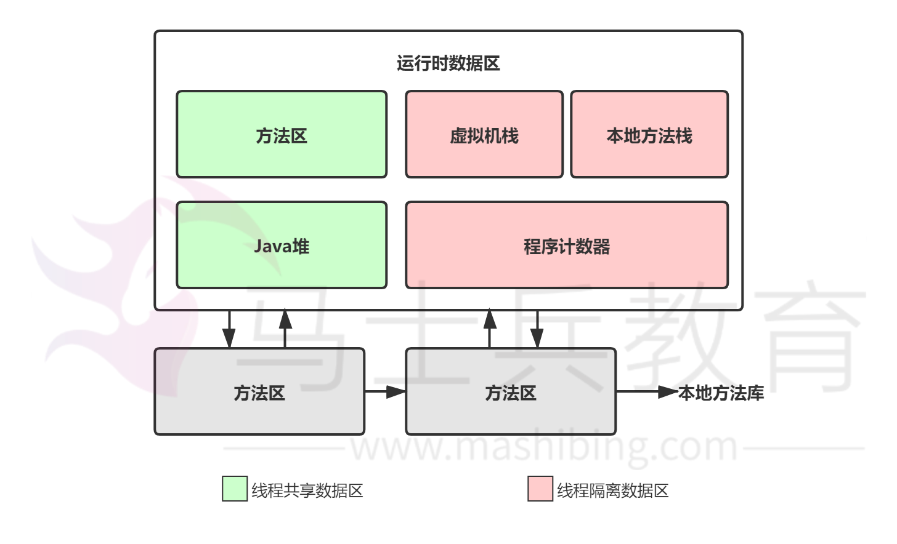

不同虚拟机的运行时数据区可能略微有所不同，但都会遵从 Java 虚拟机规范，  Java 虚拟机规范规定的区域分为以下 5 个部分： 

- 程序计数器（Program Counter Register）：当前线程所执行的字节码的行号 指示器，字节码解析器的工作是通过改变这个计数器的值，来选取下一条需要执行的 字节码指令，分支、循环、跳转、异常处理、线程恢复等基础功能，都需要依赖这个 计数器来完成；
- Java 虚拟机栈（Java Virtual Machine Stacks）：用于存储局部变量表、操作 数栈、动态链接、方法出口等信息； 
- 本地方法栈（Native Method Stack）：与虚拟机栈的作用是一样的，只不过虚 拟机栈是服务 Java 方法的，而本地方法栈是为虚拟机调用 Native 方法服务的； 
- Java 堆（Java Heap）：Java 虚拟机中内存大的一块，是被所有线程共享 的，几乎所有的对象实例都在这里分配内存； 
- 方法区（Methed Area）：用于存储已被虚拟机加载的类信息、常量、静态变量、即时编译后的代码等数据。 

## 深拷贝和浅拷贝

浅拷贝（shallowCopy）：

①对于数据类型是基本数据类型的成员变量，浅拷贝会直接进行值传递，也就是将该属性值复制一份给新的对象。因为是两份不同的数据，所以对其中一个对象的该成员变量值进行修改，不会影响另一个对象拷贝得到的数据。
②对于数据类型是引用数据类型的成员变量，比如说成员变量是某个数组、某个类的对象等，那么浅拷贝会进行引用传递，也就是只是将该成员变量的引用值（内存地址）复制一份给新的对象。因为实际上两个对象的该成员变量都指向同一个实例。在这种情况下，在一个对象中修改该成员变量会影响到另一个对象的该成员变量值。 

实现方式:

1. 通过拷贝构造方法实现浅拷贝
2. 

深拷贝（deepCopy）不仅要复制对象的所有基本数据类型的成员变量值，还要为所有引用数据类型的成员变量申请存储空间，并复制每个引用数据类型成员变量所引用的对象，直到该对象可达的所有对象。也就是说，对象进行深拷贝要对整个对象图进行拷贝！

使用深拷贝的情况下，释放内存的时候不会因为出现浅拷贝时释放同一个内存的 错误。 

浅复制：仅仅是指向被复制的内存地址，如果原地址发生改变，那么浅复制出来 的对象也会相应的改变。 

深复制：在计算机中开辟一块**新的内存地址**用于存放复制的对象。 

## 说一下堆栈的区别？ 

物理地址 

堆的物理地址分配对对象是不连续的。因此性能慢些。在GC的时候也要考虑到 不连续的分配，所以有各种算法。比如，标记-消除，复制，标记-压缩，分代 （即新生代使用复制算法，老年代使用标记——压缩） 栈使用的是数据结构中的栈，先进后出的原则，物理地址分配是连续的。所以性 能快。 

**内存分别 **

堆因为是不连续的，所以分配的内存是在运行期确认的，因此大小不固定。一般 堆大小远远大于栈。 

栈是连续的，所以分配的内存大小要在编译期就确认，大小是固定的。 

**存放的内容 **

堆存放的是对象的实例和数组。因此该区更关注的是数据的存储 

栈存放：局部变量，操作数栈，返回结果。该区更关注的是程序方法的执行。
PS：

1. 静态变量放在方法区 
2. 静态的对象还是放在堆。 

程序的可见度 

堆对于整个应用程序都是共享、可见的。 

栈只对于线程是可见的。所以也是线程私有。他的生命周期和线程相同。

##  队列和栈是什么？有什么区别？ 

队列和栈都是被用来预存储数据的。 

- 操作的名称不同。队列的插入称为入队，队列的删除称为出队。栈的插入称为进 栈，栈的删除称为出栈。 
- 可操作的方式不同。队列是在队尾入队，队头出队，即两边都可操作。而栈的进 栈和出栈都是在栈顶进行的，无法对栈底直接进行操作。 
- 操作的方法不同。队列是先进先出（FIFO），即队列的修改是依先进先出的原 则进行的。新来的成员总是加入队尾（不能从中间插入），每次离开的成员总是队列 头上（不允许中途离队）。而栈为后进先出（LIFO）,即每次删除（出栈）的总是当前栈中新的元素，即后插入（进栈）的元素，而先插入的被放在栈的底部，要到后才能删除。 

## 对象的创建

 说到对象的创建，首先让我们看看 Java 中提供的几种对象创建方式：

| Header                             | 解释             |
| ---------------------------------- | ---------------- |
| 使用new关键字                      | 调用了构造函数   |
| 使用Class的newInstance方法         | 调用了构造函数   |
| 使用Constructor类的newInstance方法 | 调用了构造函数   |
| 使用clone方法                      | 没有调用构造函数 |
| 使用反序列化                       | 没有调用构造函数 |

下面是对象创建的主要流程:

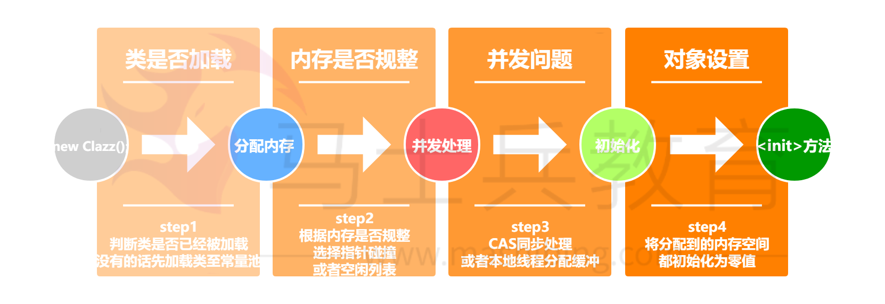

虚拟机遇到一条new指令时，先检查常量池是否已经加载相应的类，如果没有， 必须先执行相应的类加载。类加载通过后，接下来分配内存。若Java堆中内存是 绝对规整的，使用“指针碰撞“方式分配内存；如果不是规整的，就从空闲列表 中分配，叫做”空闲列表“方式。划分内存时还需要考虑一个问题-并发，也有 两种方式: CAS同步处理，或者本地线程分配缓冲(Thread Local Allocation  Buffer, TLAB)。然后内存空间初始化操作，接着是做一些必要的对象设置(元信 息、哈希码…)，后执行方法。 

## 为对象分配内存 

类加载完成后，接着会在Java堆中划分一块内存分配给对象。内存分配根据Java 堆是否规整，有两种方式： 

- 指针碰撞：如果Java堆的内存是规整，即所有用过的内存放在一边，而空闲的的 放在另一边。分配内存时将位于中间的指针指示器向空闲的内存移动一段与对象大小 相等的距离，这样便完成分配内存工作。 
- 空闲列表：如果Java堆的内存不是规整的，则需要由虚拟机维护一个列表来记录 那些内存是可用的，这样在分配的时候可以从列表中查询到足够大的内存分配给对 象，并在分配后更新列表记录。 

选择哪种分配方式是由 Java 堆是否规整来决定的，而 Java 堆是否规整又由所 采用的垃圾收集器是否带有压缩整理功能决定。

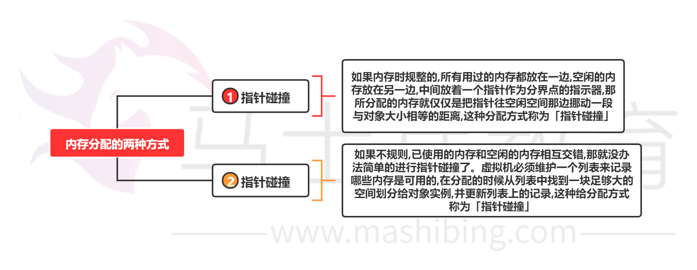

## 处理并发安全问题 

对象的创建在虚拟机中是一个非常频繁的行为，哪怕只是修改一个指针所指向的 位置，在并发情况下也是不安全的，可能出现正在给对象 A 分配内存，指针还 没来得及修改，对象 B 又同时使用了原来的指针来分配内存的情况。解决这个 问题有两种方案： 

对分配内存空间的动作进行同步处理（采用 CAS + 失败重试来保障更新操作的 原子性）； 

把内存分配的动作按照线程划分在不同的空间之中进行，即每个线程在 Java 堆 中预先分配一小块内存，称为本地线程分配缓冲（Thread Local Allocation Buffer,  TLAB）。哪个线程要分配内存，就在哪个线程的 TLAB 上分配。只有 TLAB 用完并 分配新的 TLAB 时，才需要同步锁。通过-XX:+/-UserTLAB参数来设定虚拟机是否使 用TLAB。

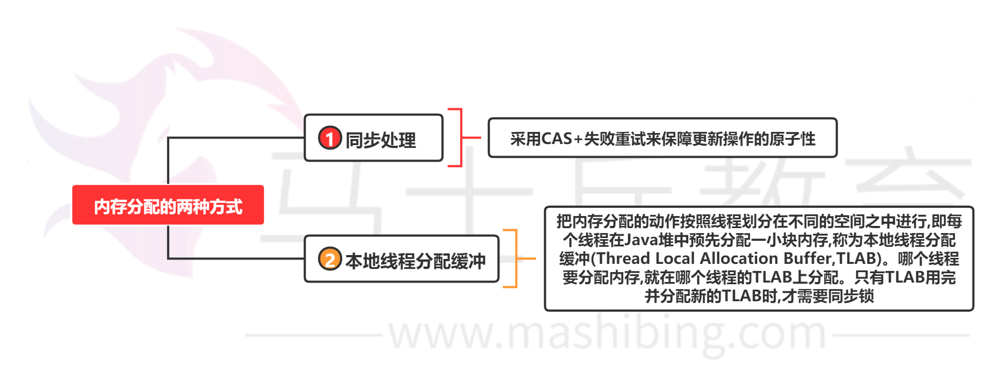

## 对象的访问定位 

**Java**程序需要通过 **JVM** 栈上的引用访问堆中的具体对象。对象的访问方式取决 于 JVM 虚拟机的实现。目前主流的访问方式有 **句柄** 和 **直接指针** 两种方式。 

指针： 指向对象，代表一个对象在内存中的起始地址。 

句柄： 可以理解为指向指针的指针，维护着对象的指针。句柄不直接指向对象，而是 指向对象的指针（句柄不发生变化，指向固定内存地址），再由对象的指针指向对象的 真实内存地址。 

### 句柄访问

Java堆中划分出一块内存来作为**句柄池**，引用中存储对象的**句柄地址**，而句柄中 包含了**对象实例数据**与**对象类型数据**各自的**具体地址**信息，具体构造如下图所 示：

 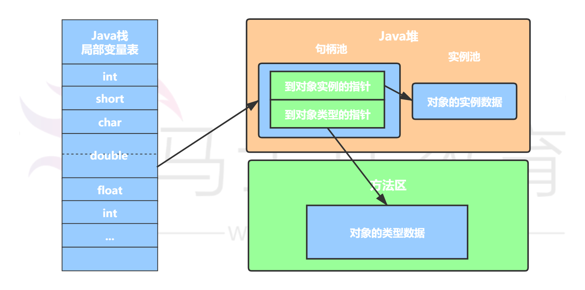

**优势**：引用中存储的是**稳定**的句柄地址，在对象被移动（垃圾收集时移动对象是 非常普遍的行为）时只会改变**句柄**中的**实例数据指针**，而**引用**本身不需要修改。 

### 直接指针 

如果使用**直接指针**访问，**引用** 中存储的直接就是**对象地址**，那么Java堆对象内 部的布局中就必须考虑如何放置访问**类型数据**的相关信息。

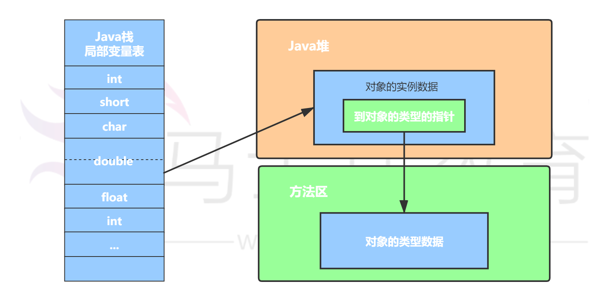

优势：速度更快，节省了一次指针定位的时间开销。由于对象的访问在Java中非 常频繁，因此这类开销积少成多后也是非常可观的执行成本。HotSpot 中采用 的就是这种方式。 

# **内**存溢出异常

**Java**会存在内存泄漏吗？请简单描述

内存泄漏是指不再被使用的对象或者变量一直被占据在内存中。理论上来说， Java是有GC垃圾回收机制的，也就是说，不再被使用的对象，会被GC自动回收 掉，自动从内存中清除。

但是，即使这样，Java也还是存在着内存泄漏的情况，java导致内存泄露的原因 很明确：长生命周期的对象持有短生命周期对象的引用就很可能发生内存泄露， 尽管短生命周期对象已经不再需要，但是因为长生命周期对象持有它的引用而导 致不能被回收，这就是java中内存泄露的发生场景。

## **垃**圾收集器

### **简述Java垃圾回收机制**

在java中，程序员是不需要显示的去释放一个对象的内存的，而是由虚拟机自行 执行。在JVM中，有一个垃圾回收线程，它是低优先级的，在正常情况下是不会 执行的，只有在虚拟机空闲或者当前堆内存不足时，才会触发执行，扫面那些没 有被任何引用的对象，并将它们添加到要回收的集合中，进行回收。

**GC**是什么？为什么要GC

GC 是垃圾收集的意思（Gabage Collection）,内存处理是编程人员容易出现问 题的地方，忘记或者错误的内存回收会导致程序或系统的不稳定甚至崩溃，Java 提供的 GC 功能可以自动监测 对象是否超过作用域从而达到自动回收内存的目的，Java 语言没有提供释放已分配内存的显示操作方法。

**垃圾回收的优点和原理。并考虑2种回收机制**

java语言最显著的特点就是引入了垃圾回收机制，它使java程序员在编写程序时 不再考虑内存管理的问题。

由于有这个垃圾回收机制，java中的对象不再有“作用域”的概念，只有引用的 对象才有“作用域”。

垃圾回收机制有效的防止了内存泄露，可以有效的使用可使用的内存。

垃圾回收器通常作为一个单独的低级别的线程运行，在不可预知的情况下对内存 堆中已经死亡的或很长时间没有用过的对象进行清除和回收。

程序员不能实时的对某个对象或所有对象调用垃圾回收器进行垃圾回收。 垃圾回收有分代复制垃圾回收、标记垃圾回收、增量垃圾回收。

### **垃圾回收器的基本原理是什么？**

**垃圾回收器可以马上回收 内存吗？有什么办法主动通知虚拟机进行垃圾回收？**

 对于GC来说，当程序员创建对象时，GC就开始监控这个对象的地址、大小以及 使用情况。

通常，GC采用有向图的方式记录和管理堆(heap)中的所有对象。通过这种方式 确定哪些对象是"可达的"，哪些对象是"不可达的"。当GC确定一些对象为"不可 达"时，GC就有责任回收这些内存空间。

可以。程序员可以手动执行System.gc()，通知GC运行，但是Java语言规范并不 保证GC一定会执行。

### **Java** **中都有哪些引用类型？**

- 强引用：发生 gc 的时候不会被回收。
- 软引用：有用但不是必须的对象，在发生内存溢出之前会被回收。
- 弱引用：有用但不是必须的对象，在下一次GC时会被回收。
- 虚引用（幽灵引用/幻影引用）：无法通过虚引用获得对象，用 

PhantomReference 实现虚引用，虚引用的用途是在 gc 时返回一个通知。

### **怎么判断对象是否可以被回收？**

垃圾收集器在做垃圾回收的时候，首先需要判定的就是哪些内存是需要被回收 的，哪些对象是「存活」的，是不可以被回收的；哪些对象已经「死掉」了，需 要被回收。

一般有两种方法来判断：

- 引用计数器法：为每个对象创建一个引用计数，有对象引用时计数器 +1，引用 被释放时计数 -1，当计数器为 0 时就可以被回收。它有一个缺点不能解决循环引用 的问题；
- 可达性分析算法：从 GC Roots 开始向下搜索，搜索所走过的路径称为引用链。 当一个对象到 GC Roots 没有任何引用链相连时，则证明此对象是可以被回收的。

### **在Java中，对象什么时候可以被垃圾回收**

当对象对当前使用这个对象的应用程序变得不可触及的时候，这个对象就可以被 回收了。

### **JVM**中的永久代中会发生垃圾回收吗

垃圾回收不会发生在永久代，如果永久代满了或者是超过了临界值，会触发完全 垃圾回收(Full GC)。如果你仔细查看垃圾收集器的输出信息，就会发现永久代 也是被回收的。这就是为什么正确的永久代大小对避免Full GC是非常重要的原 因。请参考下Java8：从永久代到元数据区

(译者注：Java8中已经移除了永久代，新加了一个叫做元数据区的native内存 区)

### **说一下 JVM 有哪些垃圾回收算法？**

- 标记-清除算法：标记无用对象，然后进行清除回收。缺点：效率不高，无法清 除垃圾碎片。
- 复制算法：按照容量划分二个大小相等的内存区域，当一块用完的时候将活着的 对象复制到另一块上，然后再把已使用的内存空间一次清理掉。缺点：内存使用率不 高，只有原来的一半。
- 标记-整理算法：标记无用对象，让所有存活的对象都向一端移动，然后直接清 除掉端边界以外的内存。
- 分代算法：根据对象存活周期的不同将内存划分为几块，一般是新生代和老年 代，新生代基本采用复制算法，老年代采用标记整理算法。

### **标记**-**清**除算法

标记无用对象，然后进行清除回收。

标记-清除算法（Mark-Sweep）是一种常见的基础垃圾收集算法，它将垃圾收 集分为两个阶段：

- 标记阶段：标记出可以回收的对象。
- 清除阶段：回收被标记的对象所占用的空间。

标记-清除算法之所以是基础的，是因为后面讲到的垃圾收集算法都是在此算法 的基础上进行改进的。

**优点**：实现简单，不需要对象进行移动。

**缺点**：标记、清除过程效率低，产生大量不连续的内存碎片，提高了垃圾回收的 频率。

标记-清除算法的执行的过程如下图所示

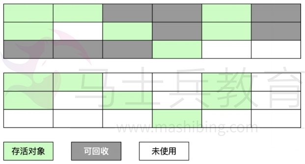

### **复制算**法

为了解决标记-清除算法的效率不高的问题，产生了复制算法。它把内存空间划 为两个相等的区域，每次只使用其中一个区域。垃圾收集时，遍历当前使用的区 域，把存活对象复制到另外一个区域中，最后将当前使用的区域的可回收的对象 进行回收。

优点：按顺序分配内存即可，实现简单、运行高效，不用考虑内存碎片。 缺点：可用的内存大小缩小为原来的一半，对象存活率高时会频繁进行复制。 复制算法的执行过程如下图所示

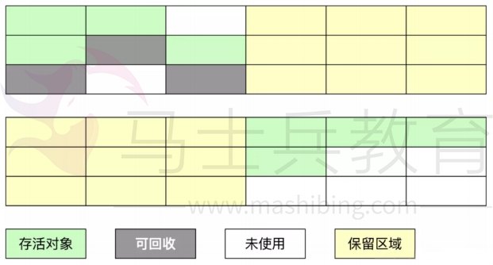

**标记-整理算法**

在新生代中可以使用复制算法，但是在老年代就不能选择复制算法了，因为老年 代的对象存活率会较高，这样会有较多的复制操作，导致效率变低。标记-清除 算法可以应用在老年代中，但是它效率不高，在内存回收后容易产生大量内存碎 片。因此就出现了一种标记-整理算法（Mark-Compact）算法，与标记-整理 算法不同的是，在标记可回收的对象后将所有存活的对象压缩到内存的一端，使 他们紧凑的排列在一起，然后对端边界以外的内存进行回收。回收后，已用和未 用的内存都各自一边。

**优点**：解决了标记-清理算法存在的内存碎片问题。

**缺点**：仍需要进行局部对象移动，一定程度上降低了效率。

标记-整理算法的执行过程如下图所示

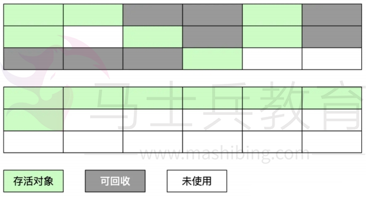

### 分代收集算法

当前商业虚拟机都采用**分代收集的垃圾收集算法。分代收集算法，顾名思义是根 据对象的存活周期**将内存划分为几块。一般包括**年轻代**、**老年代** 和 **永久代**，如 图所示：

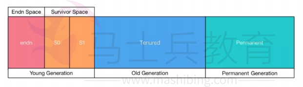

### **说一下 JVM 有哪些垃圾回收器？**

如果说垃圾收集算法是内存回收的方法论，那么垃圾收集器就是内存回收的具体 实现。下图展示了7种作用于不同分代的收集器，其中用于回收新生代的收集器 包括Serial、PraNew、Parallel Scavenge，回收老年代的收集器包括Serial Old、Parallel Old、CMS，还有用于回收整个Java堆的G1收集器。不同收集器 之间的连线表示它们可以搭配使用。

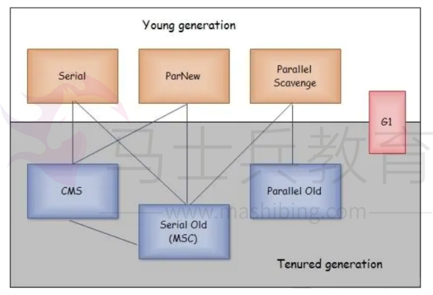

- Serial收集器（复制算法): 新生代单线程收集器，标记和清理都是单线程，优点 是简单高效；
- ParNew收集器 (复制算法): 新生代收并行集器，实际上是Serial收集器的多线程 版本，在多核CPU环境下有着比Serial更好的表现；
- Parallel Scavenge收集器 (复制算法): 新生代并行收集器，追求高吞吐量，高效 利用 CPU。吞吐量 = 用户线程时间/(用户线程时间+GC线程时间)，高吞吐量可以高 效率的利用CPU时间，尽快完成程序的运算任务，适合后台应用等对交互相应要求不 高的场景；
- Serial Old收集器 (标记-整理算法): 老年代单线程收集器，Serial收集器的老年 代版本；
- Parallel Old收集器 (标记-整理算法)： 老年代并行收集器，吞吐量优先， Parallel Scavenge收集器的老年代版本；
- CMS(Concurrent Mark Sweep)收集器（标记-清除算法）： 老年代并行收集 器，以获取最短回收停顿时间为目标的收集器，具有高并发、低停顿的特点，追求最 短GC回收停顿时间。
- G1(Garbage First)收集器 (标记-整理算法)： Java堆并行收集器，G1收集器是 JDK1.7提供的一个新收集器，G1收集器基于“标记-整理”算法实现，也就是说不会 产生内存碎片。此外，G1收集器不同于之前的收集器的一个重要特点是：G1回收的范围是整个Java堆(包括新生代，老年代)，而前六种收集器回收的范围仅限于新生代 或老年代。

### **详细介绍一下 CMS 垃圾回收器？**

CMS 是英文 Concurrent Mark-Sweep 的简称，是以牺牲吞吐量为代价来获得 最短回收停顿时间的垃圾回收器。对于要求服务器响应速度的应用上，这种垃圾 回收器非常适合。在启动 JVM 的参数加上“- XX:+UseConcMarkSweepGC”来指定使用 CMS 垃圾回收器。 CMS 使用的是标记-清除的算法实现的，所以在 gc的时候回产生大量的内存碎 片，当剩余内存不能满足程序运行要求时，系统将会出现 Concurrent Mode Failure，临时 CMS 会采用 Serial Old 回收器进行垃圾清除，此时的性能将会 被降低。

### **新生代垃圾回收器和老年代垃圾回收器都有哪些？有什么 区别？**

- 新生代回收器：Serial、ParNew、Parallel Scavenge
- 老年代回收器：Serial Old、Parallel Old、CMS
- 整堆回收器：G1

新生代垃圾回收器一般采用的是复制算法，复制算法的优点是效率高，缺点是内 存利用率低；

老年代回收器一般采用的是标记-整理的算法进行垃圾回收。

### **简述分代垃圾回收器是怎么工作的？**

分代回收器有两个分区：老生代和新生代，新生代默认的空间占比总空间的 1/3，老生代的默认占比是 2/3。

新生代使用的是复制算法，新生代里有 3 个分区：Eden、To Survivor、From Survivor，它们的默认占比是 8:1:1，它的执行流程如下：

- 把 Eden + From Survivor 存活的对象放入 To Survivor 区；
- 清空 Eden 和 From Survivor 分区；
- From Survivor 和 To Survivor 分区交换，From Survivor 变 To Survivor，To Survivor 变 From Survivor。

每次在 From Survivor 到 To Survivor 移动时都存活的对象，年龄就 +1，当年 龄到达 15（默认配置是 15）时，升级为老生代。大对象也会直接进入老生代。

老生代当空间占用到达某个值之后就会触发全局垃圾收回，一般使用标记整理的 执行算法。以上这些循环往复就构成了整个分代垃圾回收的整体执行流程。

## **内**存分配策略

### new一个对象的步骤

\1. 当虚拟机遇到一条new指令时候，首先去检查这个指令的参数是否能 **在常量池中能否定位到一个类的符号引用** （即类的带路径全名），并且检查这个符号引用代表的类是否已被加载、解析和初始化过，即**验证是否是第一次使用该类**。如果没有（不是第一次使用），那必须先执行相应的类加载过程（class.forname()）。

\2. 在类加载检查通过后，接下来虚拟机将 **为新生的对象分配内存** 。对象所需的内存的大小在类加载完成后便可以完全确定，为对象分配空间的任务等同于把一块确定大小的内存从Java堆中划分出来，目前常用的有两种方式，根据使用的垃圾收集器的不同使用不同的分配机制：

　　2.1. **指针碰撞**（Bump the Pointer）：假设Java堆的内存是绝对规整的，所有用过的内存都放一边，空闲的内存放在另一边，中间放着一个指针作为分界点的指示器，那所分配内存就仅仅把那个指针向空闲空间那边挪动一段与对象大小相等的距离。

　　2.2. **空闲列表**（Free List）：如果Java堆中的内存并不是规整的，已使用的内存和空间的内存是相互交错的，虚拟机必须维护一个空闲列表，记录上哪些内存块是可用的，在分配时候从列表中找到一块足够大的空间划分给对象使用。

\3. 内存分配完后，虚拟机需要将分配到的内存空间中的数据类型都 **初始化为零值（不包括对象头）**；

\4. 虚拟机要 **对对象头进行必要的设置** ，例如这个对象是哪个类的实例（即所属类）、如何才能找到类的元数据信息、对象的哈希码、对象的GC分代年龄等信息，这些信息都存放在对象的对象头中。

至此，从虚拟机视角来看，一个新的对象已经产生了。但是在Java程序视角来看，执行new操作后会接着执行如下步骤：

\5. **调用对象的init()方法** ,根据传入的属性值给对象属性赋值。

\6. 在线程 **栈中新建对象引用** ，并指向堆中刚刚新建的对象实例。

 

### **简述java内存分配与回收策率以及Minor GC和Major GC**

所谓自动内存管理，最终要解决的也就是内存分配和内存回收两个问题。前面我 们介绍了内存回收，这里我们再来聊聊内存分配。

对象的内存分配通常是在 Java 堆上分配（随着虚拟机优化技术的诞生，某些场 景下也会在栈上分配，后面会详细介绍），对象主要分配在新生代的 Eden 区， 如果启动了本地线程缓冲，将按照线程优先在 TLAB 上分配。少数情况下也会直 接在老年代上分配。总的来说分配规则不是百分百固定的，其细节取决于哪一种 垃圾收集器组合以及虚拟机相关参数有关，但是虚拟机对于内存的分配还是会遵 循以下几种「普世」规则：

### **对象优**先**在 Eden 区分配**

多数情况，对象都在新生代 Eden 区分配。当 Eden 区分配没有足够的空间进行 分配时，虚拟机将会发起一次 Minor GC。如果本次 GC后还是没有足够的空 间，则将启用分配担保机制在老年代中分配内存。

这里我们提到 Minor GC，如果你仔细观察过 GC 日常，通常我们还能从日志中 发现 Major GC/Full GC。

- **Minor GC** 是指发生在新生代的 GC，因为 Java 对象大多都是朝生夕死，所 有 Minor GC 非常频繁，一般回收速度也非常快；
- **Major GC/Full GC** 是指发生在老年代的 GC，出现了 Major GC 通常会伴 随至少一次 Minor GC。Major GC 的速度通常会比 Minor GC 慢 10 倍以上。

### **大对象**直**接进入老年代**

所谓大对象是指需要大量连续内存空间的对象，频繁出现大对象是致命的，会导 致在内存还有不少空间的情况下提前触发 GC 以获取足够的连续空间来安置新对 象。

前面我们介绍过新生代使用的是标记-清除算法来处理垃圾回收的，如果大对象 直接在新生代分配就会导致 Eden 区和两个 Survivor 区之间发生大量的内存复制。因此对于大对象都会直接在老年代进行分配。

### **长期存**活**对象将进入老年代**

虚拟机采用分代收集的思想来管理内存，那么内存回收时就必须判断哪些对象应 该放在新生代，哪些对象应该放在老年代。因此虚拟机给每个对象定义了一个对 象年龄的计数器，如果对象在 Eden 区出生，并且能够被 Survivor 容纳，将被 移动到 Survivor 空间中，这时设置对象年龄为 1。对象在 Survivor 区中每「熬 过」一次 Minor GC 年龄就加 1，当年龄达到一定程度（默认 15） 就会被晋升 到老年代。

## 虚拟机类加载机制

### **简述java类加载机制?**

虚拟机把描述类的数据从Class文件加载到内存，并对数据进行校验，解析和初 始化，最终形成可以被虚拟机直接使用的java类型。

### **描述一下JVM加载Class文件的原理机制**

Java中的所有类，都需要由类加载器装载到JVM中才能运行。类加载器本身也 是一个类，而它的工作就是把class文件从硬盘读取到内存中。在写程序的时 候，我们几乎不需要关心类的加载，因为这些都是隐式装载的，除非我们有特殊 的用法，像是反射，就需要显式的加载所需要的类。

类装载方式，有两种 ：

1.隐式装载， 程序在运行过程中当碰到通过new 等方式生成对象时，隐式调用 类装载器加载对应的类到jvm中，

2.显式装载， 通过class.forname() 等方法，显式加载需要的类

Java类的加载是动态的，它并不会一次性将所有类全部加载后再运行，而是保证 程序运行的基础类(像是基类)完全加载到jvm中，至于其他类，则在需要的时候 才加载。这当然就是为了节省内存开销。

### **什么是类加载器，类加载器有哪些?**

实现通过类的权限定名获取该类的二进制字节流的代码块叫做类加载器。 主要有一下四种类加载器:

1. 启动类加载器(Bootstrap ClassLoader)用来加载java核心类库，无法被 java程序直接引用。

2. 扩展类加载器(extensions class loader): 它用来加载 Java 的扩展库。 Java 虚拟机的实现会提供一个扩展库目录。该类加载器在此目录里面查找 并加载 Java 类。

3. 系统类加载器（system class loader ）：它根据 Java 应用的类路径 （CLASSPATH ）来加载 Java 类。一般来说，Java 应用的类都是由它来 完成加载的。可以通过 ClassLoader.getSystemClassLoader()来获取 它。

4. 用户自定义类加载器，通过继承 java.lang.ClassLoader类的方式实

现。

### **说一下类装载的执行过程？**

java 类加载需要经历一下3 个过程：

**加载Load**

将类的class文件读入内存，并为之创建一个java.lang.Class对象，此过程由类加载器完成

加载时类加载的第一个过程，在这个阶段，将完成一下三件事情：

1. 通过一个类的全限定名获取该类的二进制流。

2. 将该二进制流中的静态存储结构转化为方法去运行时数据结构。

3. 在内存中生成该类的 Class 对象，作为该类的数据访问入口。

**链接Link**

将java类的二进制代码合并到JVM的运行状态中的过程

1. **验证**

确保加载的类信息符合JVM规范，没有安全方面的问题

在该阶段主要完成以下四钟验证:

1. 文件格式验证：验证字节流是否符合 Class 文件的规范，如主次版本号是否在当前虚拟机范围内，常量池中的常量是否有不被支持的类型.

2. 元数据验证:对字节码描述的信息进行语义分析，如这个类是否有父类，是否集成了不被继承的类等。

3. 字节码验证：是整个验证过程中最复杂的一个阶段，通过验证数据流和控制流的分析，确定程序语义是否正确，主要针对方法体的验证。如：方法中的类型转换是否正确，跳转指令是否正确等。

4. 符号引用验证：这个动作在后面的解析过程中发生，主要是为了确保解析动作能正确执行。

2. **准备**

准备阶段是为类的静态变量分配内存并将其初始化为默认值，这些内存都将在**方法区**中进行分配。准备阶段不分配类中的实例变量的内存，实例变量将会在对象实例化时随着对象一起分配在 Java 堆中。

public static int value=123;*//**在准备阶段value初始值为0。在初始化阶段才会变为123**。

**解析**

虚拟机常量池内的符号引用(常量名)替换为直接引用(地址)的过程

该阶段主要完成符号引用到直接引用的转换动作。解析动作并不一定在初始化动作完成之前，也有可能在初始化之后。

**初始化Initialize**

JVM负责对类进行初始化

执行类构造器<clinit>()方法的过程。类构造器clinit()方法是由编译器自动收集类中所有类变量的赋能动作和静态代码中的语句合并产生的。(类构造器是构造类信息的，不是构造该类对象的构造器)
当初始化一个类的时候，如果发现其父类还没有进行初始化，则需要先触发其父类的初始化。
虚拟机会保证一个类的clinit()方法在多线程环境中被正确加锁和同步

到了初始化阶段，才真正开始执行类中定义的 Java 程序代码。

### 什么时候会发生类初始化？

类的主动引用(一定会发生类的初始化)

1. 当虚拟机启动，先初始化main方法所在的类
2. new一个类的对象
3. 调用类的静态成员(除了final常量)和静态方法
4. 使用java.lang,reflect包的方法对类进行反射调用
5. 当初始化一个类，如果其父类没有被初始化，则会先初始化父类

类的被动引用(不会发生类的初始化)

1. 当访问一个静态域时，只由真正声明这个域的类才会被初始化，如：通过子类引用父类的静态变量，不会导致子类初始化。
2. 通过数据定义类引用，不会触发此类的初始化
3. 引用常量不会触发此类的初始化(常量在链接阶段就存入调用类的常量池中了)

### **什么是双亲委派模型？**

在介绍双亲委派模型之前先说下类加载器。对于任意一个类，都需要由加载它的 类加载器和这个类本身一同确立在 JVM 中的唯一性，每一个类加载器，都有一 个独立的类名称空间。类加载器就是根据指定全限定名称将 class 文件加载到 JVM 内存，然后再转化为 class 对象。

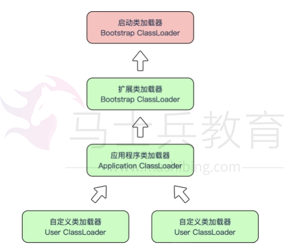

类加载器分类：

- 启动类加载器（Bootstrap ClassLoader），是虚拟机自身的一部分，用来加载 Java_HOME/lib/目录中的，或者被 -Xbootclasspath 参数所指定的路径中并且被虚 拟机识别的类库；

- 其他类加载器：
  - 扩展类加载器（Extension ClassLoader）：负责加载\lib\ext目录或Java. ext. dirs系统变量指定的路径中的所有类库；
  - 应用程序类加载器（Application ClassLoader）。负责加载用户类路径 （classpath）上的指定类库，我们可以直接使用这个类加载器。一般情况，如果我 们没有自定义类加载器默认就是用这个加载器。

双亲委派模型：如果一个类加载器收到了类加载的请求，它首先不会自己去加载 这个类，而是把这个请求委派给父类加载器去完成，每一层的类加载器都是如 此，这样所有的加载请求都会被传送到顶层的启动类加载器中，只有当父加载无 法完成加载请求（它的搜索范围中没找到所需的类）时，子加载器才会尝试去加 载类。

当一个类收到了类加载请求时，不会自己先去加载这个类，而是将其委派给父 类，由父类去加载，如果此时父类不能加载，反馈给子类，由子类去完成类的加 载。

## JVM调优

### **说一下 JVM 调优的工具？**

JDK 自带了很多监控工具，都位于 JDK 的 bin 目录下，其中最常用的是 jconsole 和 jvisualvm 这两款视图监控工具。

- jconsole：用于对 JVM 中的内存、线程和类等进行监控；
- jvisualvm：JDK 自带的全能分析工具，可以分析：内存快照、线程快照、程序 死锁、监控内存的变化、gc 变化等。

### **常用的 JVM 调优的参数都有哪些？**

- -Xms2g：初始化推大小为 2g；
- -Xmx2g：堆最大内存为 2g；
- -XX:NewRatio=4：设置年轻的和老年代的内存比例为 1:4； -XX:SurvivorRatio=8：设置新生代 Eden 和 Survivor 比例为 8:2； –XX:+UseParNewGC：指定使用 ParNew + Serial Old 垃圾回收器组合； -XX:+UseParallelOldGC：指定使用 ParNew + ParNew Old 垃圾回收器组
- 合；
- -XX:+UseConcMarkSweepGC：指定使用 CMS + Serial Old 垃圾回收器组 合；
- -XX:+PrintGC：开启打印 gc 信息；
- -XX:+PrintGCDetails：打印 gc 详细信息。

## 1. 内存模型以及分区，需要详细到每个区放什么。

JVM 分为堆区和栈区，还有方法区，初始化的对象放在堆里面，引用放在栈里面，

class 类信息常量池（static 常量和 static 变量）等放在方法区new:

·   方法区：主要是存储类信息，常量池（static 常量和 static 变量），编译后的代码（字

节码）等数据

·   堆：初始化的对象，成员变量 （那种非 static 的变量），所有的对象实例和数组都要在堆上分配

·   栈：栈的结构是栈帧组成的，调用一个方法就压入一帧，帧上面存储局部变量表，操作数栈，方法出口等信息，局部变量表存放的是 8 大基础类型加上一个应用类型，所以还是一个指向地址的指针

·   本地方法栈：主要为 Native 方法服务

·   程序计数器：记录当前线程执行的行号

## 2. 堆里面的分区：Eden，survival （from+ to），老年代，各自的特点。

堆里面分为新生代和老生代（java8 取消了永久代，采用了 Metaspace），新生代包含 Eden+Survivor 区，survivor 区里面分为 from 和 to 区，内存回收时，如果用的是复制算法，从 from 复制到 to，当经过一次或者多次 GC 之后，存活下来的对象会被移动到老年区，当 JVM 内存不够用的时候，会触发 Full GC，清理 JVM 老年区

当新生区满了之后会触发 YGC,先把存活的对象放到其中一个 Survice

区，然后进行垃圾清理。因为如果仅仅清理需要删除的对象，这样会导致内存碎

片，因此一般会把 Eden 进行完全的清理，然后整理内存。那么下次 GC 的时候，就会使用下一个 Survive，这样循环使用。如果有特别大的对象，新生代放不下，就会使用老年代的担保，直接放到老年代里面。因为 JVM 认为，一般大对象的存活时间一般比较久远。

## 3.  对象创建方法，对象的内存分配，对象的访问定位。

new 一个对象

## 4.  GC 的两种判定方法：

引用计数法：指的是如果某个地方引用了这个对象就+1，如果失效了就-1，当为 0 就会回收但是 JVM 没有用这种方式，因为无法判定相互循环引用（A 引用 B,B 引用 A）的情况

引用链法： 通过一种 GC ROOT 的对象（方法区中静态变量引用的对象等-static 变量）来判断，如果有一条链能够到达 GC ROOT 就说明，不能到达 GC ROOT 就说明可以回收

## 5.  SafePoint 是什么

比如 GC 的时候必须要等到 [Java](http://lib.csdn.net/base/java) 线程都进入到 safepoint 的时候 VMThread 才能开始

执行 GC，

1. 循环的末尾 (防止大循环的时候一直不进入 safepoint，而其他线程在等待它进入

safepoint)

2. 方法返回前

3. 调用方法的 call 之后

4. 抛出异常的位置

## 6. GC 的三种收集方法：标记清除、标记整理、复制算法的原理与特点，分别用在什么地方，如果让你优化收集方法，有什么思路？

先标记，标记完毕之后再清除，效率不高，会产生碎片

复制算法：分为 8：1 的 Eden 区和 survivor 区，就是上面谈到的 YGC

标记整理：标记完毕之后，让所有存活的对象向一端移动

## 7.  GC 收集器有哪些？CMS 收集器与 G1 收集器的特点。

并行收集器：串行收集器使用一个单独的线程进行收集，GC 时服务有停顿时间串行收集器：次要回收中使用多线程来执行

CMS 收集器是基于**“标记—清除”**算法实现的，经过多次标记才会被清除

G1 从**整体来看是基于“标记—整理”**算法实现的收集器，从**局部（两个** **Region** **之间）**

**上来看是基于“复制”**算法实现的

## 8.  Minor GC 与 Full GC 分别在什么时候发生？

新生代内存不够用时候发生 MGC 也叫 YGC，JVM 内存不够的时候发生 FGC

## 9.  几种常用的内存调试工具：jmap、jstack、jconsole、jhat jstack 

可以看当前栈的情况，jmap 查看内存，jhat 进行 dump 堆的信息mat（eclipse 的也要了解一下）

## 10. 类加载的几个过程：

加载、验证、准备、解析、初始化。然后是使用和卸载了

通过全限定名来加载生成 class 对象到内存中，然后进行验证这个 class 文件，包括文件格式校验、元数据验证，字节码校验等。准备是对这个对象分配内存。解析是将符号引用转化为直接引用（指针引用），初始化就是开始执行构造器的代码

## **11.JVM** **内存分哪几个区，每个区的作用是什么?** 

java 虚拟机主要分为以下一个区:

**方法区：**

1. 有时候也成为**永久代**，在该区内很少发生垃圾回收，但是并不代表不发生 GC，在这里进行的 GC 主要是对方法区里的常量池和对类型的卸载

2. 方法区主要用来存储已被虚拟机加载的类的信息、常量、静态变量和即时编译器编译后 

的代码等数据。

3. 该区域是被线程共享的。

4. 方法区里有一个运行时常量池，用于存放静态编译产生的字面量和符号引用。该常量池具有动态性，也就是说常量并不一定是编译时确定，运行时生成的常量也会存在这个常量池中。

**虚拟机栈:**

1. 虚拟机栈也就是我们平常所称的**栈内存**,它为 java 方法服务，每个方法在执行的时候都

会创建一个栈帧，用于存储局部变量表、操作数栈、动态链接和方法出口等信息。

2. 虚拟机栈是线程私有的，它的生命周期与线程相同。

3. 局部变量表里存储的是基本数据类型、returnAddress 类型（指向一条字节码指令的地址）和对象引用，这个对象引用有可能是指向对象起始地址的一个指针，也有可能是代表对象的句柄或者与对象相关联的位置。局部变量所需的内存空间在编译器间确定

4. 操作数栈的作用主要用来存储运算结果以及运算的操作数，它不同于局部变量表通过索引来访问，而是压栈和出栈的方式

5. 每个栈帧都包含一个指向运行时常量池中该栈帧所属方法的引用，持有这个引用是为了支持方法调用过程中的动态连接.动态链接就是将常量池中的符号引用在运行期转化为直接引用。

**本地方法栈**

本地方法栈和虚拟机栈类似，只不过本地方法栈为 Native 方法服务。

**堆**

java 堆是所有线程所共享的一块内存，在虚拟机启动时创建，几乎所有的对象实例都在这里创建，因此该区域经常发生垃圾回收操作。

**程序计数器**

内存空间小，字节码解释器工作时通过改变这个计数值可以选取下一条需要执行的字节码指令，分支、循环、跳转、异常处理和线程恢复等功能都需要依赖这个计数器完成。该内存区域是唯一一个 java 虚拟机规范没有规定任何 OOM 情况的区域。

## **12.如和判断一个对象是否存活?(或者** **GC** **对象的判定方法)**

判断一个对象是否存活有两种方法: 

\1. **引用计数法**

所谓引用计数法就是给每一个对象设置一个引用计数器，每当有一个地方引用这个对象时，就将计数器加一，引用失效时，计数器就减一。当一个对象的引用计数器为零时，说明此对象没有被引用，也就是“死对象”,将会被垃圾回收. 

引用计数法有一个缺陷就是无法解决循环引用问题，也就是说当对象 A 引用对象 B，对象B 又引用者对象 A，那么此时 A,B 对象的引用计数器都不为零，也就造成无法完成垃圾回收，所以主流的虚拟机都没有采用这种算法。

2.**可达性算法**(引用链法)

 该算法的思想是：从一个被称为 **GC** **Roots** 的对象开始向下搜索，如果一个对象到 GC Roots 没有任何引用链相连时，则说明此对象不可用。

在 java 中可以作为 GC Roots 的对象有以下几种: 

·   虚拟机栈中引用的对象 

·   方法区类静态属性引用的对象 

·   方法区常量池引用的对象 

·   本地方法栈 JNI 引用的对象

虽然这些算法可以判定一个对象是否能被回收，但是当满足上述条件时，一个对象比**不一定会被回收**。当一个对象不可达 GC Root 时，这个对象并

**不会立马被回收**，而是出于一个死缓的阶段，若要被真正的回收需要经历两次标记

如果对象在可达性分析中没有与 GC Root 的引用链，那么此时就会被第一次标记并且进行一次筛选，筛选的条件是是否有必要执行 finalize()方法。当对象没有覆盖 finalize()方法或者已被虚拟机调用过，那么就认为是没必要的。

如果该对象有必要执行 finalize()方法，那么这个对象将会放在一个称为 F-Queue 的对队列中，虚拟机会触发一个 Finalize()线程去执行，此线程是低优先级的，并且虚拟机不会承诺一直等待它运行完，这是因为如果 finalize()执行缓慢或者发生了死锁，那么就会造成 F- Queue 队列一直等待，造成了内存回收系统的崩溃。GC 对处于 F-Queue 中的对象进行

第二次被标记，这时，该对象将被移除”即将回收”集合，等待回收。

## **13.简述** **java** **垃圾回收机制?**

在 java 中，程序员是不需要显示的去释放一个对象的内存的，而是由虚拟机自行执行。在JVM 中，有一个垃圾回收线程，它是低优先级的，在正常情况下是不会执行的，只有在虚拟机空闲或者当前堆内存不足时，才会触发执行，扫面那些没有被任何引用的对象，并将它们添加到要回收的集合中，进行回收。

## **14.java** **中垃圾收集的方法有哪些?**

1. **标记-清除:**

这是垃圾收集算法中最基础的，根据名字就可以知道，它的思想就是标记哪些要被回收的对象，然后统一回收。这种方法很简单，但是会有两个主要问题：1.效率不高，标记和清除的效率都很低；2.会产生大量不连续的内存碎片，导致以后程序在分配较大的对象时，由于没有充足的连续内存而提前触发一次 GC 动作 

2. 复制算法:**

为了解决效率问题，复制算法将可用内存按容量划分为相等的两部分，然后每次只使用其中的一块，当一块内存用完时，就将还存活的对象复制到第二块内存上，然后一次性清楚完第一块内存，再将第二块上的对象复制到第一块。但是这种方式，

内存的代价太高，每次基本上都要浪费一般的内存。

于是将该算法进行了改进，内存区域不再是按照 1：1 去划分，而是将内存划分为8:1:1 三部分，较大那份内存交 Eden 区，其余是两块较小的内存区叫 Survior 区。每次都会优先使用 Eden 区，若 Eden 区满，就将对象复制到第二块内存区上，然后清除 Eden 区，如果此时存活的对象太多，以至于 Survivor 不够时，会将这些对象通过分配担保机制复制到老年代中。(java 堆又分为新生代和老年代)

3. **标记-整理**

该算法主要是为了解决标记-清除，产生大量内存碎片的问题；当对象存活率较高时，也解决了复制算法的效率问题。它的不同之处就是在清除对象的时候现将可回收对象移动到一端，然后清除掉端边界以外的对象，这样就不会产生内存碎片了 

4. **分代收集**

现在的虚拟机垃圾收集大多采用这种方式，它根据对象的生存周期，将堆分为新生代和老年代。在新生代中，由于对象生存期短，每次回收都会有大量对象死去，那么这时就采用**复制**算法。老年代里的对象存活率较高，没有额外的空间进行分配担保，所以可以使用**标记-整理** 或者 **标记-清除**。

## **15.java** **内存模型** 

java 内存模型(JMM)是线程间通信的控制机制.JMM 定义了主内存和线程之间抽象关系。线程之间的共享变量存储在主内存（main memory）中，每个线程都有一个私有的本地内存（local memory），本地内存中存储了该线程以读/写共享变量的副本。本地内存是JMM 的一个抽象概念，并不真实存在。它涵盖了缓存，写缓冲区，寄存器以及其他的硬件和编译器优化。Java 内存模型的抽象示意图如下：

从上图来看，线程 A 与线程 B 之间如要通信的话，必须要经历下面 2 个步骤：

1. 首先，线程 A 把本地内存 A 中更新过的共享变量刷新到主内存中去。

2. 然后，线程 B 到主内存中去读取线程 A 之前已更新过的共享变量。

## 

## **17.** **简述** **java** **类加载机制?**

虚拟机把描述类的数据从 Class 文件加载到内存，并对数据进行校验，解析和初始化，最终形成可以被虚拟机直接使用的 java 类型。

## **18.** **类加载器双亲委派模型机制？**

当一个类收到了类加载请求时，不会自己先去加载这个类，而是将其委派给父类，由父类 

去加载，如果此时父类不能加载，反馈给子类，由子类去完成类的加载。

## **19.什么是类加载器，类加载器有哪些?**

实现通过类的权限定名获取该类的二进制字节流的代码块叫做类加载器。

主要有一下四种类加载器:

1. 启动类加载器(Bootstrap ClassLoader)用来加载 java 核心类库，无法被 java 程序直接引用。

2. 扩展类加载器(extensions class loader):它用来加载 Java 的扩展库。Java 虚拟机的实现会提供一个扩展库目录。该类加载器在此目录里面查找并加载 Java 类。

3. 系统类加载器（system class loader）：它根据 Java 应用的类路径（CLASSPATH）来加载 Java 类。一般来说，Java 应用的类都是由它来完成加载的。可以通过ClassLoader.getSystemClassLoader()来获取它。

4. 用户自定义类加载器，通过继承 java.lang.ClassLoader 类的方式实现。 

## **20.简述** **java** **内存分配与回收策率以及** **Minor** **GC** **和Major** **GC**

1. 对象优先在堆的 Eden 区分配。

2. 大对象直接进入老年代.

3. 长期存活的对象将直接进入老年代.
   当 Eden 区没有足够的空间进行分配时，虚拟机会执行一次 Minor GC.Minor Gc 通常发生在新生代的 Eden 区，在这个区的对象生存期短，往往发生 Gc 的频率较高，回收速度比较快;Full Gc/Major GC 发生在老年代，一般情况下，触发老年代 GC的时候不会触发 Minor GC,但是通过配置，可以在 Full GC 之前进行一次 Minor GC 这样可以加快老年代的回收速度。

