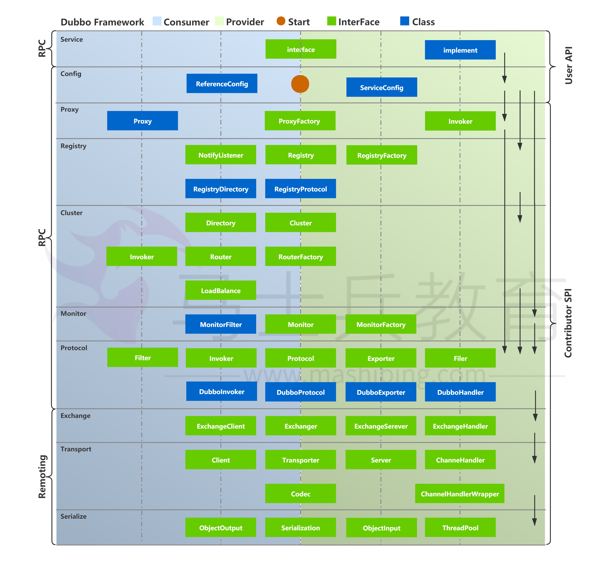

# 基础知识

## Dubbo 是什么？ 

Dubbo 是一款高性能、轻量级的开源 RPC 框架，提供服务自动注册、自动发 现等高效服务治理方案， 可以和 Spring 框架无缝集成。 

## Dubbo 的使用场景有哪些？ 

- 透明化的远程方法调用：就像调用本地方法一样调用远程方法，只需简单配置， 没有任何API侵入。 
- 软负载均衡及容错机制：可在内网替代 F5 等硬件负载均衡器，降低成本，减少单点。 
- 服务自动注册与发现：不再需要写死服务提供方地址，注册中心基于接口名查询 服务提供者的IP地址，并且能够平滑添加或删除服务提供者。 

## Dubbo 核心功能有哪些？ 

- Remoting：网络通信框架，提供对多种NIO框架抽象封装，包括“同步转异 步”和“请求-响应”模式的信息交换方式。 
- Cluster：服务框架，提供基于接口方法的透明远程过程调用，包括多协议支 持，以及软负载均衡，失败容错，地址路由，动态配置等集群支持。 
- Registry：服务注册，基于注册中心目录服务，使服务消费方能动态的查找服务 提供方，使地址透明，使服务提供方可以平滑增加或减少机器。 

# 架构设计

## Dubbo 核心组件有哪些？


- Provider：暴露服务的服务提供方 
- Consumer：调用远程服务消费方 
- Registry：服务注册与发现注册中心 
- Monitor：监控中心和访问调用统计 
- Container：服务运行容器 

## Dubbo 服务器注册与发现的流程？ 

**服务容器Container**负责启动，加载，运行服务提供者。 

**服务提供者Provider**在启动时，向注册中心注册自己提供的服务。 

**服务消费者Consumer**在启动时，向注册中心订阅自己所需的服务。 

**中心Registry**返回服务提供者地址列表给消费者，如果有变更，注册中心 将基于长连接推送变更数据给消费者。 

**服务消费者Consumer**，从提供者地址列表中，基于软负载均衡算法，选一台 提供者进行调用，如果调用失败，再选另一台调用。 

**服务消费者Consumer和提供者Provider**，在内存中累计调用次数和调用时 间，定时每分钟发送一次统计数据到监控中心Monitor。

## Dubbo 的整体架构设计有哪些分层?



**接口服务层（Service）：**该层与业务逻辑相关，根据 provider 和 consumer  的业务设计对应的接口和实现 

**配置层（Config）：**对外配置接口，以 ServiceConfig 和 ReferenceConfig 为 中心 

**服务代理层（Proxy）：**服务接口透明代理，生成服务的客户端 Stub 和 服务端 的 Skeleton，以 ServiceProxy 为中心，扩展接口为 ProxyFactory 

**服务注册层（Registry）：**封装服务地址的注册和发现，以服务 URL 为中心， 扩展接口为 RegistryFactory、Registry、RegistryService 

**路由层（Cluster）：**封装多个提供者的路由和负载均衡，并桥接注册中心，以 Invoker 为中心，扩展接口为 Cluster、Directory、Router 和 LoadBlancce 

**监控层（Monitor）：**RPC 调用次数和调用时间监控，以 Statistics 为中心， 扩展接口为 MonitorFactory、Monitor 和 MonitorService 

**远程调用层（Protocal）：**封装 RPC 调用，以 Invocation 和 Result 为中心， 扩展接口为 Protocal、Invoker 和 Exporter

**信息交换层（Exchange）：**封装请求响应模式，同步转异步。以 Request 和 Response 为中心，扩展接口为 Exchanger、ExchangeChannel、 ExchangeClient 和 ExchangeServer 

**网络传输层（Transport）：**抽象 mina 和 netty 为统一接口，以 Message  为中心，扩展接口为 Channel、Transporter、Client、Server 和 Codec 

**数据序列化层（Serialize）：**可复用的一些工具，扩展接口为 Serialization、 ObjectInput、ObjectOutput 和 ThreadPool Dubbo 

## Monitor 实现原理？ 

Consumer 端在发起调用之前会先走 filter 链；provider 端在接收到请求时也 是先走 filter 链，然后才进行真正的业务逻辑处理。默认情况下，在 consumer  和 provider 的 filter 链中都会有 Monitorfilter。 

1. MonitorFilter 向 DubboMonitor 发送数据 
2. DubboMonitor 将数据进行聚合后（默认聚合 1min 中的统计数据）暂存 到ConcurrentMap statisticsMap，然后使用一个含有 3 个线程（线程名字： DubboMonitorSendTimer）的线程池每隔 1min 钟，调用  SimpleMonitorService 遍历发送 statisticsMap 中的统计数据，每发送完毕一 个，就重置当前的 Statistics 的 AtomicReference 
3. SimpleMonitorService 将这些聚合数据塞入 BlockingQueue queue 中 （队列大写为 100000） 
4. SimpleMonitorService 使用一个后台线程（线程名为： DubboMonitorAsyncWriteLogThread）将 queue 中的数据写入文件（该线 程以死循环的形式来写） 
5. SimpleMonitorService 还会使用一个含有 1 个线程（线程名字： DubboMonitorTimer）的线程池每隔 5min 钟，将文件中的统计数据画成图表 

分布式框架

## Dubbo 类似的分布式框架还有哪些？ 

比较著名的就是 Spring Cloud。 

## Dubbo 和 Spring Cloud 有什么关系？

Dubbo 是 SOA 时代的产物，它的关注点主要在于服务的调用，流量分发、流 量监控和熔断。而 Spring Cloud 诞生于微服务架构时代，考虑的是微服务治理 的方方面面，另外由于依托了 Spring、Spring Boot 的优势之上，两个框架在 开始目标就不一致，Dubbo 定位服务治理、Spring Cloud 是打造一个生态。 

## Dubbo 和 Spring Cloud 有什么哪些区别？

Dubbo 底层是使用 Netty 这样的 NIO 框架，是基于 TCP 协议传输的，配合以 

Hession 序列化完成 RPC 通信。

Spring Cloud 是基于 Http 协议 Rest 接口调用远程过程的通信，相对来说 

Http 请求会有更大的报文，占的带宽也会更多。但是 REST 相比 RPC 更为灵

活，服务提供方和调用方的依赖只依靠一纸契约，不存在代码级别的强依赖，这在强调快速演化的微服务环境下，显得更为合适，至于注重通信速度还是方便灵活性，具体情况具体考虑。

## Dubbo 和 Dubbox 之间的区别？

Dubbox 是继 Dubbo 停止维护后，当当网基于 Dubbo 做的一个扩展项目，如加了服务可 Restful 调用，更新了开源组件等。

# 注册中心

## Dubbo 有哪些注册中心？

- Multicast 注册中心：Multicast 注册中心不需要任何中心节点，只要广播地址，就能进行服务注册和发现,基于网络中组播传输实现。
- Zookeeper 注册中心：基于分布式协调系统 Zookeeper 实现，采用 Zookeeper 的 watch 机制实现数据变更。
- Redis 注册中心：基于 Redis 实现，采用 key/map 存储，key 存储服务名和类型，map 中 key 存储服务 url，value 服务过期时间。基于 Redis 的发布/订阅模式通知数据变更。
- Simple 注册中心。

推荐使用 Zookeeper 作为注册中心

## Dubbo 的注册中心集群挂掉，发布者和订阅者之间还能通信么？

可以通讯。启动 Dubbo 时，消费者会从 Zookeeper 拉取注册的生产者的地址接口等数据，缓存在本地。每次调用时，按照本地存储的地址进行调用。

# 集群

## Dubbo集群提供了哪些负载均衡策略？

-  Random LoadBalance: 随机选取提供者策略，有利于动态调整提供者权重。截面碰撞率高，调用次数越多，分布越均匀。
-  RoundRobin LoadBalance: 轮循选取提供者策略，平均分布，但是存在请求累积的问题。
-  LeastActive LoadBalance: 少活跃调用策略，解决慢提供者接收更少的请求。
-  ConstantHash LoadBalance: 一致性 Hash 策略，使相同参数请求总是发到同一提供者，一台机器宕机，可以基于虚拟节点，分摊至其他提供者，避免引起提供者的剧烈变动。

默认为 Random 随机调用。

## Dubbo的集群容错方案有哪些？

-  Failover Cluster：失败自动切换，当出现失败，重试其它服务器。通常用于读操作，但重试会带来更长延迟。
-  Failfast Cluster：快速失败，只发起一次调用，失败立即报错。通常用于非幂等性的写操作，比如新增记录。
-  Failsafe Cluster：失败安全，出现异常时，直接忽略。通常用于写入审计日志等操作。
-  Failback Cluster：失败自动恢复，后台记录失败请求，定时重发。通常用于消息通知操作。
-  Forking Cluster：并行调用多个服务器，只要一个成功即返回。通常用于实时性要求较高的读操作，但需要浪费更多服务资源。可通过 forks=”2″ 来设置 大并行数。
-  Broadcast Cluster：广播调用所有提供者，逐个调用，任意一台报错则报错 。通常用于通知所有提供者更新缓存或日志等本地资源信息。

默认的容错方案是 Failover Cluster。

# 配置

## Dubbo 配置文件是如何加载到 Spring 中的？

Spring 容器在启动的时候，会读取到 Spring 默认的一些 schema 以及 Dubbo 自定义的 schema，每个 schema 都会对应一个自己的 NamespaceHandler， NamespaceHandler 里面通过 BeanDefinitionParser 来解析配置信息并转化为需要加载的 bean 对象！

## 说说核心的配置有哪些？

| 标签 | 用途         | 解释                                                         |
| ---- | ------------ | ------------------------------------------------------------ |
|      | 服务配置     | 用于暴露一个服务，定义服务的元信息，一个服务可以用多个协议暴露，一个服务也可以注册到多个注册中心 |
|      | 引用配置     | 用于创建一个远程服务代理，一个引用可以指向多个注册中心       |
|      | 协议配置     | 用于配置提供服务的协议信息，协议由提供方指定，消费方被动接受 |
|      | 应用配置     | 用于配置当前应用信息，不管该应用是提供者还是消费者           |
|      | 模块配置     | 用于配置当前模块信息，可选                                   |
|      | 模块配置     | 用于配置当前模块信息，可选                                   |
|      | 注册中心配置 | 用于配置连接注册中心相关信息                                 |
|      | 监控中心配置 | 用于配置连接监控中心相关信息，可选                           |
|      | 提供方配置   | 当   ProtocolC onfig 和 ServiceCo nfig 某属  性没有配置时，采用此缺省值，可选 |
|      | 消费方配置   | 当   Reference  Config 某属性没有配置时，采用此缺省值，可选  |
|      | 方法配置     | 用于   ServiceCo nfig 和 Reference Config 指  定方法级的配置信息 |
|      | 参数配置     | 用于指定方法参数配置                                         |

## Dubbo 超时设置有哪些方式？

Dubbo 超时设置有两种方式：

-  服务提供者端设置超时时间，在Dubbo的用户文档中，推荐如果能在服务端多配置就尽量多配置，因为服务提供者比消费者更清楚自己提供的服务特性。
-  服务消费者端设置超时时间，如果在消费者端设置了超时时间，以消费者端为主，即优先级更高。因为服务调用方设置超时时间控制性更灵活。如果消费方超时，服务端线程不会定制，会产生警告。

## 服务调用超时会怎么样？

dubbo 在调用服务不成功时，默认是会重试两次。

# 通信协议

## Dubbo 使用的是什么通信框架?

默认使用 Netty 作为通讯框架。

## Dubbo 支持哪些协议，它们的优缺点有哪些？

-  Dubbo： 单一长连接和 NIO 异步通讯，适合大并发小数据量的服务调用，以及消费者远大于提供者。传输协议 TCP，异步 Hessian 序列化。Dubbo推荐使用 dubbo协议。
- RMI： 采用 JDK 标准的 RMI 协议实现，传输参数和返回参数对象需要实现
- Serializable 接口，使用 Java 标准序列化机制，使用阻塞式短连接，传输数据包大小混合，消费者和提供者个数差不多，可传文件，传输协议 TCP。 多个短连接 TCP 
- 协议传输，同步传输，适用常规的远程服务调用和 RMI 互操作。在依赖低版本的 Common-Collections 包，Java 序列化存在安全漏洞。
-  WebService：基于 WebService 的远程调用协议，集成 CXF 实现，提供和原生 WebService 的互操作。多个短连接，基于 HTTP 传输，同步传输，适用系统集成和跨语言调用。
-  HTTP： 基于 Http 表单提交的远程调用协议，使用 Spring 的 HttpInvoke 实现。多个短连接，传输协议 HTTP，传入参数大小混合，提供者个数多于消费者，需要给应用程序和浏览器 JS 调用。
- Hessian：集成 Hessian 服务，基于 HTTP 通讯，采用 Servlet 暴露服务，Dubbo 内嵌 Jetty 作为服务器时默认实现，提供与 Hession 服务互操作。多个短连接，同步 HTTP 传输，Hessian 序列化，传入参数较大，提供者大于消费者，提供者压力较大，可传文件。
- Memcache：基于 Memcache实现的 RPC 协议。

Redis：基于 Redis 实现的RPC协议。

# 设计模式

## Dubbo 用到哪些设计模式？

Dubbo 框架在初始化和通信过程中使用了多种设计模式，可灵活控制类加载、权限控制等功能。

工厂模式

Provider 在 export 服务时，会调用 ServiceConfig 的 export 方法。

ServiceConfig中有个字段：

```
1	private static final Protocol protocol =
2	ExtensionLoader.getExtensionLoader(Protocol.class).getAdaptiveExtensi
3	on();
```

Dubbo 里有很多这种代码。这也是一种工厂模式，只是实现类的获取采用了

JDKSPI 的机制。这么实现的优点是可扩展性强，想要扩展实现，只需要在

classpath下增加个文件就可以了，代码零侵入。另外，像上面的 Adaptive 实现，可以做到调用时动态决定调用哪个实现，但是由于这种实现采用了动态代理，会造成代码调试比较麻烦，需要分析出实际调用的实现类。

装饰器模式

Dubbo 在启动和调用阶段都大量使用了装饰器模式。以 Provider 提供的调用链为例，具体的调用链代码是在 ProtocolFilterWrapper 的 

buildInvokerChain 完成的，具体是将注解中含有 group=provider 的 Filter 实现，按照 order 排序，   后的调用顺序是：

```
1 EchoFilter ‐> ClassLoaderFilter ‐> GenericFilter ‐> ContextFilter ‐>
2 ExecuteLimitFilter ‐> TraceFilter ‐> TimeoutFilter ‐> MonitorFilter ‐>
3 ExceptionFilter
```

更确切地说，这里是装饰器和责任链模式的混合使用。例如，EchoFilter 的作用是判断是否是回声测试请求，是的话直接返回内容，这是一种责任链的体现。而像ClassLoaderFilter 则只是在主功能上添加了功能，更改当前线程的 

ClassLoader，这是典型的装饰器模式。

观察者模式

Dubbo 的 Provider 启动时，需要与注册中心交互，先注册自己的服务，再订阅自己的服务，订阅时，采用了观察者模式，开启一个 listener。注册中心会每 5 秒定时检查是否有服务更新，如果有更新，向该服务的提供者发送一个 notify 消息，provider 接受到 notify 消息后，运行 NotifyListener 的 notify 方法，执行监听器方法。

动态代理模式

Dubbo 扩展 JDK SPI 的类 ExtensionLoader 的 Adaptive 实现是典型的动态代理实现。Dubbo 需要灵活地控制实现类，即在调用阶段动态地根据参数决定调用哪个实现类，所以采用先生成代理类的方法，能够做到灵活的调用。生成代理类的代码是 ExtensionLoader 的 createAdaptiveExtensionClassCode 方法。代理类主要逻辑是，获取 URL 参数中指定参数的值作为获取实现类的key。

# 运维管理

## 服务上线怎么兼容旧版本？

可以用版本号（version）过渡，多个不同版本的服务注册到注册中心，版本号不同的服务相互间不引用。这个和服务分组的概念有一点类似。

## Dubbo telnet 命令能做什么？

dubbo 服务发布之后，我们可以利用 telnet 命令进行调试、管理。

Dubbo2.0.5 以上版本服务提供端口支持 telnet 命令

## Dubbo 支持服务降级吗？

以通过 dubbo:reference 中设置 mock=“return null”。mock 的值也可以

修改为 true，然后再跟接口同一个路径下实现一个 Mock 类，命名规则是 “接口名称+Mock” 后缀。然后在 Mock 类里实现自己的降级逻辑

## Dubbo 如何优雅停机？

Dubbo 是通过 JDK 的 ShutdownHook 来完成优雅停机的，所以如果使用kill 

-9 PID 等强制关闭指令，是不会执行优雅停机的，只有通过 kill PID 时，才会执行。

# SPI

## Dubbo SPI 和 Java SPI 区别？

JDK SPI：

JDK 标准的 SPI 会一次性加载所有的扩展实现，如果有的扩展很耗时，但也没用上，很浪费资源。所以只希望加载某个的实现，就不现实了

DUBBO SPI：

1、     对 Dubbo 进行扩展，不需要改动 Dubbo 的源码

2、     延迟加载，可以一次只加载自己想要加载的扩展实现。

3、     增加了对扩展点 IOC 和 AOP 的支持，一个扩展点可以直接 setter 注入其它扩展点。

4、     Dubbo 的扩展机制能很好的支持第三方 IoC 容器，默认支持 Spring 

Bean。其他

## Dubbo 支持分布式事务吗？

目前暂时不支持，可与通过 tcc-transaction 框架实现介绍：tcc-transaction 是开源的 TCC 补偿性分布式事务框架

TCC-Transaction 通过 Dubbo 隐式传参的功能，避免自己对业务代码的入侵。

## Dubbo 可以对结果进行缓存吗？

为了提高数据访问的速度。Dubbo 提供了声明式缓存，以减少用户加缓存的工作量

其实比普通的配置文件就多了一个标签 cache=“true”

Dubbo 必须依赖的包有哪些？

Dubbo 必须依赖 JDK，其他为可选。

Dubbo 支持哪些序列化方式？

默认使用 Hessian 序列化，还有 Duddo、FastJson、Java 自带序列化。

## Dubbo 在安全方面有哪些措施？

-  Dubbo 通过 Token 令牌防止用户绕过注册中心直连，然后在注册中心上管理授权。
-  Dubbo 还提供服务黑白名单，来控制服务所允许的调用方。

## 服务调用是阻塞的吗？

默认是阻塞的，可以异步调用，没有返回值的可以这么做。Dubbo 是基于 NIO 的非阻塞实现并行调用，客户端不需要启动多线程即可完成并行调用多个远程服务，相对多线程开销较小，异步调用会返回一个 Future 对象。

## 服务提供者能实现失效踢出是什么原理？

服务失效踢出基于 zookeeper 的临时节点原理。

## 同一个服务多个注册的情况下可以直()连某一个服务吗？

可以点对点直连，修改配置即可，也可以通过 telnet 直接某个服务。

## Dubbo 服务降级，失败重试怎么做？

可以通过 dubbo:reference 中设置 mock=“return null”。mock 的值也可以修改为 true，然后再跟接口同一个路径下实现一个 Mock 类，命名规则是 

“接口名称+Mock” 后缀。然后在 Mock 类里实现自己的降级逻辑

## Dubbo 使用过程中都遇到了些什么问题？

在注册中心找不到对应的服务,检查 service 实现类是否添加了@service 注解无法连接到注册中心,检查配置文件中的对应的测试 ip 是否正确

# RPC

## 为什么要有RPC

http接口是在接口不多、系统与系统交互较少的情况下，解决信息孤岛初期常使用的一种通信手段；优点就是简单、直接、开发方便。利用现成的http协议进行传输。但是如果是一个大型的网站，内部子系统较多、接口非常多的情况下，

RPC框架的好处就显示出来了，首先就是长链接，不必每次通信都要像http一样去3次握手什么的，减少了网络开销；其次就是RPC框架一般都有注册中心，有丰富的监控管理；发布、下线接口、动态扩展等，对调用方来说是无感知、统一化的操作。第三个来说就是安全性。  后就是   近流行的服务化架构、服务化治理，RPC框架是一个强力的支撑。

socket只是一个简单的网络通信方式，只是创建通信双方的通信通道，而要实现rpc的功能，还需要对其进行封装，以实现更多的功能。

RPC一般配合netty框架、spring自定义注解来编写轻量级框架，其实netty内部是封装了socket的，较新的jdk的IO一般是NIO，即非阻塞IO，在高并发网站中，RPC的优势会很明显

## 什么是RPC

RPC（Remote Procedure Call Protocol）远程过程调用协议，它是一种通过网络从远程计算机程序上请求服务，而不需要了解底层网络技术的协议。简言之，RPC使得程序能够像访问本地系统资源一样，去访问远端系统资源。比较关键的一些方面包括：通讯协议、序列化、资源（接口）描述、服务框架、性能、语言支持等。


简单的说，RPC就是从一台机器(客户端)上通过参数传递的方式调用另一台机器

(服务器)上的一个函数或方法(可以统称为服务)并得到返回的结果。

## PRC架构组件

一个基本的RPC架构里面应该至少包含以下4个组件：

1、     客户端（Client）:服务调用方（服务消费者）

2、     客户端存根（Client Stub）:存放服务端地址信息，将客户端的请求参数数据信息打包成网络消息，再通过网络传输发送给服务端

3、     服务端存根（Server Stub）:接收客户端发送过来的请求消息并进行解包，然后再调用本地服务进行处理

4、     服务端（Server）:服务的真正提供者


具体调用过程：

1、     服务消费者（client客户端）通过调用本地服务的方式调用需要消费的服务；

2、     客户端存根（client stub）接收到调用请求后负责将方法、入参等信息序列化（组装）成能够进行网络传输的消息体；

3、     客户端存根（client stub）找到远程的服务地址，并且将消息通过网络发送给服务端；

4、     服务端存根（server stub）收到消息后进行解码（反序列化操作）；

5、     服务端存根（server stub）根据解码结果调用本地的服务进行相关处理；

6、     本地服务执行具体业务逻辑并将处理结果返回给服务端存根（server stub）；

7、     服务端存根（server stub）将返回结果重新打包成消息（序列化）并通过网络发送至消费方；

8、     客户端存根（client stub）接收到消息，并进行解码（反序列化）；

9、     服务消费方得到 终结果；而RPC框架的实现目标则是将上面的第2-10步完好地封装起来，也就是把调用、编码/解码的过程给封装起来，让用户感觉上像调用本地服务一样的调用远程服务。

## RPC和SOA、SOAP、REST的区别

1、REST

可以看着是HTTP协议的一种直接应用，默认基于JSON作为传输格式,使用简单, 学习成本低效率高,但是安全性较低。

2、SOAP

SOAP是一种数据交换协议规范,是一种轻量的、简单的、基于XML的协议的规范。而SOAP可以看着是一个重量级的协议，基于XML、SOAP在安全方面是通过使用XML-Security和XML-Signature两个规范组成了WS-Security来实现安全控制的,当前已经得到了各个厂商的支持 。

它有什么优点？简单总结为：易用、灵活、跨语言、跨平台。

3、SOA

面向服务架构，它可以根据需求通过网络对松散耦合的粗粒度应用组件进行分布式部署、组合和使用。服务层是SOA的基础，可以直接被应用调用，从而有效控制系统中与软件代理交互的人为依赖性。

SOA是一种粗粒度、松耦合服务架构，服务之间通过简单、精确定义接口进行通讯，不涉及底层编程接口和通讯模型。SOA可以看作是B/S模型、XML（标准通用标记语言的子集）/Web Service技术之后的自然延伸。

4、REST 和 SOAP、RPC 有何区别呢?

没什么太大区别，他们的本质都是提供可支持分布式的基础服务， 大的区别在于他们各自的的特点所带来的不同应用场景 。

## RPC框架需要解决的问题？

1、     如何确定客户端和服务端之间的通信协议？

2、     如何更高效地进行网络通信？

3、     服务端提供的服务如何暴露给客户端？

4、     客户端如何发现这些暴露的服务？

5、     如何更高效地对请求对象和响应结果进行序列化和反序列化操作？

## RPC的实现基础？

1、     需要有非常高效的网络通信，比如一般选择Netty作为网络通信框架；

2、     需要有比较高效的序列化框架，比如谷歌的Protobuf序列化框架；

3、     可靠的寻址方式（主要是提供服务的发现），比如可以使用Zookeeper来注册服务等等；

4、     如果是带会话（状态）的RPC调用，还需要有会话和状态保持的功能；

## RPC使用了哪些关键技术？

1、动态代理

生成Client Stub（客户端存根）和Server Stub（服务端存根）的时候需要用到 Java动态代理技术，可以使用JDK提供的原生的动态代理机制，也可以使用开源的：CGLib代理，Javassist字节码生成技术。

2、序列化和反序列化在网络中，所有的数据都将会被转化为字节进行传送，所以为了能够使参数对象在网络中进行传输，需要对这些参数进行序列化和反序列化操作。

- 序列化：把对象转换为字节序列的过程称为对象的序列化，也就是编码的过程。
- 反序列化：把字节序列恢复为对象的过程称为对象的反序列化，也就是解码的过程。

目前比较高效的开源序列化框架：如Kryo、FastJson和Protobuf等。

1、NIO通信

出于并发性能的考虑，传统的阻塞式 IO 显然不太合适，因此我们需要异步的 

IO，即 NIO。Java 提供了 NIO 的解决方案，Java 7 也提供了更优秀的 NIO.2 支持。可以选择Netty或者MINA来解决NIO数据传输的问题。

2、服务注册中心

可选：Redis、Zookeeper、Consul 、Etcd。一般使用ZooKeeper提供服务注册与发现功能，解决单点故障以及分布式部署的问题(注册中心)。

## 主流RPC框架有哪些

1、RMI

利用java.rmi包实现，基于Java远程方法协议(Java Remote Method Protocol) 和java的原生序列化。

2、Hessian

是一个轻量级的remoting onhttp工具，使用简单的方法提供了RMI的功能。 基于HTTP协议，采用二进制编解码。

3、protobuf-rpc-pro是一个Java类库，提供了基于 Google 的 Protocol Buffers 协议的远程方法调用的框架。基于 Netty 底层的 NIO 技术。支持 TCP 重用/ keep-alive、SSL加密、RPC 调用取消操作、嵌入式日志等功能。

4、Thrift

是一种可伸缩的跨语言服务的软件框架。它拥有功能强大的代码生成引擎，无缝地支持C + +，C#，Java，Python和PHP和Ruby。thrift允许你定义一个描述

文件，描述数据类型和服务接口。依据该文件，编译器方便地生成RPC客户端和服务器通信代码。

初由facebook开发用做系统内个语言之间的RPC通信，2007年由facebook 贡献到apache基金 ，现在是apache下的opensource之一 。支持多种语言之间的RPC方式的通信：php语言client可以构造一个对象，调用相应的服务方法

来调用java语言的服务，跨越语言的C/S RPC调用。底层通讯基于SOCKET。

5、Avro

出自Hadoop之父Doug Cutting, 在Thrift已经相当流行的情况下推出Avro的目标不仅是提供一套类似Thrift的通讯中间件,更是要建立一个新的，标准性的云计算的数据交换和存储的Protocol。支持HTTP，TCP两种协议。

6、Dubbo

Dubbo是 阿里巴巴公司开源的一个高性能优秀的服务框架，使得应用可通过高

性能的 RPC 实现服务的输出和输入功能，可以和 Spring框架无缝集成。

## RPC的实现原理架构图


PS：这张图非常重点，是PRC的基本原理，请大家一定记住！也就是说两台服务器A，B，一个应用部署在A服务器上，想要调用B服务器上应用提供的函数/方法，由于不在一个内存空间，不能直接调用，需要通过网络来表达调用的语义和传达调用的数据。

比如说，A服务器想调用B服务器上的一个方法：

User getUserByName(String userName)

1、建立通信首先要解决通讯的问题：即A机器想要调用B机器，首先得建立起通信连接。

主要是通过在客户端和服务器之间建立TCP连接，远程过程调用的所有交换的数据都在这个连接里传输。连接可以是按需连接，调用结束后就断掉，也可以是长连接，多个远程过程调用共享同一个连接。

通常这个连接可以是按需连接（需要调用的时候就先建立连接，调用结束后就立马断掉），也可以是长连接（客户端和服务器建立起连接之后保持长期持有，不管此时有无数据包的发送，可以配合心跳检测机制定期检测建立的连接是否存活有效），多个远程过程调用共享同一个连接。

2、服务寻址要解决寻址的问题，也就是说，A服务器上的应用怎么告诉底层的RPC框架，如何连接到B服务器（如主机或IP地址）以及特定的端口，方法的名称名称是什么。

通常情况下我们需要提供B机器（主机名或IP地址）以及特定的端口，然后指定调用的方法或者函数的名称以及入参出参等信息，这样才能完成服务的一个调用。

可靠的寻址方式（主要是提供服务的发现）是RPC的实现基石，比如可以采用

Redis或者Zookeeper来注册服务等等。


2.1、   从服务提供者的角度看：当服务提供者启动的时候，需要将自己提供的服务注册到指定的注册中心，以便服务消费者能够通过服务注册中心进行查找；当服务提供者由于各种原因致使提供的服务停止时，需要向注册中心注销停止的服务；服务的提供者需要定期向服务注册中心发送心跳检测，服务注册中心如果一段时间未收到来自服务提供者的心跳后，认为该服务提供者已经停止服务，则将该服务从注册中心上去掉。

2.2、   从调用者的角度看：服务的调用者启动的时候根据自己订阅的服务向服务注册中心查找服务提供者的地址等信息；当服务调用者消费的服务上线或者下线的时候，注册中心会告知该服务的调用者；服务调用者下线的时候，则取消订阅。

3、网络传输3.1、序列化

当A机器上的应用发起一个RPC调用时，调用方法和其入参等信息需要通过底层的网络协议如TCP传输到B机器，由于网络协议是基于二进制的，所有我们传输的参数数据都需要先进行序列化（Serialize）或者编组（marshal）成二进制的形式才能在网络中进行传输。然后通过寻址操作和网络传输将序列化或者编组之后的二进制数据发送给B机器。

3.2、反序列化

当B机器接收到A机器的应用发来的请求之后，又需要对接收到的参数等信息进行反序列化操作（序列化的逆操作），即将二进制信息恢复为内存中的表达方

式，然后再找到对应的方法（寻址的一部分）进行本地调用（一般是通过生成代理Proxy去调用,

通常会有JDK动态代理、CGLIB动态代理、Javassist生成字节码技术等），之后得到调用的返回值。

4、服务调用

B机器进行本地调用（通过代理Proxy和反射调用）之后得到了返回值，此时还需要再把返回值发送回A机器，同样也需要经过序列化操作，然后再经过网络传输将二进制数据发送回A机器，而当A机器接收到这些返回值之后，则再次进行反序列化操作，恢复为内存中的表达方式，  后再交给A机器上的应用进行相关处理（一般是业务逻辑处理操作）。通常，经过以上四个步骤之后，一次完整的RPC调用算是完成了，另外可能因为网络抖动等原因需要重试等。

# 1.**Dubbo** **中** **zookeeper** **做注册中心，如果注册中心集群都挂掉，发布者和订阅者之间还能通信么？** 

可以通信的，启动 dubbo 时，消费者会从 zk 拉取注册的生产者的地址接口等数据，缓存在本地。每次调用时，按照本地存储的地址进行调用； 

注册中心对等集群，任意一台宕机后，将会切换到另一台；注册中心全部宕机后，服务的提供者和消费者仍能通过本地缓存通讯。服务提供者无状态，任一台 宕机后，不影响使用；服务提供者全部宕机，服务消费者会无法使用，并无限次重连等待服务者恢复； 

挂掉是不要紧的，但前提是你没有增加新的服务，如果你要调用新的服务，则是不能办到的。 

 附文档截图：

# **2.dubbo** **服务负载均衡策略？** 

l Random LoadBalance 

  随机，按权重设置随机概率。在一个截面上碰撞的概率高，但调用量越大分布越均匀，而且按概率使用权重后也比

较均匀，有利于动态调整提供者权重。(权重可以在 dubbo 管控台配置) 

| 1    | <dubbo:parameter key="hash.arguments" value="0,1" /> |
| ---- | ---------------------------------------------------- |
|      |                                                      |

| 1    | <dubbo:parameter key="hash.nodes" value="320" /> |
| ---- | ------------------------------------------------ |
|      |                                                  |

 

l RoundRobin LoadBalance 

  轮循，按公约后的权重设置轮循比率。存在慢的提供者累积请求问题，比如：第二台机器很慢，但没挂，当请求调

到第二台时就卡在那，久而久之，所有请求都卡在调到第二台上。 

 

l LeastActive LoadBalance 

  最少活跃调用数，相同活跃数的随机，活跃数指调用前后计数差。使慢的提供者收到更少请求，因为越慢的提供者的

调用前后计数差会越大。 

 

l ConsistentHash LoadBalance 

一致性 Hash，相同参数的请求总是发到同一提供者。当某一台提供者挂时，原本发往该提供者的请求，基于虚拟节点，平摊到其它提供者，不会引起剧烈变动。缺省只对第一个参数 Hash，如果要修改，请配置 

`<dubbo:parameter key="hash.arguments" value="0,1" />`

缺省用 160 份虚拟节点，如果要修改，请配置 


` <dubbo:parameter key="hash.nodes" value="320" /> `

# 3. **Dubbo** **在安全机制方面是如何解决的** 

Dubbo 通过 Token 令牌防止用户绕过注册中心直连，然后在注册中心上管理授权。Dubbo 还提供服务黑白名单，来控

制服务所允许的调用方。 

 

# 4. **dubbo** **连接注册中心和直连的区别** 

在开发及测试环境下，经常需要绕过注册中心，只测试指定服务提供者，这时候可能需要点对点直连， 

点对点直联方式，将以服务接口为单位，忽略注册中心的提供者列表， 

服务注册中心，动态的注册和发现服务，使服务的位置透明，并通过在消费方获取服务提供方地址列表，实现软负载均衡和 Failover， 注册中心返回服务提供者地址列表给消费者，如果有变更，注册中心将基于长连接推送变更数据给消费者。 

服务消费者，从提供者地址列表中，基于软负载均衡算法，选一台提供者进行调用，如果调用失败，再选另一台调用。注册中心负责服务地址的注册与查找，相当于目录服务，服务提供者和消费者只在启动时与注册中心交互，注册中心不转发请求，服务消费者向注册中心获取服务提供者地址列表，并根据负载算法直接调用提供者，注册中心，服务提供者，服务消费者三者之间均为长连接，监控中心除外，注册中心通过长连接感知服务提供者的存在，服务提供者宕机，注册中心将立即推送事件通知消费者 

注册中心和监控中心全部宕机，不影响已运行的提供者和消费者，消费者在本地缓存了提供者列表注册中心和监控中心都是可选的，服务消费者可以直连服务提供者。 

1. **dubbo** **服务集群配置（集群容错模式）** 

在集群调用失败时，Dubbo 提供了多种容错方案，缺省为 failover 重试。可以自行扩展集群容错策略 

l Failover Cluster(默认) 

  失败自动切换，当出现失败，重试其它服务器。(缺省)通常用于读操作，但重试会带来更长延迟。可通过retries="2"来设置重试次数(不含第一次)。

```
<dubbo:service retries="2" cluster="failover"/>      或：         <dubbo:reference retries="2" cluster="failover"/>         cluster="failover"可以不用写,因为默认就是 failover   
```

l Failfast Cluster 

快速失败，只发起一次调用，失败立即报错。通常用于非幂等性的写操作，比如新增记录。 

```
dubbo:service cluster="failfast" />      或：        
<dubbo:reference cluster="failfast" />   
cluster="failfast"和 把 cluster="failover"、retries="0"是一样的效果,retries="0"就是不重试   
```

l Failsafe Cluster 

  失败安全，出现异常时，直接忽略。通常用于写入审计日志等操作。

```
<dubbo:service cluster="failsafe" />          或： 
<dubbo:reference cluster="failsafe" />
```

l Failback Cluster 

  失败自动恢复，后台记录失败请求，定时重发。通常用于消息通知操作。

```
<dubbo:service cluster="failback" />          或： 
         <dubbo:reference cluster="failback" /> 
```

l Forking Cluster 

  并行调用多个服务器，只要一个成功即返回。通常用于实时性要求较高的读操作，但需要浪费更多服务资源。可通过forks="2"来设置最大并行数。 

```
<dubbo:service cluster=“forking" forks="2"/>          或： 
         <dubbo:reference cluster=“forking" forks="2"/> 
```

l 配置 

```
服务端服务级别
<dubbo:service interface="..."  oadbalance="roundrobin" />
客户端服务级别
<dubbo:reference interface="..." loadbalance="roundrobin" />
服务端方法级别
<dubbo:service interface="...">   <dubbo:method name="..." loadbalance="roundrobin"/>
客户端方法级别
<dubbo:reference interface="..">	<dubbo:method name="..."  loadbalance="roundrobin"/>

```

## 1. **dubbo** **通信协议** **dubbo** **协议为什么要消费者比提供者个数多：** 

因 dubbo 协议采用单一长连接，假设网络为千兆网卡(1024Mbit=128MByte)， 

根据测试经验数据每条连接最多只能压满 7MByte(不同的环境可能不一样，供参考)，理论上 1 个服务提供者需要 20

个服务消费者才能压满网卡。 

 

## 2. **dubbo** **通信协议** **dubbo** **协议为什么不能传大包：**

因 dubbo 协议采用单一长连接， 

如果每次请求的数据包大小为 500KByte，假设网络为千兆网卡(1024Mbit=128MByte)，每条连接最大 7MByte(不同的环境可能不一样，供参考)， 

单个服务提供者的 TPS(每秒处理事务数)最大为：128MByte / 500KByte = 262。 

单个消费者调用单个服务提供者的 TPS(每秒处理事务数)最大为：7MByte / 500KByte = 14。如果能接受，可以考虑使用，否则网络将成为瓶颈。 

 

## 3. **dubbo** **通信协议** **dubbo** **协议为什么采用异步单一长连接：**

因为服务的现状大都是服务提供者少，通常只有几台机器，而服务的消费者多，可能整个网站都在访问该服务， 

比如 Morgan 的提供者只有 6 台提供者，却有上百台消费者，每天有 1.5 亿次调用，如果采用常规的 hessian 服务，服务提供者很容易就被压跨，通过单一连接，保证单一消费者不会压死提供者，长连接，减少连接握手验证等， 

并使用异步 IO，复用线程池，防止 C10K 问题。 

 

## 4. **dubbo** **通信协议** **dubbo** **协议适用范围和适用场景** 

适用范围：传入传出参数数据包较小（建议小于100K），消费者比提供者个数多，单一消费者无法压满提供者，尽量不要用dubbo协议传输大文件或超大字符串。 

适用场景：常规远程服务方法调用 dubbo协议补充： 

连接个数：单连接连接方式：长连接传输协议：TCP 

传输方式：NIO 异步传输 

序列化：Hessian 二进制序列化 

 

## 5. **RMI** **协议** 

RMI协议采用JDK标准的java.rmi.*实现，采用阻塞式短连接和JDK标准序列化方式，Java标准的远程调用协议。 

连接个数：多连接连接方式：短连接传输协议：TCP 传输方式：同步传输序列化：Java标准二进制序列化 

适用范围：传入传出参数数据包大小混合，消费者与提供者个数差不多，可传文件。 

适用场景：常规远程服务方法调用，与原生RMI服务互操作 

## 6. **Hessian** **协议** 

 

Hessian协议用于集成Hessian的服务，Hessian底层采用Http通讯，采用

Servlet暴露服务，Dubbo缺省内嵌Jetty作为服务器实现基于Hessian的远程调用协议。 

连接个数：多连接连接方式：短连接传输协议：HTTP 传输方式：同步传输 

序列化：Hessian二进制序列化适用范围：传入传出参数数据包较大，提供者比消费者个数多，提供者压力较大，可传文件。 

适用场景：页面传输，文件传输，或与原生hessian服务互操作 

## 7. **http** 

 

采用Spring的HttpInvoker实现基于http表单的远程调用协议。 

连接个数：多连接连接方式：短连接传输协议：HTTP 传输方式：同步传输序列化：表单序列化（JSON） 

适用范围：传入传出参数数据包大小混合，提供者比消费者个数多，可用浏览器查看，可用表单或URL传入参数，暂不支持传文件。适用场景：需同时给应用程序和浏览器JS使用的服务。 

## 8. **Webservice** 

 

基于CXF的frontend-simple和transports-http实现基于WebService的远程调用协议。 

连接个数：多连接连接方式：短连接传输协议：HTTP 传输方式：同步传输 

序列化：SOAP文本序列化适用场景：系统集成，跨语言调用。 

## 9. **Thrif** 

 

Thrift是Facebook捐给Apache的一个RPC框架，当前 dubbo 支持的 thrift 协议是对 thrift 原生协议的扩展，在原生协议的基础上添加了一些额外的头信息，比如service name，magic number等 

# **Dubbo** **支持哪些协议，每种协议的应用场景，优缺点？** 

•    **dubbo：** 单一长连接和 NIO 异步通讯，适合大并发小数据量的服务调用，以及消费者远大于提供者。传输协议 TCP，异步，Hessian 序列化； 

•    **rmi：** 采用 JDK 标准的 rmi 协议实现，传输参数和返回参数对象需要实现

Serializable 接口，使用 java 标准序列化机制，使用阻塞式短连接，传输数据包大小混合，消费者和提供者个数差不多，可传文件，传输协议 TCP。 

多个短连接，TCP 协议传输，同步传输，适用常规的远程服务调用和 rmi 互操作。在依赖低版本的 Common-Collections 包，java 序列化存在安全漏洞； 

•    **webservice：** 基于 WebService 的远程调用协议，集成 CXF 实现，提供和原生 WebService 的互操作。多个短连接，基于 HTTP 传输，同步传输，适用系统集成和跨语言调用； 

•    **http：** 基于 Http 表单提交的远程调用协议，使用 Spring 的 HttpInvoke 实现。多个短连接，传输协议 HTTP，传入参数大小混合，提供者个数多于消费者，需要给应用程序和浏览器 JS 调用； 

•    **hessian：** 集成 Hessian 服务，基于 HTTP 通讯，采用 Servlet 暴露服务， Dubbo 内嵌 Jetty 作为服务器时默认实现，提供与 Hession 服务互操作。多个短连接，同步 HTTP 传输，Hessian 序列化，传入参数较大，提供者大于消费者，提供者压力较大，可传文件； 

•    **memcache：** 基于 memcached 实现的 RPC 协议 

•    **redis：** 基于 redis 实现的 RPC 协议 

# **Dubbo** **超时时间怎样设置？** 

　Dubbo 超时时间设置有两种方式： 

•    服务提供者端设置超时时间，在 Dubbo 的用户文档中，推荐如果能在服务端多配置就尽量多配置，因为服务提供者比消费者更清楚自己提供的服务特性。 

•    服务消费者端设置超时时间，如果在消费者端设置了超时时间，以消费者端为主，即优先级更高。因为服务调用方设置超时时间控制性更灵活。如果消费方超时，服务端线程不会定制，会产生警告。 

# **Dubbo** **有些哪些注册中心？** 

•    **Multicast** **注册中心：** Multicast 注册中心不需要任何中心节点，只要广播地址，就能进行服务注册和发现。基于网络中组播传输实现； 

•    **Zookeeper** **注册中心：** 基于分布式协调系统 Zookeeper 实现，采用

Zookeeper 的 watch 机制实现数据变更； 

•    **redis** **注册中心：** 基于 redis 实现，采用 key/Map 存储，住 key 存储服务名和类型，Map 中 key 存储服务 URL，value 服务过期时间。基于 redis 的发布/订阅模式通知数据变更； 

•    **Simple** **注册中心** 

# **Dubbo** **集群的负载均衡有哪些策略**　　 

　Dubbo 提供了常见的集群策略实现，并预扩展点予以自行实现。 

•    **Random LoadBalance:** 随机选取提供者策略，有利于动态调整提供者权重。截面碰撞率高，调用次数越多，分布越均匀； 

•    **RoundRobin LoadBalance:** 轮循选取提供者策略，平均分布，但是存在请求累积的问题； 

•    **LeastActive LoadBalance:** 最少活跃调用策略，解决慢提供者接收更少的请求； 

•    **ConstantHash LoadBalance:** 一致性 Hash 策略，使相同参数请求总是发到同一提供者，一台机器宕机，可以基于虚拟节点，分摊至其他提供者，避免引起提供者的剧烈变动； 

#  Dubbo 是什么？ 

 Dubbo 是一个分布式、高性能、透明化的 RPC 服务框架，提

供服务自动注册、自动发现等高效服务治理方案， 可以和 

Spring 框架无缝集成。 

#  Dubbo 的主要应用场景？ 

•    透明化的远程方法调用，就像调用本地方法一样调用远程方法，

只需简单配置，没有任何 API 侵入。 

•    软负载均衡及容错机制，可在内网替代 F5 等硬件负载均衡器，

降低成本，减少单点。 

•    服务自动注册与发现，不再需要写死服务提供方地址，注册中心

基于接口名查询服务提供者的 IP 地址，并且能够平滑添加或删

除服务提供者。 

# Dubbo 的核心功能？ 

主要就是如下 3 个核心功能： 

§ **Remoting：**网络通信框架，提供对多种 NIO 框架抽象封装，包括

“同步转异步”和“请求-响应”模式的信息交换方式。 

§ **Cluster：服务框架**，提供基于接口方法的透明远程过程调用，包括多

协议支持，以及软负载均衡，失败容错，地址路由，动态配置等集群

支持。 

**Registry：服务注册**，基于注册中心目录服务，使服务消费方能动态的查找服务提供方，使地址透明，使服务提供方可以平滑增加或减少机器。


#  **Dubbo** **的核心组件？** 


# Dubbo 服务注册与发现的流程？ 


# 流程说明：

§ Provider(提供者)绑定指定端口并启动服务 

§ 指供者连接注册中心，并发本机 IP、端口、应用信息和提供服务信息

发送至注册中心存储 

§ Consumer(消费者），连接注册中心 ，并发送应用信息、所求服务信

息至注册中心 

§ 注册中心根据 消费 者所求服务信息匹配对应的提供者列表发送至

Consumer 应用缓存。 

§ Consumer 在发起远程调用时基于缓存的消费者列表择其一发起调

用。 

Provider 状态变更会实时通知注册中心、在由注册中心实时推送至

Consumer 

# 设计的原因： 

-  Consumer 与 Provider 解偶，双方都可以横向增减节点数。 
-  注册中心对本身可做对等集群，可动态增减节点，并且任意一台宕掉后，将自动切换到另一台 
-  去中心化，双方不直接依懒注册中心，即使注册中心全部宕机短时间内也不会影响服务的调用 
-  服务提供者无状态，任意一台宕掉后，不影响使用 


# Dubbo 的架构设计？


# Dubbo 框架设计一共划分了 10 个层： 

-  **服务接口层（Service）**：该层是与实际业务逻辑相关的，根据服务提供方和服务消费方的业务设计对应的接口和实现。 
-  **配置层（Config）**：对外配置接口，以 ServiceConfig 和ReferenceConfig 为中心。 
-  **服务代理层（Proxy**）：服务接口透明代理，生成服务的客户端 Stub 和服务器端 Skeleton。 
-  **服务注册层（Registry）**：封装服务地址的注册与发现，以服务 URL为中心。 

-  **集群层（Cluster）**：封装多个提供者的路由及负载均衡，并桥接注册中心，以 Invoker 为中心。 
-  **监控层（Monitor）**：RPC 调用次数和调用时间监控。 
-  **远程调用层（Protocol）**：封将 RPC 调用，以 Invocation 和 Result为中心，扩展接口为 Protocol、Invoker 和 Exporter。 
-  **信息交换层（Exchange）**：封装请求响应模式，同步转异步，以Request 和 Response 为中心。 
-  **网络传输层（Transport）**：抽象 mina 和 netty 为统一接口，以essage 为中心。 

# Dubbo 的服务调用流程？ 


# Dubbo 支持哪些协议，每种协议的应用场景，优缺点？ 

-  **dubbo：** 单一长连接和 NIO 异步通讯，适合大并发小数据量的服务调用，以及消费者远大于提供者。传输协议 TCP，异步，Hessian 序列化； **rmi：** 采用 JDK 标准的 rmi 协议实现，传输参数和返回参数对象需要实现 Serializable 接口，使用 java 标准序列化机制，使用阻塞式短连接，传输数据包大小混合，消费者和提供者个数差不多，可传文件，传输协议 TCP。 多个短连接，TCP 协议传输，同步传输，适用常规的远程服务调用和 rmi 互操作。在依赖低版本的 Common-Collections包，java 序列化存在安全漏洞； 
-  **webservice：** 基于 WebService 的远程调用协议，集成 CXF 实现，提供和原生 WebService 的互操作。多个短连接，基于 HTTP 传输，同步传输，适用系统集成和跨语言调用； 
-  **http：** 基于 Http 表单提交的远程调用协议，使用 Spring 的HttpInvoke 实现。多个短连接，传输协议 HTTP，传入参数大小混合，提供者个数多于消费者，需要给应用程序和浏览器 JS 调用； 
-  **hessian：** 集成 Hessian 服务，基于 HTTP 通讯，采用 Servlet 暴露服务，Dubbo 内嵌 Jetty 作为服务器时默认实现，提供与 Hession 服务互操作。多个短连接，同步 HTTP 传输，Hessian 序列化，传入参数较大，提供者大于消费者，提供者压力较大，可传文件； 
-  **memcache：** 基于 memcached 实现的 RPC 协议 
-  **redis：** 基于 redis 实现的 RPC 协议 **dubbo** **推荐用什么协议？**
   默认使用 dubbo 协议 

# Dubbo 有些哪些注册中心？ 

-  **Multicast** **注册中心：** Multicast 注册中心不需要任何中心节点，只要广播地址，就能进行服务注册和发现。基于网络中组播传输实现； 
-  **Zookeeper** **注册中心：** 基于分布式协调系统 Zookeeper 实现，采用Zookeeper 的 watch 机制实现数据变更； 
-  **redis** **注册中心：** 基于 redis 实现，采用 key/Map 存储，住 key 存储服务名和类型，Map 中 key 存储服务 URL，value 服务过期时间。基于 redis 的发布/订阅模式通知数据变更； 
-  **Simple** **注册中心** 

**Dubbo** **默认采用注册中心？** 

采用 Zookeeper 

# 为什么需要服务治理？ 


-  过多的服务 URL 配置困难 
-  负载均衡分配节点压力过大的情况下也需要部署集群服务依赖混乱，启动顺序不清晰 
-  过多服务导致性能指标分析难度较大，需要监控 

# Dubbo 的注册中心集群挂掉，发布者和订阅者之间还能通信么？ 

可以的，启动 dubbo 时，消费者会从 zookeeper 拉取注册的生产者的地址接口等数据，缓存在本地。 

每次调用时，按照本地存储的地址进行调用。 

# Dubbo 与 Spring 的关系？ 

Dubbo 采用全 Spring 配置方式，透明化接入应用，对应用没有任何

API 侵入，只需用 Spring 加载 Dubbo 的配置即可，Dubbo 基于

Spring 的 Schema 扩展进行加载。 

**Dubbo** **使用的是什么通信框架?** 

默认使用 NIO Netty 框架 

# Dubbo 集群提供了哪些负载均衡策略？ 

-  **Random LoadBalance:** 随机选取提供者策略，有利于动态调整提供者权重。截面碰撞率高，调用次数越多，分布越均匀； 
-  **RoundRobin LoadBalance:** 轮循选取提供者策略，平均分布，但是存在请求累积的问题； 

# LeastActive LoadBalance: 最少活跃调用策略，解决慢提供者接收

更少的请求； 

**ConstantHash LoadBalance:** 一致性 Hash 策略，使相同参数请求总是发到同一提供者，一台机器宕机，可以基于虚拟节点，分摊至其他提供者，避免引起提供者的剧烈变动； 

缺省时为 Random 随机调用 

**Dubbo** **的集群容错方案有哪些？** 

# Failover Cluster 

 失败自动切换，当出现失败，重试其它服务器。通常用于读操作，但

重试会带来更长延迟。 

# Failfast Cluster 

快速失败，只发起一次调用，失败立即报错。通常用于非幂等性的写操作，比如新增记录。 

**Failsafe Cluster**

失败安全，出现异常时，直接忽略。通常用于写入审计日志等操作。 

# Failback Cluster 

失败自动恢复，后台记录失败请求，定时重发。通常用于消息通知操作。 

**Forking Cluster** 并行调用多个服务器，只要一个成功即返回。通常用于实时性要求较高的读操作，但需要浪费更多服务资源。可通过 forks="2" 来设置最大并行数。 

# roadcast Cluster 

广播调用所有提供者，逐个调用，任意一台报错则报错 。通常用于通知所有提供者更新缓存或日志等本地资源信息。 

**Dubbo** **的默认集群容错方案？** 

Failover Cluster 

# Dubbo 支持哪些序列化方式？ 

默认使用 Hessian 序列化，还有 Duddo、FastJson、Java 自带序列化。 

# Dubbo 超时时间怎样设置？ 

Dubbo 超时时间设置有两种方式： 

- 服务提供者端设置超时时间，在 Dubbo 的用户文档中，推荐如果能在服务端多配置就尽量多配置，因为服务提供者比消费者更清楚自己提供的服务特性。 
- 服务消费者端设置超时时间，如果在消费者端设置了超时时间，以消费者端为主，即优先级更高。因为服务调用方设置超时时间控制性更灵活。如果消费方超时，服务端线程不会定制，会产生警告。 

**服务调用超时问题怎么解决？** 

dubbo 在调用服务不成功时，默认是会重试两次的。 

# Dubbo 在安全机制方面是如何解决？ 

Dubbo 通过 Token 令牌防止用户绕过注册中心直连，然后在注册中心上管理授权。Dubbo 还提供服务黑白名单，来控制服务所允许的调用方。 

# Dubbo 和 Dubbox 之间的区别？ 

dubbox 基于 dubbo 上做了一些扩展，如加了服务可 restful 调用，更新了开源组件等。 

# Dubbo 和 Spring Cloud 的关系？ 

Dubbo 是 SOA 时代的产物，它的关注点主要在于服务的调用，流量分发、流量监控和熔断。而 Spring Cloud 诞生于微服务架构时代，考虑的是微服务治理的方方面面，另外由于依托了 Spirng、

Spirng Boot 的优势之上，两个框架在开始目标就不一致，Dubbo 定位服务治理、Spirng Cloud 是一个生态。 

# Dubbo 和 Spring Cloud 的区别？ 


最大的区别：Dubbo 底层是使用 Netty 这样的 NIO 框架，是基于TCP 协议传输的，配合以 Hession 序列化完成 RPC 通信。 

而 SpringCloud 是基于 Http 协议+Rest 接口调用远程过程的通信，相对来说，Http 请求会有更大的报文，占的带宽也会更多。但是REST 相比 RPC 更为灵活，服务提供方和调用方的依赖只依靠一纸契约，不存在代码级别的强依赖。 