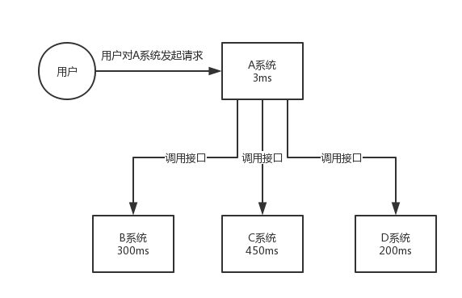
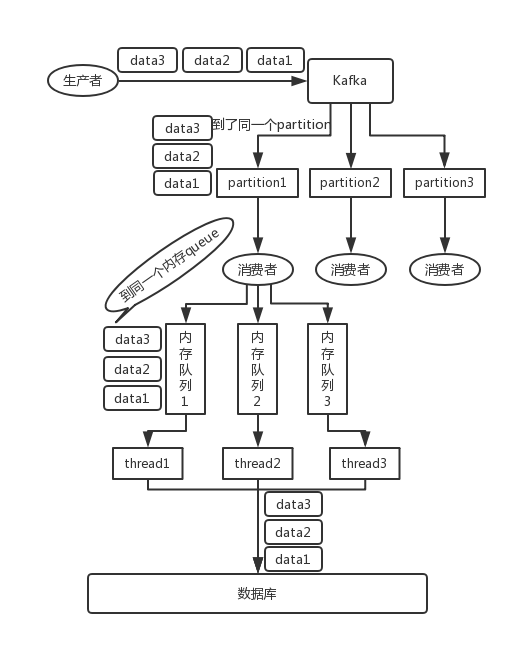

# 1为什么使用消息队列

- 为什么使用消息队列？
- 消息队列有什么优点和缺点？
- Kafka、ActiveMQ、RabbitMQ、RocketMQ 都有什么区别，以及适合哪些场景？

## 面试官心理分析

其实面试官主要是想看看：

- **第一**，你知不知道你们系统里为什么要用消息队列这个东西？<br>
  不少候选人，说自己项目里用了 Redis、MQ，但是其实他并不知道自己为什么要用这个东西。其实说白了，就是为了用而用，或者是别人设计的架构，他从头到尾都没思考过。<br>
  没有对自己的架构问过为什么的人，一定是平时没有思考的人，面试官对这类候选人印象通常很不好。因为面试官担心你进了团队之后只会木头木脑的干呆活儿，不会自己思考。

- **第二**，你既然用了消息队列这个东西，你知不知道用了有什么好处&坏处？<br>
  你要是没考虑过这个，那你盲目弄个 MQ 进系统里，后面出了问题你是不是就自己溜了给公司留坑？你要是没考虑过引入一个技术可能存在的弊端和风险，面试官把这类候选人招进来了，基本可能就是挖坑型选手。就怕你干 1 年挖一堆坑，自己跳槽了，给公司留下无穷后患。

- **第三**，既然你用了 MQ，可能是某一种 MQ，那么你当时做没做过调研？<br>
  你别傻乎乎的自己拍脑袋看个人喜好就瞎用了一个 MQ，比如 Kafka，甚至都从没调研过业界流行的 MQ 到底有哪几种。每一个 MQ 的优点和缺点是什么。每一个 MQ **没有绝对的好坏**，但是就是看用在哪个场景可以**扬长避短，利用其优势，规避其劣势**。<br>
  如果是一个不考虑技术选型的候选人招进了团队，leader 交给他一个任务，去设计个什么系统，他在里面用一些技术，可能都没考虑过选型，最后选的技术可能并不一定合适，一样是留坑。

## 面试题剖析

### 简答 

- 异步处理 - 相比于传统的串行、并行方式，提高了系统吞吐量。 
- 应用解耦 - 系统间通过消息通信，不用关心其他系统的处理。 
- 流量削锋 - 可以通过消息队列长度控制请求量；可以缓解短时间内的高并发请 求。 
- 日志处理 - 解决大量日志传输。 
- 消息通讯 - 消息队列一般都内置了高效的通信机制，因此也可以用在纯的消息通 讯。比如实现点对点消息队列，或者聊天室等。 


### 为什么使用消息队列

其实就是问问你消息队列都有哪些使用场景，然后你项目里具体是什么场景，说说你在这个场景里用消息队列是什么？

面试官问你这个问题，**期望的一个回答**是说，你们公司有个什么**业务场景**，这个业务场景有个什么技术挑战，如果不用 MQ 可能会很麻烦，但是你现在用了 MQ 之后带给了你很多的好处。

先说一下消息队列常见的使用场景吧，其实场景有很多，但是比较核心的有 3 个：**解耦**、**异步**、**削峰**。

#### 解耦

看这么个场景。A 系统发送数据到 BCD 三个系统，通过接口调用发送。如果 E 系统也要这个数据呢？那如果 C 系统现在不需要了呢？A 系统负责人几乎崩溃......


在这个场景中，A 系统跟其它各种乱七八糟的系统严重耦合，A 系统产生一条比较关键的数据，很多系统都需要 A 系统将这个数据发送过来。A 系统要时时刻刻考虑 BCDE 四个系统如果挂了该咋办？要不要重发，要不要把消息存起来？头发都白了啊！

如果使用 MQ，A 系统产生一条数据，发送到 MQ 里面去，哪个系统需要数据自己去 MQ 里面消费。如果新系统需要数据，直接从 MQ 里消费即可；如果某个系统不需要这条数据了，就取消对 MQ 消息的消费即可。这样下来，A 系统压根儿不需要去考虑要给谁发送数据，不需要维护这个代码，也不需要考虑人家是否调用成功、失败超时等情况。


**总结**：通过一个 MQ，Pub/Sub 发布订阅消息这么一个模型，A 系统就跟其它系统彻底解耦了。

**面试技巧**：你需要去考虑一下你负责的系统中是否有类似的场景，就是一个系统或者一个模块，调用了多个系统或者模块，互相之间的调用很复杂，维护起来很麻烦。但是其实这个调用是不需要直接同步调用接口的，如果用 MQ 给它异步化解耦，也是可以的，你就需要去考虑在你的项目里，是不是可以运用这个 MQ 去进行系统的解耦。在简历中体现出来这块东西，用 MQ 作解耦。

#### 异步

再来看一个场景，A 系统接收一个请求，需要在自己本地写库，还需要在 BCD 三个系统写库，自己本地写库要 3ms，BCD 三个系统分别写库要 300ms、450ms、200ms。最终请求总延时是 3 + 300 + 450 + 200 = 953ms，接近 1s，用户感觉搞个什么东西，慢死了慢死了。用户通过浏览器发起请求，等待个 1s，这几乎是不可接受的。



一般互联网类的企业，对于用户直接的操作，一般要求是每个请求都必须在 200 ms 以内完成，对用户几乎是无感知的。

如果**使用 MQ**，那么 A 系统连续发送 3 条消息到 MQ 队列中，假如耗时 5ms，A 系统从接受一个请求到返回响应给用户，总时长是 3 + 5 = 8ms，对于用户而言，其实感觉上就是点个按钮，8ms 以后就直接返回了，爽！网站做得真好，真快！


#### 削峰

每天 0:00 到 12:00，A 系统风平浪静，每秒并发请求数量就 50 个。结果每次一到 12:00 ~ 13:00 ，每秒并发请求数量突然会暴增到 5k+ 条。但是系统是直接基于 MySQL 的，大量的请求涌入 MySQL，每秒钟对 MySQL 执行约 5k 条 SQL。

一般的 MySQL，扛到每秒 2k 个请求就差不多了，如果每秒请求到 5k 的话，可能就直接把 MySQL 给打死了，导致系统崩溃，用户也就没法再使用系统了。

但是高峰期一过，到了下午的时候，就成了低峰期，可能也就 1w 的用户同时在网站上操作，每秒中的请求数量可能也就 50 个请求，对整个系统几乎没有任何的压力。


如果使用 MQ，每秒 5k 个请求写入 MQ，A 系统每秒钟最多处理 2k 个请求，因为 MySQL 每秒钟最多处理 2k 个。A 系统从 MQ 中慢慢拉取请求，每秒钟就拉取 2k 个请求，不要超过自己每秒能处理的最大请求数量就 ok，这样下来，哪怕是高峰期的时候，A 系统也绝对不会挂掉。而 MQ 每秒钟 5k 个请求进来，就 2k 个请求出去，结果就导致在中午高峰期（1 个小时），可能有几十万甚至几百万的请求积压在 MQ 中。


这个短暂的高峰期积压是 ok 的，因为高峰期过了之后，每秒钟就 50 个请求进 MQ，但是 A 系统依然会按照每秒 2k 个请求的速度在处理。所以说，只要高峰期一过，A 系统就会快速将积压的消息给解决掉。

### 消息队列有什么优缺点

优点上面已经说了，就是**在特殊场景下有其对应的好处**，**解耦**、**异步**、**削峰**。

缺点有以下几个：

- 系统可用性降低<br>
  系统引入的外部依赖越多，越容易挂掉。本来你就是 A 系统调用 BCD 三个系统的接口就好了，人 ABCD 四个系统好好的，没啥问题，你偏加个 MQ 进来，万一 MQ 挂了咋整，MQ 一挂，整套系统崩溃的，你不就完了？如何保证消息队列的高可用，可以[点击这里查看](#面试题二)。
- 系统复杂度提高<br>
  硬生生加个 MQ 进来，你怎么[保证消息没有重复消费](./docs/high-concurrency/how-to-ensure-that-messages-are-not-repeatedly-consumed.md)？怎么[处理消息丢失的情况](./docs/high-concurrency/how-to-ensure-the-reliable-transmission-of-messages.md)？怎么保证消息传递的顺序性？头大头大，问题一大堆，痛苦不已。
- 一致性问题<br>
  A 系统处理完了直接返回成功了，人都以为你这个请求就成功了；但是问题是，要是 BCD 三个系统那里，BD 两个系统写库成功了，结果 C 系统写库失败了，咋整？你这数据就不一致了。

所以消息队列实际是一种非常复杂的架构，你引入它有很多好处，但是也得针对它带来的坏处做各种额外的技术方案和架构来规避掉，做好之后，你会发现，妈呀，系统复杂度提升了一个数量级，也许是复杂了 10 倍。但是关键时刻，用，还是得用的。

## 你们公司生产环境用的是什么消息中间件？ 

这个首先你可以说下你们公司选用的是什么消息中间件，比如用的是 RabbitMQ，然后可以初步给一些你对不同MQ中间件技术的选型分析。 

举个例子：比如说ActiveMQ是老牌的消息中间件，国内很多公司过去运用的还 是非常广泛的，功能很强大。 

但是问题在于没法确认ActiveMQ可以支撑互联网公司的高并发、高负载以及高 吞吐的复杂场景，在国内互联网公司落地较少。而且使用较多的是一些传统企 业，用ActiveMQ做异步调用和系统解耦。

然后你可以说说RabbitMQ，他的好处在于可以支撑高并发、高吞吐、性能很 高，同时有非常完善便捷的后台管理界面可以使用。 

另外，他还支持集群化、高可用部署架构、消息高可靠支持，功能较为完善。

而且经过调研，国内各大互联网公司落地大规模RabbitMQ集群支撑自身业务的 case较多，国内各种中小型互联网公司使用RabbitMQ的实践也比较多。 

除此之外，RabbitMQ的开源社区很活跃，较高频率的迭代版本，来修复发现的 bug以及进行各种优化，因此综合考虑过后，公司采取了RabbitMQ。 

但是RabbitMQ也有一点缺陷，就是他自身是基于erlang语言开发的，所以导致 较为难以分析里面的源码，也较难进行深层次的源码定制和改造，毕竟需要较为 扎实的erlang语言功底才可以。 

然后可以聊聊RocketMQ，是阿里开源的，经过阿里的生产环境的超高并发、 高吞吐的考验，性能卓越，同时还支持分布式事务等特殊场景。 

而且RocketMQ是基于Java语言开发的，适合深入阅读源码，有需要可以站在 源码层面解决线上生产问题，包括源码的二次开发和改造。 

另外就是Kafka。Kafka提供的消息中间件的功能明显较少一些，相对上述几款 MQ中间件要少很多。 

但是Kafka的优势在于专为超高吞吐量的实时日志采集、实时数据同步、实时数 据计算等场景来设计。 

因此Kafka在大数据领域中配合实时计算技术（比如Spark Streaming、 Storm、Flink）使用的较多。但是在传统的MQ中间件使用场景中较少采用。 

## Kafka、ActiveMQ、RabbitMQ、RocketMQ 有 什么优缺点？ 

|             | ActiveMQ                                                     | RabbitMQ                                                     | RocketMQ                                                     | Kafka                                                        | ZeroMQ               |
| ----------- | ------------------------------------------------------------ | ------------------------------------------------------------ | ------------------------------------------------------------ | ------------------------------------------------------------ | -------------------- |
| 单机吞吐 量 | 比 RabbitM Q低                                               | 2.6w/s（ 消息做持 久化）                                     | 11.6w/s                                                      | 17.3w/s                                                      | 29w/s                |
| 开发语言    | Java                                                         | Erlang                                                       | Java                                                         | Scala/Java                                                   | C                    |
| 主要维护者  | Apache                                                       | Mozilla/Spring                                               | Alibaba                                                      | Apache                                                       | iMatix创始人已去世   |
| 成熟度      | 成熟                                                         | 成熟                                                         | 开源版本不够成熟                                             | 比较成熟                                                     | 只有C、PHP等版本成熟 |
| 订阅形式    | 点对点 (p2p)、广 播（发布订阅）                              | 提供了4 种： direct,  topic,Headers 和 fanout。 fanout就 是广播模 式 | 基于 topic/me ssageTag 以及按照消息类 型、属性 进行正则 匹配的发 布订阅模 式 | 基于topic 以及按照 topic进行 正则匹配的发布订 阅模式         | 点对点(P2P)          |
| 持久化      | 支持少量 堆积                                                | 支持少量 堆积                                                | 支持大量 堆积                                                | 支持大量 堆积                                                | 不支持               |
| 顺序消息    | 不支持                                                       | 不支持                                                       | 支持                                                         | 支持                                                         | 不支持               |
| 性能稳定 性 | 好                                                           | 好                                                           | 一般                                                         | 较差                                                         | 很好                 |
| 集群方式    | 支持简单 集群模 式，比 如’主备’，对 高级集群 模式支持 不好。 | 支持简单 集群，'复 制’模 式，对高 级集群模 式支持不 好。     | 常用 多 对’Mast erSlave’ 模 式，开源 版本需手 动切换 Slave变成 Master | 天然 的‘Lead erSlave’无 状态集 群，每台 服务器既 是Master 也是Slave | 不支持               |
| 管理界面    | 一般                                                         | 较好                                                         | 一般                                                         | 无                                                           | 无                   |
|可用性|高，基于主从架构实现高可用|同 ActiveMQ|非常高，分布式架构|非常高，分布式，一个数据多个副本，少数机器宕机，不会丢失数据，不会导致不可用||
|消息可靠性|有较低的概率丢失数据|基本不丢|经过参数优化配置，可以做到 0 丢失|同 RocketMQ||
|优劣总结|非常成熟，功能强大，大公司都有应用，偶尔会有较低概率丢消息，现在社区ActiveMQ5.x 维护次数少，主要是基于解耦和异步来使用的，较少在大规模吞吐的场景中使用|erlang语言开发，性能好，而且开源提供的管理界面非常棒，<br />RabbitMQ确实吞吐量会低一些，因为他做的实现机制比较重|阿里品牌保障，接口简单易用，可以实现大规模吞吐，性能好，分布式扩展也很方便，可靠性和可用性都OK，支撑大规模的topic数量，支持复杂MQ业务场景|提供较少的核心功能，超高的吞吐量，ms级延迟，极高的可用性，和可靠性，支持分布式扩展。||


综上，各种对比之后，有如下建议： 

一般的业务系统要引入 MQ，最早大家都用 ActiveMQ，但是现在确实大家用 的不多了，没经过大规模吞吐量场景的验证，社区也不是很活跃，所以大家还是 算了吧，我个人不推荐用这个了； 

后来大家开始用 RabbitMQ，但是确实 erlang 语言阻止了大量的 Java 工程师 去深入研究和掌控它，对公司而言，几乎处于不可控的状态，但是确实人家是开 源的，比较稳定的支持，活跃度也高； 

不过现在确实越来越多的公司会去用 RocketMQ，确实很不错，毕竟是阿里出 品，但社区可能有突然黄掉的风险（目前 RocketMQ 已捐给 [Apache](https://github.com/apache/rocketmq)，但  GitHub 上的活跃度其实不算高）对自己公司技术实力有绝对自信的，推荐用  RocketMQ，否则回去老老实实用 RabbitMQ 吧，人家有活跃的开源社区，绝 对不会黄。 

所以**中小型公司**，技术实力较为一般，技术挑战不是特别高，用 RabbitMQ 是 不错的选择；**大型公司**，基础架构研发实力较强，用 RocketMQ 是很好的选 择。

如果是**大数据领域**的实时计算、日志采集等场景，用 Kafka 是业内标准的，绝 对没问题，社区活跃度很高，绝对不会黄，何况几乎是全世界这个领域的事实性 规范。 

# 2消息队列的高可用

如何保证消息队列的高可用？

## 面试官心理分析

如果有人问到你 MQ 的知识，**高可用是必问的**。MQ 会导致**系统可用性降低**。所以只要你用了 MQ，接下来问的一些要点肯定就是围绕着 MQ 的那些缺点怎么来解决了。

## 面试题剖析

这个问题这么问是很好的，因为不能问你 Kafka 的高可用性怎么保证？ActiveMQ 的高可用性怎么保证？一个面试官要是这么问就显得很没水平，人家可能用的就是 RabbitMQ，没用过 Kafka，你上来问人家 Kafka 干什么？这不是摆明了刁难人么。

所以有水平的面试官，问的是 MQ 的高可用性怎么保证？这样就是你用过哪个 MQ，你就说说你对那个 MQ 的高可用性的理解。

### RabbitMQ 的高可用性

RabbitMQ 是比较有代表性的，因为是**基于主从**（非分布式）做高可用性的，我们就以 RabbitMQ 为例子讲解第一种 MQ 的高可用性怎么实现。

RabbitMQ 有三种模式：单机模式、普通集群模式、镜像集群模式。

#### 单机模式

单机模式，就是 Demo 级别的，一般就是你本地启动了玩玩儿的😄，没人生产用单机模式。

#### 普通集群模式（无高可用性）

普通集群模式，意思就是在多台机器上启动多个 RabbitMQ 实例，每个机器启动一个。你**创建的 queue，只会放在一个 RabbitMQ 实例上**，但是每个实例都同步 queue 的元数据（元数据可以认为是 queue 的一些配置信息，通过元数据，可以找到 queue 所在实例）。你消费的时候，实际上如果连接到了另外一个实例，那么那个实例会从 queue 所在实例上拉取数据过来。


这种方式确实很麻烦，也不怎么好，**没做到所谓的分布式**，就是个普通集群。因为这导致你要么消费者每次随机连接一个实例然后拉取数据，要么固定连接那个 queue 所在实例消费数据，前者有**数据拉取的开销**，后者导致**单实例性能瓶颈**。

而且如果那个放 queue 的实例宕机了，会导致接下来其他实例就无法从那个实例拉取，如果你**开启了消息持久化**，让 RabbitMQ 落地存储消息的话，**消息不一定会丢**，得等这个实例恢复了，然后才可以继续从这个 queue 拉取数据。

所以这个事儿就比较尴尬了，这就**没有什么所谓的高可用性**，**这方案主要是提高吞吐量的**，就是说让集群中多个节点来服务某个 queue 的读写操作。

#### 镜像集群模式（高可用性）

这种模式，才是所谓的 RabbitMQ 的高可用模式。跟普通集群模式不一样的是，在镜像集群模式下，你创建的 queue，无论元数据还是 queue 里的消息都会**存在于多个实例上**，就是说，每个 RabbitMQ 节点都有这个 queue 的一个**完整镜像**，包含 queue 的全部数据的意思。然后每次你写消息到 queue 的时候，都会自动把**消息同步**到多个实例的 queue 上。


那么**如何开启这个镜像集群模式**呢？其实很简单，RabbitMQ 有很好的管理控制台，就是在后台新增一个策略，这个策略是**镜像集群模式的策略**，指定的时候是可以要求数据同步到所有节点的，也可以要求同步到指定数量的节点，再次创建 queue 的时候，应用这个策略，就会自动将数据同步到其他的节点上去了。

这样的话，好处在于，你任何一个机器宕机了，没事儿，其它机器（节点）还包含了这个 queue 的完整数据，别的 consumer 都可以到其它节点上去消费数据。坏处在于，第一，这个性能开销也太大了吧，消息需要同步到所有机器上，导致网络带宽压力和消耗很重！第二，这么玩儿，不是分布式的，就**没有扩展性可言**了，如果某个 queue 负载很重，你加机器，新增的机器也包含了这个 queue 的所有数据，并**没有办法线性扩展**你的 queue。你想，如果这个 queue 的数据量很大，大到这个机器上的容量无法容纳了，此时该怎么办呢？

### Kafka 的高可用性

Kafka 一个最基本的架构认识：由多个 broker 组成，每个 broker 是一个节点；你创建一个 topic，这个 topic 可以划分为多个 partition，每个 partition 可以存在于不同的 broker 上，每个 partition 就放一部分数据。

这就是**天然的分布式消息队列**，就是说一个 topic 的数据，是**分散放在多个机器上的，每个机器就放一部分数据**。

实际上 RabbmitMQ 之类的，并不是分布式消息队列，它就是传统的消息队列，只不过提供了一些集群、HA(High Availability, 高可用性) 的机制而已，因为无论怎么玩儿，RabbitMQ 一个 queue 的数据都是放在一个节点里的，镜像集群下，也是每个节点都放这个 queue 的完整数据。

Kafka 0.8 以前，是没有 HA 机制的，就是任何一个 broker 宕机了，那个 broker 上的 partition 就废了，没法写也没法读，没有什么高可用性可言。

比如说，我们假设创建了一个 topic，指定其 partition 数量是 3 个，分别在三台机器上。但是，如果第二台机器宕机了，会导致这个 topic 的 1/3 的数据就丢了，因此这个是做不到高可用的。


Kafka 0.8 以后，提供了 HA 机制，就是 replica（复制品） 副本机制。每个 partition 的数据都会同步到其它机器上，形成自己的多个 replica 副本。所有 replica 会选举一个 leader 出来，那么生产和消费都跟这个 leader 打交道，然后其他 replica 就是 follower。写的时候，leader 会负责把数据同步到所有 follower 上去，读的时候就直接读 leader 上的数据即可。只能读写 leader？很简单，**要是你可以随意读写每个 follower，那么就要 care 数据一致性的问题**，系统复杂度太高，很容易出问题。Kafka 会均匀地将一个 partition 的所有 replica 分布在不同的机器上，这样才可以提高容错性。


这么搞，就有所谓的**高可用性**了，因为如果某个 broker 宕机了，没事儿，那个 broker上面的 partition 在其他机器上都有副本的。如果这个宕机的 broker 上面有某个 partition 的 leader，那么此时会从 follower 中**重新选举**一个新的 leader 出来，大家继续读写那个新的 leader 即可。这就有所谓的高可用性了。

**写数据**的时候，生产者就写 leader，然后 leader 将数据落地写本地磁盘，接着其他 follower 自己主动从 leader 来 pull 数据。一旦所有 follower 同步好数据了，就会发送 ack 给 leader，leader 收到所有 follower 的 ack 之后，就会返回写成功的消息给生产者。（当然，这只是其中一种模式，还可以适当调整这个行为）

**消费**的时候，只会从 leader 去读，但是只有当一个消息已经被所有 follower 都同步成功返回 ack 的时候，这个消息才会被消费者读到。

看到这里，相信你大致明白了 Kafka 是如何保证高可用机制的了，对吧？不至于一无所知，现场还能给面试官画画图。要是遇上面试官确实是 Kafka 高手，深挖了问，那你只能说不好意思，太深入的你没研究过。

### ActiveMQ高可用


基于zookeeper和LevelDB搭建ActiveMQ集群。集群仅提供主备方式的高可用集群功能，避免单点故障。

**原理：**

使用Zookeeper集群注册所有的ActiveMQ Broker但只有其中一个Broker可以提供服务，它将被视为Master,其他的Broker处于待机状态被视为Slave。<br>如果Master因故障而不能提供服务，Zookeeper会从Slave中选举出一个Broker充当Master。<br>Slave连接Master并同步他们的存储状态，Slave不接受客户端连接。所有的存储操作都将被复制到连接至Maste的Slaves。<br>如果Master宕机得到了最新更新的Slave会变成Master。故障节点在恢复后会重新加入到集群中并连接Master进入Slave模式。<br><br>所有需要同步的消息操作都将等待存储状态被复制到其他法定节点的操作完成才能完成。<br>所以，如给你配置了replicas=3，name法定大小是（3/2）+1 = 2。Master将会存储更新然后等待（2-1）=1个Slave存储和更新完成，才汇报success

容错性


# 3保证消息不被重复消费

如何保证消息不被重复消费？或者说，如何保证消息消费的幂等性？

## 面试官心理分析

其实这是很常见的一个问题，这俩问题基本可以连起来问。既然是消费消息，那肯定要考虑会不会重复消费？能不能避免重复消费？或者重复消费了也别造成系统异常可以吗？这个是 MQ 领域的基本问题，其实本质上还是问你**使用消息队列如何保证幂等性**，这个是你架构里要考虑的一个问题。


## 如何保证消息不被重复消费？或者说，如何保证消息消费的幂等性？

回答这个问题，首先你别听到重复消息这个事儿，就一无所知吧，你**先大概说一说可能会有哪些重复消费的问题**。

```
思路：
本地维护一个消息事件表，通过数据库主键ID性质(本地事务)，实现幂等性，消息不被重复消费。
举例：
支付A服务和订单B服务，服务A实现逻辑：
 1.先向A本地消息事件表插入支付成功事件数据，再调用第三方支付接口(先操作db，再操作事件)，如果数据库操作失败，就取消调用接口；若是调用接口失败，则回滚数据库操作。
 2.定时查询A消息事件表，先修改数据状态"已发送"，再向消息队列发送消息(先操作db，再操作事件)
服务B实现逻辑：
 1.监听消息队列，并插入B消息事件表，状态改为"已接受"。*受数据库主键ID性质，重复数据无法插入，实现消息不被重复消费* 
 2.定时任务，先修改B消息事件表，状态改为"已消费"，再进行消费服务。
```


首先，比如 RabbitMQ、RocketMQ、Kafka，都有可能会出现消息重复消费的问题，正常。因为这问题通常不是 MQ 自己保证的，是由我们开发来保证的。挑一个 Kafka 来举个例子，说说怎么重复消费吧。

Kafka 实际上有个 offset 的概念，就是每个消息写进去，都有一个 offset，代表消息的序号，然后 consumer 消费了数据之后，**每隔一段时间**（定时定期），会把自己消费过的消息的 offset 提交一下，表示“我已经消费过了，下次我要是重启啥的，你就让我继续从上次消费到的 offset 来继续消费吧”。

但是凡事总有意外，比如我们之前生产经常遇到的，就是你有时候重启系统，看你怎么重启了，如果碰到点着急的，直接 kill 进程了，再重启。这会导致 consumer 有些消息处理了，但是没来得及提交 offset，尴尬了。重启之后，少数消息会再次消费一次。

举个栗子。

有这么个场景。数据 1/2/3 依次进入 kafka，kafka 会给这三条数据每条分配一个 offset，代表这条数据的序号，我们就假设分配的 offset 依次是 152/153/154。消费者从 kafka 去消费的时候，也是按照这个顺序去消费。假如当消费者消费了 `offset=153` 的这条数据，刚准备去提交 offset 到 zookeeper，此时消费者进程被重启了。那么此时消费过的数据 1/2 的 offset 并没有提交，kafka 也就不知道你已经消费了 `offset=153` 这条数据。那么重启之后，消费者会找 kafka 说，嘿，哥儿们，你给我接着把上次我消费到的那个地方后面的数据继续给我传递过来。由于之前的 offset 没有提交成功，那么数据 1/2 会再次传过来，如果此时消费者没有去重的话，那么就会导致重复消费。


如果消费者干的事儿是拿一条数据就往数据库里写一条，会导致说，你可能就把数据 1/2 在数据库里插入了 2 次，那么数据就错啦。

其实重复消费不可怕，可怕的是你没考虑到重复消费之后，**怎么保证幂等性**。

举个例子吧。假设你有个系统，消费一条消息就往数据库里插入一条数据，要是你一个消息重复两次，你不就插入了两条，这数据不就错了？但是你要是消费到第二次的时候，自己判断一下是否已经消费过了，若是就直接扔了，这样不就保留了一条数据，从而保证了数据的正确性。

一条数据重复出现两次，数据库里就只有一条数据，这就保证了系统的幂等性。

幂等性，通俗点说，就一个数据，或者一个请求，给你重复来多次，你得确保对应的数据是不会改变的，**不能出错**。

所以第二个问题来了，怎么保证消息队列消费的幂等性？

其实还是得结合业务来思考，我这里给几个思路：

- 比如你拿个数据要写库，你先根据主键查一下，如果这数据都有了，你就别插入了，update 一下好吧。
- 比如你是写 Redis，那没问题了，反正每次都是 set，天然幂等性。
- 比如你不是上面两个场景，那做的稍微复杂一点，你需要让生产者发送每条数据的时候，里面加一个全局唯一的 id，类似订单 id 之类的东西，然后你这里消费到了之后，先根据这个 id 去比如 Redis 里查一下，之前消费过吗？如果没有消费过，你就处理，然后这个 id 写 Redis。如果消费过了，那你就别处理了，保证别重复处理相同的消息即可。
- 比如基于数据库的唯一键来保证重复数据不会重复插入多条。因为有唯一键约束了，重复数据插入只会报错，不会导致数据库中出现脏数据。


当然，如何保证 MQ 的消费是幂等性的，需要结合具体的业务来看。

# 3处理消息丢失

如何保证消息的可靠性传输？或者说，如何处理消息丢失的问题？

## 面试官心理分析

这个是肯定的，用 MQ 有个基本原则，就是**数据不能多一条，也不能少一条**，不能多，就是前面说的重复消费和幂等性问题。不能少，就是说这数据别搞丢了。那这个问题你必须得考虑一下。

如果说你这个是用 MQ 来传递非常核心的消息，比如说计费、扣费的一些消息，那必须确保这个 MQ 传递过程中**绝对不会把计费消息给弄丢**。

## 如何处理消息丢失的问题？

数据的丢失问题，可能出现在生产者、MQ、消费者中，咱们从 RabbitMQ 和 Kafka 分别来分析一下吧。

### RabbitMQ


#### 生产者弄丢了数据

生产者将数据发送到 RabbitMQ 的时候，可能数据就在半路给搞丢了，因为网络问题啥的，都有可能。

此时可以选择用 RabbitMQ 提供的事务功能，就是生产者**发送数据之前**开启 RabbitMQ 事务`channel.txSelect`，然后发送消息，如果消息没有成功被 RabbitMQ 接收到，那么生产者会收到异常报错，此时就可以回滚事务`channel.txRollback`，然后重试发送消息；如果收到了消息，那么可以提交事务`channel.txCommit`。

```java
// 开启事务
channel.txSelect
try {
    // 这里发送消息
} catch (Exception e) {
    channel.txRollback

    // 这里再次重发这条消息
}

// 提交事务
channel.txCommit
```

但是问题是，RabbitMQ 事务机制（同步）一搞，基本上**吞吐量会下来，因为太耗性能**。

所以一般来说，如果你要确保说写 RabbitMQ 的消息别丢，可以开启 `confirm` 模式，在生产者那里设置开启 `confirm` 模式之后，你每次写的消息都会分配一个唯一的 id，然后如果写入了 RabbitMQ 中，RabbitMQ 会给你回传一个 `ack` 消息，告诉你说这个消息 ok 了。如果 RabbitMQ 没能处理这个消息，会回调你的一个 `nack` 接口，告诉你这个消息接收失败，你可以重试。而且你可以结合这个机制自己在内存里维护每个消息 id 的状态，如果超过一定时间还没接收到这个消息的回调，那么你可以重发。

事务机制和 `confirm` 机制最大的不同在于，**事务机制是同步的**，你提交一个事务之后会**阻塞**在那儿，但是 `confirm` 机制是**异步**的，你发送个消息之后就可以发送下一个消息，然后那个消息 RabbitMQ 接收了之后会异步回调你的一个接口通知你这个消息接收到了。

所以一般在生产者这块**避免数据丢失**，都是用 `confirm` 机制的。

#### RabbitMQ 弄丢了数据

就是 RabbitMQ 自己弄丢了数据，这个你必须**开启 RabbitMQ 的持久化**，就是消息写入之后会持久化到磁盘，哪怕是 RabbitMQ 自己挂了，**恢复之后会自动读取之前存储的数据**，一般数据不会丢。除非极其罕见的是，RabbitMQ 还没持久化，自己就挂了，**可能导致少量数据丢失**，但是这个概率较小。

设置持久化有**两个步骤**：

- 创建 queue 的时候将其设置为持久化<br>
  这样就可以保证 RabbitMQ 持久化 queue 的元数据，但是它是不会持久化 queue 里的数据的。
- 第二个是发送消息的时候将消息的 `deliveryMode` 设置为 2<br>
  就是将消息设置为持久化的，此时 RabbitMQ 就会将消息持久化到磁盘上去。

必须要同时设置这两个持久化才行，RabbitMQ 哪怕是挂了，再次重启，也会从磁盘上重启恢复 queue，恢复这个 queue 里的数据。

注意，哪怕是你给 RabbitMQ 开启了持久化机制，也有一种可能，就是这个消息写到了 RabbitMQ 中，但是还没来得及持久化到磁盘上，结果不巧，此时 RabbitMQ 挂了，就会导致内存里的一点点数据丢失。

所以，持久化可以跟生产者那边的 `confirm` 机制配合起来，只有消息被持久化到磁盘之后，才会通知生产者 `ack` 了，所以哪怕是在持久化到磁盘之前，RabbitMQ 挂了，数据丢了，生产者收不到 `ack`，你也是可以自己重发的。

#### 消费端弄丢了数据

RabbitMQ 如果丢失了数据，主要是因为你消费的时候，**刚消费到，还没处理，结果进程挂了**，比如重启了，那么就尴尬了，RabbitMQ 认为你都消费了，这数据就丢了。

这个时候得用 RabbitMQ 提供的 `ack` 机制，简单来说，就是你必须关闭 RabbitMQ 的自动 `ack`，可以通过一个 api 来调用就行，然后每次你自己代码里确保处理完的时候，再在程序里 `ack` 一把。这样的话，如果你还没处理完，不就没有 `ack` 了？那 RabbitMQ 就认为你还没处理完，这个时候 RabbitMQ 会把这个消费分配给别的 consumer 去处理，消息是不会丢的。


### Kafka

#### 消费端弄丢了数据

唯一可能导致消费者弄丢数据的情况，就是说，你消费到了这个消息，然后消费者那边**自动提交了 offset**，让 Kafka 以为你已经消费好了这个消息，但其实你才刚准备处理这个消息，你还没处理，你自己就挂了，此时这条消息就丢咯。

这不是跟 RabbitMQ 差不多吗，大家都知道 Kafka 会自动提交 offset，那么只要**关闭自动提交** offset，在处理完之后自己手动提交 offset，就可以保证数据不会丢。但是此时确实还是**可能会有重复消费**，比如你刚处理完，还没提交 offset，结果自己挂了，此时肯定会重复消费一次，自己保证幂等性就好了。

生产环境碰到的一个问题，就是说我们的 Kafka 消费者消费到了数据之后是写到一个内存的 queue 里先缓冲一下，结果有的时候，你刚把消息写入内存 queue，然后消费者会自动提交 offset。然后此时我们重启了系统，就会导致内存 queue 里还没来得及处理的数据就丢失了。

#### Kafka 弄丢了数据

这块比较常见的一个场景，就是 Kafka 某个 broker 宕机，然后重新选举 partition 的 leader。大家想想，要是此时其他的 follower 刚好还有些数据没有同步，结果此时 leader 挂了，然后选举某个 follower 成 leader 之后，不就少了一些数据？这就丢了一些数据啊。

生产环境也遇到过，我们也是，之前 Kafka 的 leader 机器宕机了，将 follower 切换为 leader 之后，就会发现说这个数据就丢了。

所以此时一般是要求起码设置如下 4 个参数：

- 给 topic 设置 `replication.factor` 参数：这个值必须大于 1，要求每个 partition 必须有至少 2 个副本。
- 在 Kafka 服务端设置 `min.insync.replicas` 参数：这个值必须大于 1，这个是要求一个 leader 至少感知到有至少一个 follower 还跟自己保持联系，没掉队，这样才能确保 leader 挂了还有一个 follower 吧。
- 在 producer 端设置 `acks=all`：这个是要求每条数据，必须是**写入所有 replica 之后，才能认为是写成功了**。
- 在 producer 端设置 `retries=MAX`（很大很大很大的一个值，无限次重试的意思）：这个是**要求一旦写入失败，就无限重试**，卡在这里了。

我们生产环境就是按照上述要求配置的，这样配置之后，至少在 Kafka broker 端就可以保证在 leader 所在 broker 发生故障，进行 leader 切换时，数据不会丢失。

#### 生产者会不会弄丢数据？

如果按照上述的思路设置了 `acks=all`，一定不会丢，要求是，你的 leader 接收到消息，所有的 follower 都同步到了消息之后，才认为本次写成功了。如果没满足这个条件，生产者会自动不断的重试，重试无限次。

### ActiveMQ

#### 生产者弄丢了数据

做高可用**预防**，保证消息不因节点故障或网络故障丢失


消息确认机制 SESSION_TRANSACTED= 0：事务提交并确认

在事务开启之后，和session.commit()之前，所有消费的消息，要么全部正常确认，要么全部redelivery。

#### ActiveMQ 弄丢了数据

持久化消息，JDBC持久化方式

#### 消费端弄丢了数据

可追溯消息，默认topic数据是不进行持久化的，可以设置可追溯策略，最近多少条、最近多长时间、最近多少字节。


幂等化业务操作，使得消息丢失后可以重试，但不影响结果


死信队列，对死信队列的数据进行重新推送或重新消费


ack，消息被消费处理完成后再回复broker可以去清除该消息了


消息重投、重试机制


记录日志，将处理异常的或者可能丢失的筛选出来重新处理

[JMS消息的确认与重发机制](https://www.cnblogs.com/liuyuan1227/p/10776189.html)

消息确认机制有四种：定义于在session对象中

AUTO_ACKNOWLEDGE= 1 ：自动确认

消费者成功从receive方法返回时，或者从MessageListener.onMessage方法成功返回时，会话自动确认消息

CLIENT_ACKNOWLEDGE= 2：客户端手动确认 

客户端显示调用acknowledge方法确认消息

DUPS_OK_ACKNOWLEDGE= 3： 自动批量确认

不是必须确认，是一种“懒散的”消息确认，消息可能会重复发送，在第二次重新传送消息时，消息头的JMSRedelivered会被置为true标识当前消息已经传送过一次，客户端需要进行消息的重复处理控制

SESSION_TRANSACTED= 0：事务提交并确认

事务提交并确认。 配合事务消息的

但是在activemq补充了一个自定义的ACK模式:

INDIVIDUAL_ACKNOWLEDGE= 4：单条消息确认

具体哪些情况会引发消息重发

1：Client用了transactions且再session中调用了rollback

2：Client用了transactions且再调用commit之前关闭或者没有commit

3：Client再CLIENT_ACKNOWLEDGE(客户端手动确认)的传递模式下，session中调用了recover 

请说说消息重发时间间隔和重发次数

间隔：1

次数：6

每秒发6次

有毒消息Poison ACK

一个消息被重发六次(默认最大重发次数)时，消息端会给MQ发送一个“Poison ack”，告诉broker停止重发，broker会把这个消息放到DLQ(死信队列)

死信队列

如果你想在消息处理失败后，不被服务器删除，还能被其他消费者处理或重试，可以关闭
AUTO_ACKNOWLEDGE(自动确认)，将 ack 交由程序自己处理

# 4保证消息的顺序性

如何保证消息的顺序性？

## 面试官心理分析

其实这个也是用 MQ 的时候必问的话题，第一看看你了不了解顺序这个事儿？第二看看你有没有办法保证消息是有顺序的？这是生产系统中常见的问题。

## 如何保证消息的顺序性？

我举个例子，我们以前做过一个 mysql `binlog` 同步的系统，压力还是非常大的，日同步数据要达到上亿，就是说数据从一个 mysql 库原封不动地同步到另一个 mysql 库里面去（mysql -> mysql）。常见的一点在于说比如大数据 team，就需要同步一个 mysql 库过来，对公司的业务系统的数据做各种复杂的操作。

你在 mysql 里增删改一条数据，对应出来了增删改 3 条 `binlog` 日志，接着这三条 `binlog` 发送到 MQ 里面，再消费出来依次执行，起码得保证人家是按照顺序来的吧？不然本来是：增加、修改、删除；你楞是换了顺序给执行成删除、修改、增加，不全错了么。

本来这个数据同步过来，应该最后这个数据被删除了；结果你搞错了这个顺序，最后这个数据保留下来了，数据同步就出错了。

先看看顺序会错乱的俩场景：

- **RabbitMQ**：一个 queue，多个 consumer。比如，生产者向 RabbitMQ 里发送了三条数据，顺序依次是 data1/data2/data3，压入的是 RabbitMQ 的一个内存队列。有三个消费者分别从 MQ 中消费这三条数据中的一条，结果消费者2先执行完操作，把 data2 存入数据库，然后是 data1/data3。这不明显乱了。


- **Kafka**：比如说我们建了一个 topic，有三个 partition。生产者在写的时候，其实可以指定一个 key，比如说我们指定了某个订单 id 作为 key，那么这个订单相关的数据，一定会被分发到同一个 partition 中去，而且这个 partition 中的数据一定是有顺序的。<br>消费者从 partition 中取出来数据的时候，也一定是有顺序的。到这里，顺序还是 ok 的，没有错乱。接着，我们在消费者里可能会搞**多个线程来并发处理消息**。因为如果消费者是单线程消费处理，而处理比较耗时的话，比如处理一条消息耗时几十 ms，那么 1 秒钟只能处理几十条消息，这吞吐量太低了。而多个线程并发跑的话，顺序可能就乱掉了。


### 解决方案

#### RabbitMQ

拆分多个 queue，每个 queue 一个 consumer，就是多一些 queue 而已，确实是麻烦点；或者就一个 queue 但是对应一个 consumer，然后这个 consumer 内部用内存队列做排队，然后分发给底层不同的 worker 来处理。


#### Kafka

- 一个 topic，一个 partition，一个 consumer，内部单线程消费，单线程吞吐量太低，一般不会用这个。
- 写 N 个内存 queue，具有相同 key 的数据都到同一个内存 queue；然后对于 N 个线程，每个线程分别消费一个内存 queue 即可，这样就能保证顺序性。



#### ActiveMQ

1. activeMQ的独占模式

总结起来就是，代理者会在消费者中选择一个作为主消费者并且将所有消息都按顺序发送给它，如果该主消费者挂掉，那么将立即启用故障切换到下一个消费者。

原理

 在ActiveMQ4.x中可以采用Exclusive Consumer或者Exclusive Queues，Broker会从多个consumers中挑选一个consumer来处理queue中所有的消息，从而保证了消息的有序处理。如果这个consumer失效，那么broker会自动切换到其它的consumer。

原则
A．当在接收信息的时候有一个或者多个备份接收消息者和一个独占消息者的同时接收时候，无论两者创建先后，在接收的时候，均为独占消息者接收。

B．当在接收信息的时候，有多个独占消费者的时候，只有一个独占消费者可以接收到消息。

C．当有多个备份消息者和多个独占消费者的时候，当所有的独占消费者均close的时候，只有一个备份消费者接到到消息。
备注：备份消费者为不带任何参数的消费者。

可以通过DestinationOptions 来创建一个Exclusive Consumer，如下：

```java
queue = new ActiveMQQueue("TEST.QUEUE?consumer.exclusive=true");
consumer = session.createConsumer(queue);
```

还可以给consumer设置优先级，以便针对网络情况进行优化，如下：

```java
queue = new ActiveMQQueue("TEST.QUEUE?consumer.exclusive=true&consumer.priority=10");
```


2. activeMQ的分组模式

原理

也是一种负载均衡的机制。在一个消息被分发到consumer之前，broker首先检查消息JMSXGroupID属性。如果存在，那么broker会检查是否有某个consumer拥有这个message group。如果没有，那么broker会选择一个consumer，并将它关联到这个message group。此后，这个consumer会接收这个message group的所有消息，直到：

   1：Consumer被关闭
    
   2：Message group被关闭，通过发送一个消息，并设置这个消息的JMSXGroupSeq为-1

实现
message.setStringProperty("JMSXGroupID","GroupA");


## ActiveMQ 就是基于 JMS 规范实现的。

JMS（JAVA Message Service,java消息服务）是java的消息服务，**两个应用程序之间进行异步通信的API**。JMS的客户端之间可以通过JMS服务进行异步的消息传输。JMS（JAVA Message Service,Java消息服务）API是一个消息服务的标准或者说是规范，允许应用程序组件基于JavaEE平台创建、发送、接收和读取消息。它使分布式通信耦合度更低，消息服务更加可靠以及异步性。
JMS两种消息模型：
① 点对点（Point-to-Point）。在点对点的消息系统中，消息分发给一个单独的使用者。点对点消息往往与队列（javax.jms.Queue）相关联。

点对点的消息发送方式主要建立在 Message Queue,Sender,reciever上，Message Queue 存贮消息，Sneder 发送消息，receive接收消息.具体点就是Sender Client发送Message Queue ,而 receiver Cliernt从Queue中接收消息和"发送消息已接受"到Quere,确认消息接收。**消息发送客户端与接收客户端没有时间上的依赖，发送客户端可以在任何时刻发送信息到Queue，而不需要知道接收客户端是不是在运行。在此列模型中，消息不是自动推动给客户端的，而是要由客户端从队列中请求获得。**

② 发布/订阅（Publish/Subscribe）。发布/订阅消息系统支持一个事件驱动模型，消息生产者和消费者都参与消息的传递。生产者发布事件，而使用者订阅感兴趣的事件，并使用事件。该类型消息一般与特定的主题（javax.jms.Topic）关联。

pub/sub消息传递模型允许多个主题订阅者接收同一条消息。一个接收端只能接收他创建以后发送客户端发送的信息。作为subscriber ,在接收消息时有两种方法，destination的receive方法，和实现message listener 接口的onMessage 方法。**在该模型中，消息会自动广播，消费者无须通过主动请求或轮询主题的方法来获得新的消息。**

## MQ 有哪些常见问题？如何解决这些问题？ 

MQ 的常见问题有： 

1. 消息的顺序问题 
2. 消息的重复问题 

**消息的顺序问题 **

消息有序指的是可以按照消息的发送顺序来消费。 

假如生产者产生了 2 条消息：M1、M2，假定 M1 发送到 S1，M2 发送到  S2，如果要保证 M1 先于 M2 被消费，怎么做？


解决方案： （1）保证生产者 - MQServer - 消费者是一对一对一的关系


缺陷：

- 并行度就会成为消息系统的瓶颈（吞吐量不够） 
- 更多的异常处理，比如：只要消费端出现问题，就会导致整个处理流程阻塞，我 们不得不花费更多的精力来解决阻塞的问题。（2）通过合理的设计或者将问题分解 来规避。 
- 不关注乱序的应用实际大量存在 
- 队列无序并不意味着消息无序 所以从业务层面来保证消息的顺序而不仅仅是依 赖于消息系统，是一种更合理的方式。 

**消息的重复问题 **

造成消息重复的根本原因是：网络不可达。 

所以解决这个问题的办法就是绕过这个问题。那么问题就变成了：如果消费端收 到两条一样的消息，应该怎样处理？ 

消费端处理消息的业务逻辑保持幂等性。只要保持幂等性，不管来多少条重复消 息，最后处理的结果都一样。保证每条消息都有唯一编号且保证消息处理成功与 去重表的日志同时出现。利用一张日志表来记录已经处理成功的消息的 ID，如 果新到的消息 ID 已经在日志表中，那么就不再处理这条消息。 

## 什么是RabbitMQ？ 

RabbitMQ是一款开源的，Erlang编写的，基于AMQP协议的消息中间件 

AMQP，即Advanced Message Queuing Protocol,一个提供统一消息服务的应用层标准 高级消息队列协议（二进制应用层协议），是应用层协议的一个开放标准,为面向消息的中间件设计，兼容 JMS。基于此协议的客户端与消息中间件可传递消息，并不受客户端/中间件同产品，不同的开发语言等条件的限制。

## Rabbitmq 的使用场景 

（1）服务间异步通信

（2）顺序消费 

（3）定时任务 

（4）请求削峰 

## RabbitMQ基本概念 

- Broker： 简单来说就是消息队列服务器实体 
- Exchange： 消息交换机，它指定消息按什么规则，路由到哪个队列 
- Queue： 消息队列载体，每个消息都会被投入到一个或多个队列 
- Binding： 绑定，它的作用就是把exchange和queue按照路由规则绑定起来 
- Routing Key： 路由关键字，exchange根据这个关键字进行消息投递 
- VHost： vhost 可以理解为虚拟 broker ，即 mini-RabbitMQ server。其内部 均含有独立的 queue、exchange 和 binding 等，但最最重要的是，其拥有独立的 权限系统，可以做到 vhost 范围的用户控制。当然，从 RabbitMQ 的全局角度， vhost 可以作为不同权限隔离的手段（一个典型的例子就是不同的应用可以跑在不同 的 vhost 中）。 
- Producer： 消息生产者，就是投递消息的程序 
- Consumer： 消息消费者，就是接受消息的程序 
- Channel： 消息通道，在客户端的每个连接里，可建立多个channel，每个 channel代表一个会话任务 

由Exchange、Queue、RoutingKey三个才能决定一个从Exchange到Queue的 唯一的线路。 

## RabbitMQ的工作模式 

### 一.simple模式（即最简单的收发模式）


1.消息产生消息，将消息放入队列 

2.消息的消费者(consumer) 监听 消息队列,如果队列中有消息,就消费掉,消息被 拿走后,自动从队列中删除(隐患 消息可能没有被消费者正确处理,已经从队列中消失了,造成消息的丢失，这里可以设置成手动的ack,但如果设置成手动ack，处 理完后要及时发送ack消息给队列，否则会造成内存溢出)。 

### 二.work工作模式(资源的竞争)


1.消息产生者将消息放入队列消费者可以有多个,消费者1,消费者2同时监听同一 个队列,消息被消费。C1 C2共同争抢当前的消息队列内容,谁先拿到谁负责消费 消息(隐患：高并发情况下,默认会产生某一个消息被多个消费者共同使用,可以设 置一个开关(syncronize) 保证一条消息只能被一个消费者使用)。 

### 三.publish/subscribe发布订阅(共享资源)

.png)1、每个消费者监听自己的队列； 

2、生产者将消息发给broker，由交换机将消息转发到绑定此交换机的每个队 列，每个绑定交换机的队列都将接收到消息。 

### 四.routing路由模式

1.消息生产者将消息发送给交换机按照路由判断,路由是字符串(info) 当前产生的 消息携带路由字符(对象的方法),交换机根据路由的key,只能匹配上路由key对应的消息队列,对应的消费者才能消费消息; 

2.根据业务功能定义路由字符串 

3.从系统的代码逻辑中获取对应的功能字符串,将消息任务扔到对应的队列中。

4.业务场景:error 通知;EXCEPTION;错误通知的功能;传统意义的错误通知;客户 通知;利用key路由,可以将程序中的错误封装成消息传入到消息队列中,开发者可 以自定义消费者,实时接收错误;

### 五.topic 主题模式(路由模式的一种)

.png)
1.星号井号代表通配符 

2.星号代表多个单词,井号代表一个单词 

3.路由功能添加模糊匹配 

4.消息产生者产生消息,把消息交给交换机 

5.交换机根据key的规则模糊匹配到对应的队列,由队列的监听消费者接收消息消 费 

（在我的理解看来就是routing查询的一种模糊匹配，就类似sql的模糊查询方 式） 


# 消息如何分发？

若该队列至少有一个消费者订阅，消息将以循环（round-robin）的方式发送给消费者。每条消息只会分发给一个订阅的消费者（前提是消费者能够正常处理消息并进行确认）。通过路由可实现多消费的功能

# 消息怎么路由？

消息提供方->路由->一至多个队列消息发布到交换器时，消息将拥有一个路由键（routing key），在消息创建时设定。通过队列路由键，可以把队列绑定到交换器上。消息到达交换器后，RabbitMQ 会将消息的路由键与队列的路由键进行匹配（针对不同的交换器有不同的路由规则）；常用的交换器主要分为一下三种： fanout：如果交换器收到消息，将会广播到所有绑定的队列上 direct：如果路由键完全匹配，消息就被投递到相应的队列

topic：可以使来自不同源头的消息能够到达同一个队列。 使用 topic 交换器时，可以使用通配符

# 消息基于什么传输？

由于 TCP 连接的创建和销毁开销较大，且并发数受系统资源限制，会造成性能瓶颈。RabbitMQ 使用信道的方式来传输数据。信道是建立在真实的 TCP 连接内的虚拟连接，且每条 TCP 连接上的信道数量没有限制。


# [ActiveMq实现分布式事务一致性](https://www.cnblogs.com/zdd-java/p/7434831.html)

1. 操作数据库成功，向MQ中投递消息也成功，皆大欢喜。
2. 操作数据库失败，不会向MQ中投递消息了。
3. 操作数据库成功，但是向MQ中投递消息时失败，向外抛出了异常，刚刚执行的更新数据库的操作将被回滚。
4. 操作数据库成功，投递MQ消息成功，消费异常，数据未更新，通过扫描消息表再次把数据取出进行消费。

从上面分析的几种情况来看，貌似问题都不大的。那么我们来分析下消费者端面临的问题：

1. 消息出列后，消费者对应的业务操作要执行成功。如果业务执行失败，消息不能失效或者丢失。需要保证消息与业务操作一致。
2. 尽量避免消息重复消费,消费前先查询一下是否消费成功,一定要有一个标识标明，如果重复消费，也不能因此影响业务结果,保证幂等性。


# 消息堆积


3.1 发生的场景
分组或者独占消费者（exclusive和selector），即设定消息只能有特定的消费者接收消费，或者消费者设定了只接收特定属性值的消息。

消费者的消费能力远小于生产者的生产能力（也许是存在短时间消息生产高峰或者消费者节点出现故障）

 

3.2 可能导致的问题
内存占用越来越多，内存可能溢出；

如果设置了消息持久化，磁盘空间占用越来越大；

主要还是影响业务响应时间；

内存溢出或者磁盘占满还可能导致消息丢失。

3.3 解决思路
对应场景和原因提出解决思路。

分组或独占消费者：定期检查发现追踪。

消费者能力不足：增加节点，多线程提升消费效率，优化IO模型与IO传递速度。

broker容量有限：增加容量，JVM参数配置，是否有不自动清除的垃圾数据、死信未处理、做高可用集群。

生产者短时间产生大量消息：检查产生的数据是否正常、程序是否有问题；事前做好压测和测试，预留处理能力。


# 为什么不应该对所有的 message 都使用持久化机制？

首先，必然导致性能的下降，因为写磁盘比写 RAM 慢的多，message 的吞吐量可能有 10 倍的差距。

其次，message 的持久化机制用在 RabbitMQ 的内置 cluster 方案时会出现“坑爹”问题。矛盾点在于，若 message 设置了 persistent 属性，但 queue 未设置 durable 属性，那么当该 queue 的 owner node 出现异常后，在未重建该 queue 前，发往该 queue 的 message 将被 blackholed ；若 message 设置了 persistent 属性，同时 queue 也设置了 durable 属性，那么当 queue 的 owner node 异常且无法重启的情况下，则该 queue 无法在其他 node 上重建，只能等待其 owner node 重启后，才能恢复该 queue 的使用，而在这段时间内发送给该 queue 的 message 将被 blackholed 。

所以，是否要对 message 进行持久化，需要综合考虑性能需要，以及可能遇到的问题。若想达到 100,000 条/秒以上的消息吞吐量（单 RabbitMQ 服务

器），则要么使用其他的方式来确保 message 的可靠 delivery ，要么使用非常快速的存储系统以支持全持久化（例如使用 SSD）。另外一种处理原则是：

仅对关键消息作持久化处理（根据业务重要程度），且应该保证关键消息的量不会导致性能瓶颈。

# 如何保证高可用的？RabbitMQ 的集群

RabbitMQ 是比较有代表性的，因为是基于主从（非分布式）做高可用性的，

我们就以 RabbitMQ 为例子讲解第一种 MQ 的高可用性怎么实现。RabbitMQ 有三种模式：单机模式、普通集群模式、镜像集群模式。

单机模式，就是 Demo 级别的，一般就是你本地启动了玩玩儿的?，没人生产用单机模式普通集群模式，意思就是在多台机器上启动多个 RabbitMQ 实例，每个机器启动一个。你创建的 queue，只会放在一个 RabbitMQ 实例上，但是每个实例都同步 queue 的元数据（元数据可以认为是 queue 的一些配置信息，通过元数据，可以找到 queue 所在实例）。你消费的时候，实际上如果连接到了另外一个实例，那么那个实例会从 queue 所在实例上拉取数据过来。这方案主要是提高吞吐量的，就是说让集群中多个节点来服务某个 queue 的读写操作。

镜像集群模式：这种模式，才是所谓的 RabbitMQ 的高可用模式。跟普通集群模式不一样的是，在镜像集群模式下，你创建的 queue，无论元数据还是 queue 里的消息都会存在于多个实例上，就是说，每个 RabbitMQ 节点都有这个 queue 的一个完整镜像，包含 queue 的全部数据的意思。然后每次你写消息到 queue 的时候，都会自动把消息同步到多个实例的 queue 上。

RabbitMQ 有很好的管理控制台，就是在后台新增一个策略，这个策略是镜像集群模式的策略，指定的时候是可以要求数据同步到所有节点的，也可以要求同步到指定数量的节点，再次创建 queue 的时候，应用这个策略，就会自动将数据同步到其他的节点上去了。这样的话，好处在于，你任何一个机器宕机了，没事儿，其它机器（节点）还包含了这个 queue 的完整数据，别的 consumer 都可以到其它节点上去消费数据。坏处在于，第一，这个性能开销也太大了吧，消息需要同步到所有机器上，导致网络带宽压力和消耗很重！RabbitMQ 一个 queue 的数据都是放在一个节点里的，镜像集群下，也是每个节点都放这个queue 的完整数据。 

如何解决消息队列的延时以及过期失效问题？消息队列满了以后该怎么处理？有几百万消息持续积压几小时，说说怎么解决？

消息积压处理办法：临时紧急扩容：

先修复 consumer 的问题，确保其恢复消费速度，然后将现有 cnosumer 都停掉。

新建一个 topic，partition 是原来的 10 倍，临时建立好原先 10 倍的 queue 数量。

然后写一个临时的分发数据的 consumer 程序，这个程序部署上去消费积压的

数据，消费之后不做耗时的处理，直接均匀轮询写入临时建立好的 10 倍数量的 queue。

接着临时征用 10 倍的机器来部署 consumer，每一批 consumer 消费一个临时 queue 的数据。这种做法相当于是临时将 queue 资源和 consumer 资源扩大 10 倍，以正常的 10 倍速度来消费数据。

等快速消费完积压数据之后，得恢复原先部署的架构，重新用原先的 consumer 机器来消费消息。

MQ中消息失效：假设你用的是 RabbitMQ，RabbtiMQ 是可以设置过期时间

的，也就是 TTL。如果消息在 queue 中积压超过一定的时间就会被 RabbitMQ 给清理掉，这个数据就没了。那这就是第二个坑了。这就不是说数据会大量积压在 mq 里，而是大量的数据会直接搞丢。我们可以采取一个方案，就是批量重导，这个我们之前线上也有类似的场景干过。就是大量积压的时候，我们当时就直接丢弃数据了，然后等过了高峰期以后，比如大家一起喝咖啡熬夜到晚上12 点以后，用户都睡觉了。这个时候我们就开始写程序，将丢失的那批数据，写个临时程序，一点一点的查出来，然后重新灌入 mq 里面去，把白天丢的数据给他补回来。也只能是这样了。假设 1 万个订单积压在 mq 里面，没有处理，其中 1000 个订单都丢了，你只能手动写程序把那 1000 个订单给查出来，手动发到 mq 里去再补一次。

mq消息队列块满了：如果消息积压在 mq 里，你很长时间都没有处理掉，此时导致 mq 都快写满了，咋办？这个还有别的办法吗？没有，谁让你第一个方案执行的太慢了，你临时写程序，接入数据来消费，消费一个丢弃一个，都不要

了，快速消费掉所有的消息。然后走第二个方案，到了晚上再补数据吧。

# 设计MQ思路

比如说这个消息队列系统，我们从以下几个角度来考虑一下：首先这个 mq 得支持可伸缩性吧，就是需要的时候快速扩容，就可以增加吞吐量和容量，那怎么搞？设计个分布式的系统呗，参照一下 kafka 的设计理念，

broker -> topic -> partition，每个 partition 放一个机器，就存一部分数据。

如果现在资源不够了，简单啊，给 topic 增加 partition，然后做数据迁移，增加机器，不就可以存放更多数据，提供更高的吞吐量了？其次你得考虑一下这个 mq 的数据要不要落地磁盘吧？那肯定要了，落磁盘才能保证别进程挂了数据就丢了。那落磁盘的时候怎么落啊？顺序写，这样就没有

磁盘随机读写的寻址开销，磁盘顺序读写的性能是很高的，这就是 kafka 的思路。

其次你考虑一下你的 mq 的可用性啊？这个事儿，具体参考之前可用性那个环节讲解的 kafka 的高可用保障机制。多副本 -> leader & follower -> broker 挂了重新选举 leader 即可对外服务。

能不能支持数据 0 丢失啊？可以的，参考我们之前说的那个 kafka 数据零丢失方案。