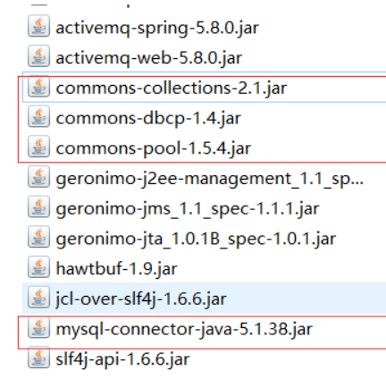
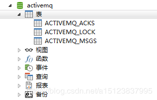

http://activemq.apache.org/persistence

### 一、添加mysql数据库的驱动包到lib文件夹



### 二、jdbcPersistenceAdapter配置/数据库连接池配置

```xml
<broker brokerName="broker">
    <persistenceAdapter>
          <!--<kahaDB directory="activemq-data" journalMaxFileLength="32mb"/>-->
          <!--createTablesOnStartup 启动是否创建表 第一次为true 后续为false-->
          <jdbcPersistenceAdapter dataSource="#activemq-db" createTablesOnStartup="true" />
    </persistenceAdapter>
    <!--JDBC Persistence without Journaling 带缓存的JDBC持久化配置-->
    <!--<persistenceFactory>
        <journalPersistenceAdapterFactory
            journalLogFiles="5"
            journalLogFileSize="32768"
            useJournal="true"
            useQuickJournal="true"
            dataSource="#mysql-ds"
            dataDirectory="activemq-data"/>
	</persistenceFactory>-->
</broker>

<bean id="activemq-db" class="org.apache.commons.dbcp2.BasicDataSource" destroy-method="close"> 
    <property name="driverClassName" value="com.mysql.jdbc.Driver"/> 
    <property name="url" value="jdbc:mysql://localhost/activemq?relaxAutoCommit=true"/> 
    <property name="username" value="activemq"/> 
    <property name="password" value="activemq"/> 
    <property name="poolPreparedStatements" value="true"/> 
</bean> 
```


### 三、建库SQL和创表说明



建一个名为activemq的数据库

表说明:

**ACTIVEMQ_MSGS**

消息表，缺省表名ACTIVEMQ_MSGS，Queue和Topic都存在里面，结构如下

ID：自增的数据库主键<br>CONTAINER：消息的Destination<br>MSGID_PROD：消息发送者的主键<br>MSG_SEQ：是发送消息的顺序，MSGID_PROD+MSG_SEQ可以组成JMS的MessageID<br>EXPIRATION：消息的过期时间，存储的是从1970-01-01到现在的毫秒数<br>MSG：消息本体的Java序列化对象的二进制数据<br>PRIORITY：优先级，从0-9，数值越大优先级越高<br> <br>

**ACTIVEMQ_ACKS**

订阅关系表，若持久化是Topic，订阅者和服务器的订阅关系就在这个表保存》

CONTAINER：消息的Destination<br>

SUB_DEST：如果是使用Static集群，这个字段会有集群其他系统的信息<br>

CLIENT_ID：每个订阅者都必须有一个唯一的客户端ID用以区分<br>

SUB_NAME：订阅者名称<br>

SELECTOR：选择器，可以选择只消费满足条件的消息，条件可以用自定义属性实现，可支持多属性AND和OR操作<br>

LAST_ACKED_ID：记录消费过的消息的ID<br><br>

**ACTIVEMQ_LOCK**

表ACTIVEMQ_LOCK在集群环境下才有用，只有一个Broker可以获取消息，称为Master Broker，其他的只能作为备份等待Master Broker不可用，才可能成为下一个Master Broker。这个表用于记录哪个Broker是当前的Master Broker

### 

### 总结

如果是queue<br>在没有消费者消费的情况下会将消息保存到activemq_msgs表中，只要有任意一个消费者消费了，就会删除消费过的消息<br><br>如果是topic，<br>一般是先启动消费订阅者然后再生产的情况下会将持久订阅者永久保存到qctivemq_acks，而消息则永久保存在activemq_msgs，<br>在acks表中的订阅者有一个last_ack_id对应了activemq_msgs中的id字段，这样就知道订阅者最后收到的消息是哪一条。

`ps:`

在配置关系型数据库作为ActiveMQ的持久化存储方案时，有坑<br> <br>数据库jar包<br>注意把对应版本的数据库jar或者你自己使用的非自带的数据库连接池jar包<br> <br>createTablesOnStartup属性<br>默认为true，每次启动activemq都会自动创建表，在第一次启动后，应改为false，避免不必要的损失。<br><br>java.lang.IllegalStateException: LifecycleProcessor not initialized<br>确认计算机主机名名称没有下划线