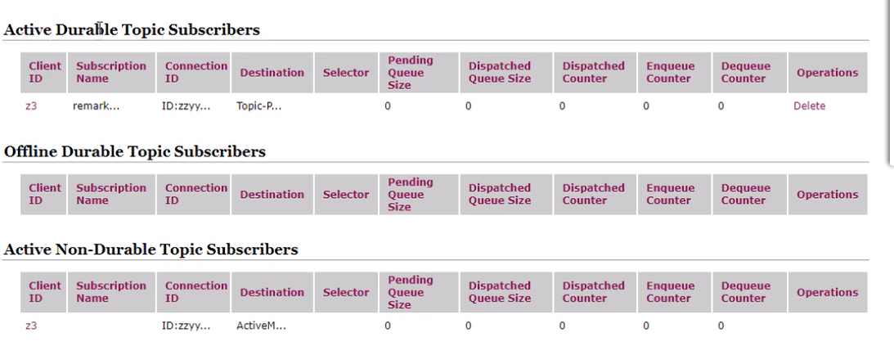

### java_jms

#### DeliveryMode(配送模式持久化)

Queue

```java
//创建Destination 获取消息目的地 Queue
Destination destination = session.createQueue(queueName);

//创建生产者producer
MessageProducer messageProducer = session.createProducer(destination);

//非持久化：当服务器宕机，消息不存在。
//messageProducer.setDeliveryMode(DeliveryMode.NON_PERSISTENT)
//持久化：当服务器宕机，消息依然存在。
messageProducer.setDeliveryMode(DeliveryMode.PERSISTENT)

/**
持久化消息
这是队列的默认传递模式，此模式保证这些消息只被传送一次和成功使用一次。对于这些消息，可靠性是优先考虑的因素。
可靠性的另一个重要方面是确保持久性消息传送至目标后，消息服务在向消费者传送它们之前不会丢失这些消息。
*/
```


Topic

`先启动定阅消费者再启动定阅生产者`

```java
/**持久的发布主题生产者*/

// 获取消息目的地，消息发送给谁
Destination destination = session.createTopic("test-topic");
// 获取消息生产者
MessageProducer producer = session.createProducer(destination);
//
producer.setDeliveryMode(DeliveryMode.PERSISTENT);
```


**Consumer 持久化 变 Subscriber**

```java
/**持久的定阅主题消费者*/

// 构造ConnectionFactory实例对象
ConnectionFactory connectionFactory = new ActiveMQConnectionFactory("tcp://localhost:61616");
// 从工厂获取连接对象
Connection connection = connectionFactory.createConnection();
connection.setClientID("")

// 获取操作连接，一个发送或接收消息的线程
Session session = connection.createSession(Boolean.FALSE, Session.AUTO_ACKNOWLEDGE);
// 获取消息目的地，消息发送给谁
Topic topic = session.createTopic("test-topic");
// 订阅者，消息接收者
//MessageConsumer consumer = session.createConsumer(destination);
TopicSubscriber topicSubscriber = session.createDurableSubscriber(topic,"remark...");

// 启动
connection.start();
```



#### 事务/签收

`false`

只要执行send，就进入到队列中

关闭事务，那第2个签收参数的设置需要有效

`true`

先执行send再执行commit，消息才被真正提交到队列中

消息需要需要批量提交，需要缓冲处理

```java
// 1.创建ConnectionFactory
ConnectionFactory connectionFactory = new ActiveMQConnectionFactory(url);
// 2.由connectionFactory创建connection
Connection connection = connectionFactory.createConnection();
// 3.启动connection
connection.start();
// 4.创建Session===第一个参数是是否事务管理，第二个参数是应答模式/签收模式
Session session = connection.createSession(true, Session.AUTO_ACKNOWLEDGE);
/**`Session.AUTO_ACKNOWLEDGE`自动签收(默认)

`Session.CLIENT_ACKNOWLEDGE`手动签收

`Session.DUPS_OK_ACKNOWLEDGE`允许重复消息*/
....
    
// 8.生产者发送消息
producer.send(tms);
// 9.提交事务
session.commit();
```

>  消费者开启事务，不`commit`，会**重复消费**，切不是真正消费

监听器加入session.rollback();消息进行回滚重传

回滚的过程是消息先出列，然后重发，默认6次，超过次数后进入到死亡队列，（配置持久化数据库的时候，并持久化到数据库一条数据)；

回滚肯定是开启了事务的情况下，那么没有开启事务的情况呢？消息没有确认的情况，消息会停在消息队列中，等待着再次被监听，除非调用session.recover()方法，效果和开启事务并回滚一样会进入死亡队列。

```
session.rollback();//手动的调用此方法进行回滚，抛出异常时实际上事务开启后会自动进行回滚的。
```

调用commit()方法进行提交：值得说的是，在事务模式下，在接收消息没有确认的情况也会出列。完成消息。

```
session.commit();
```

也就是说，开启事务后消息永远不会出现停留在队列的情况，消息会回滚重发，最后到死亡队列中，而不开启事务的情况，只要不使用session.recover()；消息会停留在队列中，不会重发，直至被确认出列。如果调用了recover就和回滚重发一样了。


### Spring_JMS

#### DeliveryMode(配送模式持久化)

applicationContext-activemq.xml  生产者

```xml
<?xml version="1.0" encoding="UTF-8"?>
<beans xmlns="http://www.springframework.org/schema/beans"
       xmlns:xsi="http://www.w3.org/2001/XMLSchema-instance"
       xsi:schemaLocation="http://www.springframework.org/schema/beans
		http://www.springframework.org/schema/beans/spring-beans-3.2.xsd">
       <!-- 扫描包 -->
    <!--<context:component-scan base-package="com.roger.activemq" />-->
       <!-- activeMQ连接工厂 -->
    <bean id="targetConnectionFactory" class="org.apache.activemq.ActiveMQConnectionFactory">
        <property name="brokerURL" value="tcp://localhost:61616"></property>
        <property name="userName" value="admin"></property>
        <property name="password" value="admin"></property>
    </bean>
        <!-- Spring caching连接工厂 -->
    <bean id="connectionFactory" class="org.springframework.jms.connection.CachingConnectionFactory">
        <property name="targetConnectionFactory" ref="targetConnectionFactory"></property>
        <property name="sessionCacheSize" value="100"></property>
    </bean>
        <!-- Spring JmsTemplate 的消息生产者 -->
    <bean id="jmsQueueTemplate" class="org.springframework.jms.core.JmsTemplate" >
        <constructor-arg ref="connectionFactory"/>
        <!-- 队列模式 -->
        <property name="pubSubDomain" value="false"/>
        <!-- 持久化 -->
        <property name="deliveryMode" value="2"/>
        <property name="sessionTransacted" value="true"/>
        <!-- 存活时间 -->
        <!-- <property name="timeToLive" value="6000000"/> -->
        <!-- 开启服务质量的开关   开启之后上面的配置才会生效 -->
        <property name="explicitQosEnabled" value="true"/>
    </bean>
    <bean id="jmsTopicTemplate" class="org.springframework.jms.core.JmsTemplate" >
        <constructor-arg ref="mqConnectionFactory"/>
        <!-- 广播模式 -->
        <property name="pubSubDomain" value="true"/>
        <!-- 持久化 -->
        <property name="deliveryMode" value="2"/>
        <property name="sessionTransacted" value="true"/>
        <!-- 存活时间 -->
        <!-- <property name="timeToLive" value="6000000"/> -->
        <!-- 开启服务质量的开关   开启之后上面的配置才会生效 -->
        <property name="explicitQosEnabled" value="true"/>
    </bean>
</beans>
```

消费者

```xml
<?xml version="1.0" encoding="UTF-8"?>
<beans xmlns="http://www.springframework.org/schema/beans"
       xmlns:xsi="http://www.w3.org/2001/XMLSchema-instance"
       xsi:schemaLocation="http://www.springframework.org/schema/beans
		http://www.springframework.org/schema/beans/spring-beans-3.2.xsd">
       <!-- 扫描包 -->
    <!--<context:component-scan base-package="com.roger.activemq" />-->
       <!-- activeMQ连接工厂 -->
    <bean id="targetConnectionFactory" class="org.apache.activemq.ActiveMQConnectionFactory">
        <property name="brokerURL" value="tcp://localhost:61616"></property>
        <property name="userName" value="admin"></property>
        <property name="password" value="admin"></property>
    </bean>
        <!-- Spring caching连接工厂 -->
    <bean id="connectionFactory" class="org.springframework.jms.connection.CachingConnectionFactory">
        <!-- 标识连接者身份 -->
        <property name="clientId" value="client_001" />
        <property name="targetConnectionFactory" ref="targetConnectionFactory"></property>
        <property name="sessionCacheSize" value="100"></property>
    </bean>
       
    <!--这个是队列目的地-->  
 <!-- 点对点队列 -->
    <bean id="defaultQueueDestination" class="org.apache.activemq.command.ActiveMQQueue">
        <constructor-arg index="0" value="com.zheng.cms.queue.default"/>
    </bean>
    <!-- 一对多队列 -->
    <bean id="defaultTopicDestination" class="org.apache.activemq.command.ActiveMQTopic">
        <constructor-arg index="0" value="com.zheng.cms.topic.default"/>
    </bean>
<!-- 自定义消息监听器 -->  
<bean id="defaultMessageQueueListener" class="com.xx.xx.xx.xx.DefaultMessageQueueListener"/>      
  
<!-- 消息监听容器 -->  
<bean id="jmsContainer" class=" org.springframework.jms.listener.DefaultMessageListenerContainer">
    <property name="connectionFactory" ref="connectionFactory"/>
    <property name="destination" ref="defaultQueueDestination"/>
    <property name="messageListener" ref="defaultMessageQueueListener"/>
</bean>    
    
<bean id="jmsContainerTopic"        class="org.springframework.jms.listener.DefaultMessageListenerContainer">  
    <property name="connectionFactory" ref="connectionFactory" />  
    <property name="destination" ref="defaultTopicDestination" />  
    <property name="messageListener" ref="defaultMessageQueueListener" />  
    <!-- 持久化消息1 -->
    <property name="subscriptionDurable" value="true"/>  
    <property name="clientId" value="client_001" />  
    <property name="durableSubscriptionName" value="client_001"/>
	<!--应答模式是 INDIVIDUAL_ACKNOWLEDGE-->
    <!--AUTO_ACKNOWLEDGE = 1    自动确认
        CLIENT_ACKNOWLEDGE = 2    客户端手动确认
        DUPS_OK_ACKNOWLEDGE = 3    自动批量确认
        SESSION_TRANSACTED = 0    事务提交并确认
        INDIVIDUAL_ACKNOWLEDGE = 4    单条消息确认-->
    <property name="sessionAcknowledgeMode" value="4"/>
    <!--对消息开启事务模式-->
    <property name="sessionTransacted" value="true"/>
</bean>  
</beans>

```

> 消费者相关配置，主要的两点就是clientId和durableSubscriptionName。clientId是针对连接的，而durableSubscriptionName是针对消费者，因为一个连接可以有多个消费者，只有这两个属性才能让生产者记住是哪个连接上的哪个消费者


##### spring中的三种connectionFactory

**SingleConnectionFactory**：顾名思义只会创建一个共享的连接。
**CachingConnectionFactory**：继承了SingleConnectionFactory，所以它拥有SingleConnectionFactory的所有功能，同时它还新增了缓存功能，它可以缓存Session、MessageProducer和MessageConsumer。推荐使用，在并发量不是很高的情况下也是比较实用。
**PooledConnectionFactory**：只会缓存connection，session和productor，不会缓存consumer。并发量高的情况下比较实用。


#### 事务/签收

```xml
<!--配置 消息监听容器-->
    <bean id="jmsContainer" class=" org.springframework.jms.listener.DefaultMessageListenerContainer">
        <property name="connectionFactory" ref="connectionFactory"/>
        <property name="destination" ref="defaultQueueDestination"/>
        <property name="messageListener" ref="defaultMessageQueueListener"/>
        <!--应答模式是 INDIVIDUAL_ACKNOWLEDGE-->
        <!--AUTO_ACKNOWLEDGE = 1    自动确认
        CLIENT_ACKNOWLEDGE = 2    客户端手动确认
        DUPS_OK_ACKNOWLEDGE = 3    自动批量确认
        SESSION_TRANSACTED = 0    事务提交并确认
        INDIVIDUAL_ACKNOWLEDGE = 4    单条消息确认-->
        <property name="sessionAcknowledgeMode" value="4"/>
        <!--对消息开启事务模式-->
        <property name="sessionTransacted" value="true"/>
    </bean>
```


DefaultMessageQueueListener.class

```java
public class DefaultMessageQueueListener implements MessageListener {

    private static final Logger LOGGER = LoggerFactory.getLogger(DefaultMessageQueueListener.class);

    @Autowired
    ThreadPoolTaskExecutor threadPoolTaskExecutor;

    @Override
    public void onMessage(final Message message) {
        // 使用线程池多线程处理
        threadPoolTaskExecutor.execute(new Runnable() {
            @Override
            public void run() {
                TextMessage textMessage = (TextMessage) message;
                try {
                    String text = textMessage.getText();
                    LOGGER.info("消费：{}", text);
                } catch (Exception e) {
                    e.printStackTrace();
                }
            }
        });
    }
}

```


JmsUtil.class

```java
public class JmsUtil {

    /**
     * 发送文本消息
     * @param jmsTemplate
     * @param destination
     * @param textMessage
     */
    public static void sendMessage(JmsTemplate jmsTemplate, Destination destination, final String textMessage) {
        jmsTemplate.send(destination, new MessageCreator() {
            @Override
            public Message createMessage(Session session) throws JMSException {
                return session.createTextMessage(textMessage);
            }
        });
    }

    /**
     * 发送对象消息
     * @param jmsTemplate
     * @param destination
     * @param objectMessage
     */
    public static void sendMessage(JmsTemplate jmsTemplate, Destination destination, final Serializable objectMessage) {
        jmsTemplate.send(destination, new MessageCreator() {
            @Override
            public Message createMessage(Session session) throws JMSException {
                return session.createObjectMessage(objectMessage);
            }
        });
    }

    /**
     * 延迟发送对象消息
     * @param jmsTemplate
     * @param destination
     * @param objectMessage
     * @param delay
     */
    public static void sendMessageDelay(Session session,JmsTemplate jmsTemplate, Destination destination, final Serializable objectMessage, final long delay) {
        jmsTemplate.send(destination, new MessageCreator() {
            @Override
            public Message createMessage(Session session) throws JMSException {
                ObjectMessage om = session.createObjectMessage(objectMessage);
                om.setLongProperty(ScheduledMessage.AMQ_SCHEDULED_DELAY, delay);
                om.setLongProperty(ScheduledMessage.AMQ_SCHEDULED_PERIOD, 1 * 1000);
                om.setLongProperty(ScheduledMessage.AMQ_SCHEDULED_REPEAT, 1);
                return om;
            }
        });
    }
}
```

