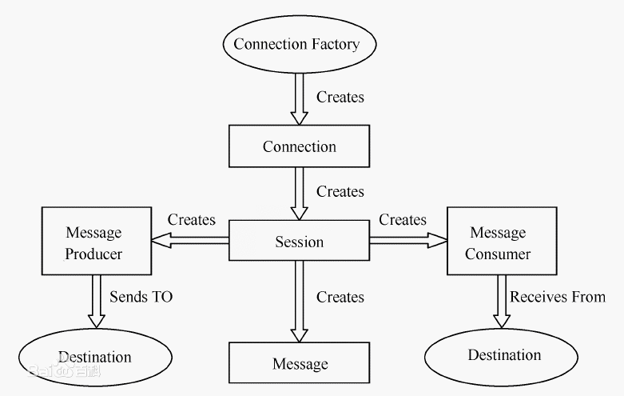
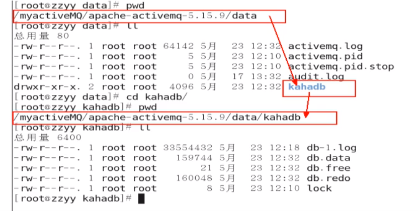
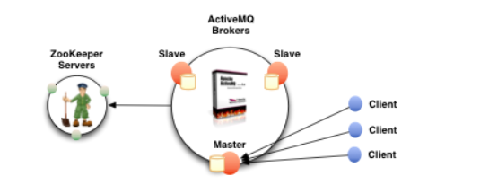
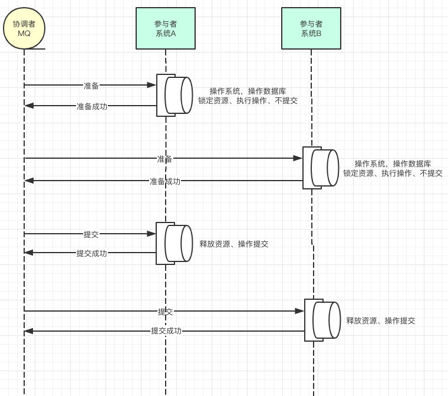

## JMS

什么是Java消息服务

Java消息服务指的是两个应用程序之间进行异步通信的API，它为标准协议和消息服务提供了一组通用接口，包括创建、发送、读取消息等，用于支持Java应用程序开发。在JavaEE中，当两个应用程序使用JMS进行通信时，它们之间不是直接相连的，而是通过一个共同的消息收发服务组件关联起来以达到解耦/异步削峰的效果。

### JMS的组成结构

JMS提供者(JMS Provider)、JMS生产者(JMS Producer)、JMS消费者(JMS Consumer)、JMS消息(JSM Message)

[JMS百度百科](https://baike.baidu.com/item/JMS/2836691?fr=aladdin)


### 对象模型

JMS对象模型包含如下几个要素： 

1）连接工厂。连接工厂（ConnectionFactory）是由管理员创建，并绑定到[JNDI](https://baike.baidu.com/item/JNDI)树中。客户端使用JNDI查找连接工厂，然后利用连接工厂创建一个JMS连接。

2）JMS连接。JMS连接（Connection）表示JMS客户端和服务器端之间的一个活动的连接，是由客户端通过调用连接工厂的方法建立的。

3）JMS会话。JMS会话（Session）表示JMS客户与JMS服务器之间的会话状态。JMS会话建立在JMS连接上，表示客户与服务器之间的一个会话线程。

4）JMS目的。JMS目的（Destination），又称为消息队列，是实际的消息源。

5）JMS生产者和消费者。生产者（Message Producer）和消费者（Message Consumer）对象由Session对象创建，用于发送和接收消息。

6）JMS消息通常有两种类型：

① 点对点（Point-to-Point）。在点对点的消息系统中，消息分发给一个单独的使用者。点对点消息往往与队列（javax.jms.Queue）相关联。

点对点的消息发送方式主要建立在 Message Queue,Sender,reciever上，Message Queue 存贮消息，Sneder 发送消息，receive接收消息.具体点就是Sender Client发送Message Queue ,而 receiver Cliernt从Queue中接收消息和"发送消息已接受"到Quere,确认消息接收。**消息发送客户端与接收客户端没有时间上的依赖，发送客户端可以在任何时刻发送信息到Queue，而不需要知道接收客户端是不是在运行。在此列模型中，消息不是自动推动给客户端的，而是要由客户端从队列中请求获得。**

② 发布/订阅（Publish/Subscribe）。发布/订阅消息系统支持一个事件驱动模型，消息生产者和消费者都参与消息的传递。生产者发布事件，而使用者订阅感兴趣的事件，并使用事件。该类型消息一般与特定的主题（javax.jms.Topic）关联。

pub/sub消息传递模型允许多个主题订阅者接收同一条消息。一个接收端只能接收他创建以后发送客户端发送的信息。作为subscriber ,在接收消息时有两种方法，destination的receive方法，和实现message listener 接口的onMessage 方法。**在该模型中，消息会自动广播，消费者无须通过主动请求或轮询主题的方法来获得新的消息。**




### Queue和Topic比较

1. JMS Queue执行load balancer语义

​    一条消息仅能被一个consumer收到。如果在message发送的时候没有可用的consumer，那么它讲被保存一直到能处理该message的consumer可用。如果一个consumer收到一条message后却不响应它，那么这条消息将被转到另外一个consumer那儿。一个Queue可以有很多consumer，并且在多个可用的consumer中负载均衡。

 

2. Topic实现publish和subscribe语义

​    一条消息被publish时，他将发送给所有感兴趣的订阅者，所以零到多个subscriber将接收到消息的一个拷贝。但是在消息代理接收到消息时，只有激活订阅的subscriber能够获得消息的一个拷贝。

 

3. 分别对应两种消息模式

​    Point-to-Point(点对点)，Publisher/Subscriber Model(发布/订阅者)

​    其中在Publicher/Subscriber模式下又有Nondurable subscription(非持久化订阅)和durable subscription(持久化订阅)两种消息处理方式。


### JMS消息(JSM Message)属性

#### **消息格式**

· StreamMessage -- Java原始值的数据流

· MapMessage--一套名称-值对

· TextMessage--一个字符串对象

· ObjectMessage--一个序列化的 Java对象

· BytesMessage--一个未解释字节的数据流

#### **消息属性**

· JMSDestination -- 消息发送的目的地，主要是指Queue和Topic

· JMSDeliveryMode -- 持久模式和非持久模式

· JMSExpiration -- 过期时间

· JMSPriority -- 优先级 0-9十个级别，0-4是普通消息5-9是加急消息 默认是4级

· JMSMessageID -- 唯一标识每个消息的标识由MQ产生

· StringProperty -- 消息属性 Property


**发送消息的基本步骤：**

(1)、创建连接使用的工厂类JMS ConnectionFactory

(2)、使用管理对象JMS ConnectionFactory建立连接Connection，并启动

(3)、使用连接Connection 建立会话Session

(4)、使用会话Session和管理对象Destination创建消息生产者MessageSender

(5)、使用消息生产者MessageSender发送消息

 

**消息接收者从JMS接受消息的步骤**

(1)、创建连接使用的工厂类JMS ConnectionFactory

(2)、使用管理对象JMS ConnectionFactory建立连接Connection，并启动

(3)、使用连接Connection 建立会话Session

(4)、使用会话Session和管理对象Destination创建消息接收者MessageReceiver

(5)、使用消息接收者MessageReceiver接受消息，需要用setMessageListener将MessageListener接口绑定到MessageReceiver消息接收者必须实现了MessageListener接口，需要定义onMessage事件方法。

[java操作代码演示](../code/java_jms.md)

[spring整合JMS代码演示](https://www.cnblogs.com/liuyuan1227/p/10744278.html)

## 解决了什么问题

异步处理提高系统性能

解耦

削峰 把请求放到队列里面，然后至于每秒消费多少请求，就看自己的服务器处理能力

## 产生的问题

### 一、可靠性

[java、spring整合JMS代码演示](../code/ActiveMQ_Queue和Topic持久性配置.md)

#### PERSISTENT：持久性

DeliveryMode(配送模式持久化)

持久性：当服务器宕机，消息依然存在。

queue

持久化消息
这是队列的默认传递模式，此模式保证这些消息只被传送一次和成功使用一次。对于这些消息，可靠性是优先考虑的因素。
可靠性的另一个重要方面是确保持久性消息传送至目标后，消息服务在向消费者传送它们之前不会丢失这些消息。

topic

先启动定阅消费者再启动定阅生产者

Consumer 持久化 变 Subscriber


> Spring整合JMS，jmsTemplate生产者配置deliveryMode，1为不开启，2为开启PERSISTENT


#### Transaction：事务

事务偏生产者/签收偏消费者

`false`

只要执行send，就进入到队列中

关闭事务，那第2个签收参数的设置需要有效

`true`

先执行send再执行commit，消息才被真正提交到队列中

**批量消息提交**


> 消费者开启事务，不`session.commit`，会**重复消费**，切不是真正消费


监听器加入session.rollback();消息进行回滚重传

回滚的过程是消息先出列，然后重发，默认6次，超过次数后进入到死亡队列，（配置持久化数据库的时候，并持久化到数据库一条数据)；

回滚肯定是开启了事务的情况下，那么没有开启事务的情况呢？消息没有确认的情况，消息会停在消息队列中，等待着再次被监听，除非调用session.recover()方法，效果和开启事务并回滚一样会进入死亡队列。

```
session.rollback();//手动的调用此方法进行回滚，抛出异常时实际上事务开启后会自动进行回滚的。
```

调用commit()方法进行提交：值得说的是，在事务模式下，在接收消息没有确认的情况也会出列。完成消息。

```
session.commit();
```

也就是说，开启事务后消息永远不会出现停留在队列的情况，消息会回滚重发，最后到死亡队列中，而不开启事务的情况，只要不使用session.recover()；消息会停留在队列中，不会重发，直至被确认出列。如果调用了recover就和回滚重发一样了。


#### Acknowledge：签收/答应

事务偏生产者/签收偏消费者

**非事务**

AUTO_ACKNOWLEDGE = 1    自动确认 (默认)
CLIENT_ACKNOWLEDGE = 2    客户端手动确认
DUPS_OK_ACKNOWLEDGE = 3    自动批量确认
SESSION_TRANSACTED = 0    事务提交并确认
INDIVIDUAL_ACKNOWLEDGE = 4    单条消息确认

**事务**

生产事务开启，只有commit后才能将全部消息变为已消费

在事务中，当一个事务被成功提交，则消息会被自动签收
由于消费者开启了事务,没有提交事务(就算手动签收也没用),服务器认为,消费者没有收到消息


点对点模型是基于队列的，生产者发送消息到队列，消费者从队列接收消息，队列的存在使得消息的异步传输成为可能。和我们平时给朋友发送短信类似。<br><br>1：如果在Session关闭时有部分消息被收到但还没有被签收（acknowledge），那当消费者下次连接到相同的队列时，这些消息还会被再次接收<br><br>2：**队列可以长久的保存消息直到消费者收到消息**。消费者不需要因为担心消息会丢失而时刻和队列保持激活的链接状态，充分体现了异步传输模式的优势

非持久订阅只有当客户端处于激活状态，也就是和MQ保持连接状态才能收发到某个主题的消息。<br><br>


持久订阅客户端首先向MQ注册一个自己的身份ID识别号，当这个客户端处于离线时，生产者会为这个ID保存所有发送到主题的消息，当客户再次连接到MQ的时候，会根据消费者的ID得到所有当自己处于离线时发送到主题的消息<br><br>当非持久订阅状态下，不能恢复或重新派送一个未签收的消息。<br><br>持久订阅才能恢复或重新派送一个未签收的消息。


#### [物理]消息存储和持久化

为了避免意外宕机以后丢失信息，需要做到重启后可以恢复消息队列，消息系统一半都会采用持久化机制。<br>ActiveMQ的消息持久化机制有JDBC，AMQ，KahaDB和LevelDB，无论使用哪种持久化方式，消息的存储逻辑都是一致的。<br> <br>就是在发送者将消息发送出去后，消息中心首先将消息存储到本地数据文件、内存数据库或者远程数据库等。再试图将消息发给接收者，成功则将消息从存储中删除，失败则继续尝试尝试发送。<br><br>消息中心启动以后，要先检查指定的存储位置是否有未成功发送的消息，如果有，则会先把存储位置中的消息发出去。

**AMQ Mesage Store(了解）**

AMQ是一种文件存储形式，它具有写入速度快和容易恢复的特点。消息存储再一个个文件中文件的默认大小为32M，当一个文件中的消息已经全部被消费，那么这个文件将被标识为可删除，在下一个清除阶段，这个文件被删除。AMQ适用于ActiveMQ5.3之前的版本

**KahaDB消息存储(默认)**

ActiveMQ5.4

KahaDB是目前默认的存储方式，可用于任何场景，提高了性能和恢复能力。<br>消息存储使用一个**事务日志**和仅仅用一个**索引文件**来存储它所有的地址。<br>KahaDB是一个专门针对消息持久化的解决方案，它对典型的消息使用模型进行了优化。<br>数据被追加到data logs中。当不再需要log文件中的数据的时候，log文件会被丢弃。




KahaDB在消息保存的目录中有4类文件和一个lock，跟ActiveMQ的其他几种文件存储引擎相比，这就非常简洁了。

1，db-<number>.log

KahaDB存储消息到预定大小的数据纪录文件中，文件名为db-<number>.log。当数据文件已满时，一个新的文件会随之创建，number数值也会随之递增，它随着消息数量的增多，如没32M一个文件，文件名按照数字进行编号，如db-1.log，db-2.log······。当不再有引用到数据文件中的任何消息时，文件会被删除或者归档。

2，db.data

该文件包含了持久化的BTree索引，索引了消息数据记录中的消息，是消息的索引文件，本质是BTree，指向了db-<number>.log 里的消息

3，db.free

当前db.data 文件里哪些页面是空闲的，文件具体内容是所有空页面的ID

4，db.redo

用来进行消息恢复，如果KahaDB消息存储在强制退出后启动，用于恢复BTree索引

5， lock 

文件锁，表示当前获得KahaDB读写权限的broker

**JDBC存储消息**

将数据持久化到数据库中。建一个名为activemq的数据库，有三张表ACTIVEMQ_MSGS、ACTIVEMQ_ACKS、ACTIVEMQ_LOCK，如果是queue，在没有消费者消费的情况下会将消息保存到ACTIVEMQ_MSGS表中，只要有任意一个消费者消费了，就会删除消费过的消息。如果是topic，一般是先启动消费订阅者然后再生产的情况下会将持久订阅者永久保存到ACTIVEMQ_ACKS，而消息则永久保存在ACTIVEMQ_MSGS，在acks表中的订阅者有一个last_ack_id对应了activemq_msgs中的id字段，这样就知道订阅者最后收到的消息是哪一条。


[JDBC存储消息配置](../code/ActiveMQ_JDBC持久化.md)

**JDBC Persistence without Journaling**

这种方式克服了JDBC Store的不足，JDBC每次消息过来，都需要去写库读库。<br>ActiveMQ Journal，使用高速缓存写入技术，大大提高了性能。<br><br>当消费者的速度能够及时跟上生产者消息的生产速度时，journal文件能够大大减少需要写入到DB中的消息。<br>举个例子：<br>生产者生产了1000条消息，这1000条消息会保存到journal文件，如果消费者的消费速度很快的情况下，在journal文件还没有同步到DB之前，消费者已经消费了90%的以上消息，那么这个时候只需要同步剩余的10%的消息到DB。如果消费者的速度很慢，这个时候journal文件可以使消息以批量方式写到DB。


### 二、可用性

**集群**



基于zookeeper和LevelDB搭建ActiveMQ集群。集群仅提供主备方式的高可用集群功能，避免单点故障。

**原理：**

使用Zookeeper集群注册所有的ActiveMQ Broker但只有其中一个Broker可以提供服务，它将被视为Master,其他的Broker处于待机状态被视为Slave。<br>如果Master因故障而不能提供服务，Zookeeper会从Slave中选举出一个Broker充当Master。<br>Slave连接Master并同步他们的存储状态，Slave不接受客户端连接。所有的存储操作都将被复制到连接至Maste的Slaves。<br>如果Master宕机得到了最新更新的Slave会变成Master。故障节点在恢复后会重新加入到集群中并连接Master进入Slave模式。<br><br>所有需要同步的消息操作都将等待存储状态被复制到其他法定节点的操作完成才能完成。<br>所以，如给你配置了replicas=3，name法定大小是（3/2）+1 = 2。Master将会存储更新然后等待（2-1）=1个Slave存储和更新完成，才汇报success

容错性

### 三、延时/定时发送

要在activemq.xml中`<broker>`配置schedulerSupport属性为true

Message设置属性，ScheduledMessage类

`message.setLongProperty(ScheduledMessage.AMQ_SCHEDULED_DELAY.delay);`

| Property name        | type   | description                                                  |
| -------------------- | ------ | ------------------------------------------------------------ |
| AMQ_SCHEDULED_DELAY  | long   | 消息在计划由代理传递之前等待的时间(以毫秒为单位)             |
| AMQ_SCHEDULED_PERIOD | long   | 在开始时间之后等待的时间(以毫秒为单位)，在再次调度消息之前等待 |
| AMQ_SCHEDULED_REPEAT | int    | 重复调度传递消息的次数                                       |
| AMQ_SCHEDULED_CRON   | String | 使用Cron条目来设置时间表                                     |

[ActiveMQ_延时or定时发送](../code/ActiveMQ_延时or定时发送.md)


### 四、数据一致性

JTA Java Transaction API

事务是恢复和并发控制的基本单位。

事务应该具有4个属性：原子性、一致性、隔离性、持久性。这四个属性通常称为ACID特性。

原子性（atomicity）：一个事务是一个不可分割的工作单位，事务中包括的操作要么都做，要么都不做。

一致性（consistency）：事务必须是使数据库从一个一致性状态变到另一个一致性状态。一致性与原子性是密切相关的。

隔离性（isolation）：一个事务的执行不能被其他事务干扰。即一个事务内部的操作及使用的数据对并发的其他事务是隔离的，并发执行的各个事务之间不能互相干扰。

持久性（durability）：持久性也称永久性（permanence），指一个事务一旦提交，它对数据库中数据的改变就应该是永久性的。接下来的其他操作或故障不应该对其有任何影响。


#### 分布式事务

[分布式事务中常见的三种解决方案](https://www.cnblogs.com/bluemiaomiao/p/11216380.html)

[分布式事务解决方案之最大努力通知](https://www.cnblogs.com/zeussbook/p/11799017.html)

[ActiveMq实现分布式事务一致性](https://www.cnblogs.com/zdd-java/p/7434831.html)

[基于可靠消息服务的分布式事务](https://blog.csdn.net/liang183691/article/details/102931944)

**最大努力通知型**

> 主动方业务成功后，被动方业务成功是否，不会影响主动方业务回滚。

> 最大努力的将消息通知给接收方，当消息无法被接收方接收时，**由接收方主动查询消息**

特点：

接受消息丢失。

消息重复通知机制。因为被动方可能没有接收到通知，此时要有一定的机制对消息重复通知。

消息校对机制。如果尽最大努力也没有通知到被动方，或者被动方消费消息后要再次消费，此时被动方可以向主动方查询消息信息。

1.业务活动的主动方，在完成业务处理之后，向业务活动的被动方发送消息，**允许消息丢失**。
2.主动方在通知消息失败后，按规则重复通知，直到通知N次后不再通知。
3.主动方提供校对查询接口给被动方按需校对查询，用于恢复丢失的业务消息。
4.业务活动的被动方如果正常接收了数据，就正常返回响应，并结束事务。
5.如果被动方没有正常接收，根据定时策略，向业务活动主动方查询，恢复丢失的业务消息。

思路：

1. 主动方操作数据库成功后，发送消息到MQ，同时把消息内容保存到**通知记录表**中。
2. 被动方监听MQ，得到消息后正常返回响应，**通知记录表**添加标记，不在调用。
3. 主动方，调用被动方的接口，询问是否成功收到消息，并在**通知记录表**更新通知次数。若返回成功，则添加标记，不再调用。调用间隔1min、5min、10min、30min、1h、2h、5h、10h。
4. 被动方可设置消息的手动确认，如果业务处理正常，手动确认，如果处理异常，就不确认了，`session.recover`，这样mq还会发送该消息。重发机制
5. 如果尽最大努力也没有通知到被动方，或者被动方消费消息后要再次消费，此时被动方可以向主动方查询消息信息。主动方调用被动方接口时，证明消息已经发送到MQ，若几次调用后任不成功，被动方可直接查询消息内容


**可靠消息一致性**

> 消息从发出到接收的一致性，即消息发出并且被接收到，消息的可靠性关键**由发起通知方来保证**

特点：

消息预发送机制。在主动方业务操作之前，有个预发送动作，就是把准备发送到MQ的消息保存一份到消息表，添加标记，**待确认**

业务主动方本地事务提交失败，业务被动方不会收到消息的投递。

思路：

1. 在主动方业务操作之前，有个预发送动作，就是把准备发送到MQ的消息保存一份到消息表，添加标记，**待确认**
2. 然后执行主动方业务代码，如果失败: 就回滚,捕捉异常，把预处理的这条数据给删除了,双方数据一致。如果成功: 修改数据的状态,把**待确认**改为**待发送**,再把信息发给MQ,


问题：

问：为什么要增加一个消息`预发送`机制，增加两次发布出去消息的重试机制，为什么不在业务成功之后，发送失败的话使用一次重试机制？

答：如果业务执行成功，再去发消息，此时如果还没来得及发消息，业务系统就已经宕机了，系统重启后，根本没有记录之前是否发送过消息，这样就会导致业务执行成功，消息最终没发出去的情况。


**2pc（两段式提交）** :

在两个系统操作事务的时候都锁定资源但是不提交事务，等两者都准备好了，告诉消息中间件，然后再分别提交事务。




思考：

> 被动方业务失败，会影响主动方已成功的业务/事务回滚
>
> TCC（Try、Confirm、Cancel）

### 五、消息重复消费

幂等性，强校验，流水号

用redis，给消息分配一个全局ID，只要消费过该消息，将<id.message>写入redis，消费者开始消费前，先去redis中查询有没有记录。

**[分布式全局ID](https://mp.weixin.qq.com/s/-_KLEGVmREI5Y2Y5HWImWw)**

雪花算法

生成的是Long类型的ID，一个Long类型占8个字节，每个字节占8比特，也就是说一个Long类型占64个比特。

Snowflake ID组成结构：`正数位`（占1比特）+ `时间戳`（占41比特）+ `机器ID`（占5比特）+ `数据中心`（占5比特）+ `自增值`（占12比特），总共64比特组成的一个Long类型。时间位：可以根据时间进行排序，有助于提高查询速度。

- 第一个bit位（1bit）：Java中long的最高位是符号位代表正负，正数是0，负数是1，一般生成ID都为正数，所以默认为0。
- 时间戳部分（41bit）：毫秒级的时间，不建议存当前时间戳，而是用（当前时间戳 - 固定开始时间戳）的差值，可以使产生的ID从更小的值开始；41位的时间戳可以使用69年，(1L << 41) / (1000L * 60 * 60 * 24 * 365) = 69年
- 工作机器id（10bit）：也被叫做`workId`，这个可以灵活配置，机房或者机器号组合都可以。
- 序列号部分（12bit），自增值支持同一毫秒内同一个节点可以生成4096个ID

### 六、消息丢失

[生产问题](https://blog.csdn.net/u011099093/article/details/83006226)

丢失原因：

1. 生产者与消费者时间不一致
2. 非持久化消息堆积过多且没有消费完时，会因为心跳机制的断开tcp链接，而丢失

这得从 java 的 **java.net.SocketException** 异常说起。简单点说就是当网络发送方发送一堆数据，然后调用close 关闭连接之后。这些发送的数据都在**接收者的缓存**里，接收者如果调用 read 方法仍旧能从缓存中读取这些数据，尽管对方已经关闭了连接。但是当接收者尝试发送数据时，由于此时连接已关闭，所以会发生异常，这个很好理解。

不过需要注意的是，当发生 SocketException 后，原本缓存区中数据也作废了，此时接收者再次调用 read 方法去读取缓存中的数据，就会报 Software caused connection abort: recvfailed 错误。
通过抓包得知，ActiveMQ 会每隔 10 秒发送一个**心跳包**，这个心跳包是服务器发送给客户端的，用来判断客户端死没死。**非持久化消息堆积到一定程度**会写到文件里，这个写的过程会阻塞所有动作，而且会持续 20 到 30 秒，并且随着内存的增大而增大。**当客户端发完消息调用connection.close()时**，会期待服务器对于关闭连接的回答，**如果超过 15 秒没回答就直接调用 socket 层的 close 关闭 tcp 连接了**。这时客户端发出的消息其实还在服务器的缓存里等待处理，不过由于**服务器心跳包的设置**，导致发生了 java.net.SocketException 异常，**把缓存里的数据作废了**，没处理的消息全部丢失。

解决方案：用持久化消息，或者非持久化消息及时处理不要堆积，或者启动事务，启动事务后，commit()方法会负责任的等待服务器的返回，也就不会关闭连接导致消息丢失了。


**增强可靠性**

#### 异步发送，自写回调函数

ActiveMQ默认使用异步发送的模式，除非**明确指定使用同步发送的方式**或者在**未使用事务的前提下发送持久化的消息**，这两种情况都是同步发送的。<br>如果你没有使用事务且发送的是持久化的消息，每一次发送都是同步发送的且会阻塞producer知道broker返回一个确认，表示消息已经被安全的持久化到磁盘。确认机制提供了消息安全的保障，但同时会阻塞客户端带来了很大的延时。<br>

除去我们人为设置的方式，其**默认的选择策略**总结如下：
1.非持久化的消息都是异步发送的。
2.持久化消息在非事务模式下是同步发送的。
3.在开启事务的情况下，消息都是异步发送。

异步发送可能丢失消息，官网配置下：

**Configuring Async Send using a Connection URI**

You can use the Connection Configuration URsends as follows

```java
cf = new ActiveMQConnectionFactory("tcp://locahost:61616?jms.useAsyncSend=true");
```

**Configuring Async Send at the ConnectionFactory Level**

You can enable this feature on the ActiveMQConnectionFactory object using the property.

```java
((ActiveMQConnectionFactory)connectionFactory).setUseAsyncSend(true);
```

**Configuring Async Send at the Connection Level**

Configuring the dispatchAsync setting at this level overrides the settings at the connection factory level.

You can enable this feature on the ActiveMQConnection object using the property.

```java
((ActiveMQConnection)connection).setUseAsyncSend(true);
```


异步发送丢失消息的场景是：生产者设置userAsyncSend=true，使用producer.send(msg)持续发送消息。<br>如果消息不阻塞，生产者会认为所有send的消息均被成功发送至MQ。<br>如果MQ突然宕机，此时生产者端内存中尚未被发送至MQ的消息都会丢失。<br><br>所以，正确的异步发送方法是**需要接收回调的**。<br><br>同步发送和异步发送的区别就在此，<br>同步发送等send不阻塞了就表示一定发送成功了，<br>异步发送需要客户端回执并由客户端再判断一次是否发送成功<br>

```java
ActiveMQMessageProducer.send(tms,new AsyncCallback(){
    @Override
    public void onSuccess(){
        //成功操作
    }
    @Override
    public void onException(JMSException exception){
        //失败操作
    }
});
```


[ActiveMQ_异步发送消息并回调代码演示](../code/ActiveMQ_异步发送消息并回调.md)


#### 消息重发机制

[JMS消息确认与重发机制](https://www.cnblogs.com/liuyuan1227/p/10776189.html)

具体哪些情况会引发消息重发<br>1：Client用了transactions且再session中调用了rollback<br>2：Client用了transactions且再调用commit之前关闭或者没有commit<br>3：Client再CLIENT_ACKNOWLEDGE(客户端手动确认)的传递模式下，session中调用了recover<br> <br>请说说消息重发时间间隔和重发次数<br>间隔：1<br>次数：6<br>每秒发6次<br>有毒消息Poison ACK<br>

一个消息被重发六次(默认最大重发次数)时，消息端会给MQ发送一个“Poison ack”，告诉broker停止重发，broker会把这个消息放到DLQ(死信队列)

<br>

#### 死信队列

**如果你想在消息处理失败后，不被服务器删除，还能被其他消费者处理或重试**，可以关闭
AUTO_ACKNOWLEDGE(自动确认)，将 ack 交由程序自己处理

### 七、消息顺序消费

1. 一个消费成功了再发下一个


2. ActiveMQ从4.x版本起开始支持Exclusive Consumer。 Broker会从多个consumers中挑选一个consumer来处理queue中

   所有的消息，从而保证了消息的有序处理。如果这个consumer失效，那么broker会自动切换到其它的consumer。 

   可以通过DestinationOptions 来创建一个Exclusive Consumer，如下：

   ```java
   queue = new ActiveMQQueue("TEST.QUEUE?consumer.exclusive=true");
   consumer = session.createConsumer(queue);
   ```

   还可以给consumer设置优先级，以便针对网络情况进行优化，如下：

   ```java
   queue = new ActiveMQQueue("TEST.QUEUE?consumer.exclusive=true&consumer.priority=10");
   ```


3. 添加属性`"JMSXGroupID"`

```java
message.setStringProperty("JMSXGroupID","GroupA");
```

Message Groups特性保证所有具有相同JMSXGroupID的消息会被分发到相同的consumer（只要这个consumer保持active）

也是一种负载均衡的机制。在一个消息被分发到consumer之前，broker首先检查消息JMSXGroupID属性。如果存在，那么broker会检查是否有某个consumer拥有这个message group。如果没有，那么broker会选择一个consumer，并将它关联到这个message group。此后，这个consumer会接收这个message group的所有消息，直到：

  1：Consumer被关闭

  2：Message group被关闭，通过发送一个消息，并设置这个消息的JMSXGroupSeq为-1

### 八、ActiveMQ的传输协议

[ActiveMQ传输协议](https://blog.csdn.net/qq_26975307/article/details/100147542)

(默认)Transmission Control Protocol(TCP)<br>        1.这是默认的Broker配置，TCP的Client监听端口61616<br>        2.在网络传输数据前，必须要先序列化数据，消息是通过一个叫wire protocol的来序列化成字节流。<br>        3.TCP连接的URI形式如：tcp://HostName:port?key=value&key=value，后面的参数是可选的。<br>        4.TCP传输的的优点：<br>                (4.1)TCP协议传输可靠性高，稳定性强<br>                (4.2)高效率：字节流方式传递，效率很高<br>                (4.3)有效性、可用性：应用广泛，支持任何平台<br>        5.关于Transport协议的可选配置参数可以参考官网http://activemq.apache.org/configuring-version-5-transports.html

New I/O API Protocol(NIO)<br>      1.NIO协议和TCP协议类似，但NIO更侧重于底层的访问操作。它允许开发人员对同一资源可有更多的client调用和服务器端有更多的负载。<br>      2.适合使用NIO协议的场景：<br>             (2.1)可能有大量的Client去连接到Broker上，一般情况下，大量的Client去连接Broker是被操作系统的线程所限制的。因此，NIO的实现比TCP需要更少的线程去运行，所以建议使用NIO协议。<br>             (2.2)可能对于Broker有一个很迟钝的网络传输，NIO比TCP提供更好的性能。<br>      3.NIO连接的URI形式：nio://hostname:port?key=value&key=value<br>


### ActiveMQ perfetch机制

消息不均匀消费问题，默认预取为1000

解决方案：将 prefetch 设为 1，每次处理 1 条消息，处理完再去取，这样也慢不了多少。

[ActiveMQ prefetch属性](https://blog.csdn.net/a19881029/article/details/85730150)

ActiveMQ使用了　消息”预取限制“(prefetch limit)：表示在某个时间段内，可能向消费者传输的最大消息量，如果达到该上限，那么停止发送，直到ActiveMQ收到消费者的acknowledgements(确认，表示已经处理了该消息)。prefetch limit可以针对每个不同的consumer来设置。
　　为了获取更高的性能，prefetch limit当然是越大越好，只要consumer有足够大的消息缓冲区(messagevolume)。如果消息的总量非常少，而且每个消息的处理时间非常的长，那么，可以将prefetch设置为1，这样，每次向consumer发送一个消息，等其确认已经处理完毕后，再发送第二个。
特别地，如果prefetch设置为0，表示consumer每次　主动向activeMQ要求传输最大的数据量，而不是被动地接收消息。

如何指定prefetech的值：
　　通过指定ActiveMQConnection或ActiveMQConnectionFactory的ActiveMQPretchPolicy来设置所有的pretch值


persistent queues (default value: 1000)
non-persistent queues (default value: 1000)
persistent topics (default value: 100)
non-persistent topics (default value: Short.MAX_VALUE - 1)

### ActiveMQ 储存机制

在通常的情况下，非持久化消息是存储在**内存**中的，持久化消息是存储在**文件**中的，它们的最大限制在配置文件的节点中配置。但是，在非持久化消息堆积到一定程度，内存告急的时候，ActiveMQ 会将内存中的非持久化消息写入**临时文件**中，以腾出内存。虽然都保存到了文件里，但它和持久化消息的区别是，重启后持久化消息会从文件中恢复，非持久化的临时文件会直接删除。
那如果文件增大到达了配置中的最大限制的时候会发生什么？我做了以下实验：
设置 2G 左右的持久化文件限制，大量生产**持久化消息**直到文件达到最大限制，**此时生产者阻塞**，但消费者可正常连接并消费消息，等消息消费掉一部分，文件删除又腾出空间之后，生产者又可继续发送消息，服务自动恢复正常。
设置 2G 左右的临时文件限制，大量生产**非持久化消息**并写入临时文件，在达到最大限制时，生产者阻塞，消费者可正常连接但不能消费消息，或者原本慢速消费的消费者，消费突然停止。整个系统可连接，但是无法提供服务，就这样挂了。
具体原因不详，解决方案：尽量不要用非持久化消息，非要用的话，将临时文件限制尽可能的调大。


### 

