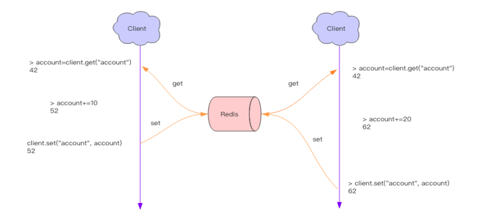

## 应用篇

### Redis 可以做什么？

1、记录帖子的点赞数、 评论数和点击数 (hash)。 
2、 记录用户的帖子 ID 列表 (排序)， 便于快速显示用户的帖子列表 (zset)。
3、 记录帖子的标题、 摘要、 作者和封面信息， 用于列表页展示 (hash)。
4、 记录帖子的点赞用户 ID 列表， 评论 ID 列表， 用于显示和去重计数 (zset)。
5、 缓存近期热帖内容 (帖子内容空间占用比较大)， 减少数据库压力 (hash)。
6、 记录帖子的相关文章 ID， 根据内容推荐相关帖子 (list)。
7、 如果帖子 ID 是整数自增的， 可以使用 Redis 来分配帖子 ID(计数器)。
8、 收藏集和帖子之间的关系 (zset)。
9、 记录热榜帖子 ID 列表， 总热榜和分类热榜 (zset)。
10、 缓存用户行为历史， 进行恶意行为过滤 (zset,hash)。 

### 分布式锁



如果这样的操作同时进行了，就会出现并发问题，因为读取和保存状态这两个操作不是原子的。（ Wiki 解释：所谓原子操作是指不会被线程调度机制打断的操作；这种操作一旦开始，就一直运行到结束，中间不会有任何 context switch 线程切换。） 

#### 分布式本质

保证 setnx 和 expire 组合在一起的原子性。

某个客户端执行setnx加锁，不释放锁会导致死锁，于是在拿到锁之后，expire 给锁设置过期时间，时间到自动释放锁。

```
> setnx lock:codehole true
OK
> expire lock:codehole 5
... do something critical ...
> del lock:codehole
(integer) 1
```

如果在 setnx 和 expire 之间服务器进程突然挂掉了，可能是因为机器掉电或者是被人为杀掉的，就会导致 expire 得不到执行，也会造成死锁。 这种问题的根源就在于 setnx 和 expire 是两条指令而不是原子指令。如果这两条指令可以一起执行就不会出现问题。也许你会想到用 Redis 事务来解决。但是这里不行，因为 expire是依赖于 setnx 的执行结果的，如果 setnx 没抢到锁， expire 是不应该执行的。事务里没有 if-else 分支逻辑，事务的特点是一口气执行，要么全部执行要么一个都不执行。 

Redis 2.8 版本中作者加入了 set 指令的扩展参数，使得 setnx 和expire 指令可以一起执行，彻底解决了分布式锁的乱象。

```xml
> set lock:codehole true ex 5 nx `
 OK ... 
 do something critical ... `
> dellock:codehole `
```

上面这个指令就是 setnx 和 expire 组合在一起的原子指令，它就是分布式锁的奥义所在 .

#### 锁超时问题

因为业务代码耗时过长，超过了锁的超时时间，造成锁自动失效，然后另外一个线程意外的持有了锁。于是就出现了多个线程共同持有锁的现象。

客户端1加锁成功，会启动一个后台线程，每10秒检查一下，是否继续持有锁，要不要延长锁时间 -自动延时机制

[锁掩饰机制、一](https://blog.csdn.net/weixin_33943347/article/details/88009397)
[锁掩饰机制、二](https://www.cnblogs.com/wangzaiplus/p/10864135.html)

#### 可重入性

可重入性是指线程在持有锁的情况下再次请求加锁，如果一个锁支持同一个线程的多次加锁，那么这个锁就是可重入的。比如 Java 语言里有个 ReentrantLock 就是可重入锁。  

可重入加锁机制，对应的加锁次数加1
如果执行lock.unlock()，就可以释放分布式锁，就是对myLock数据结构(客户端ID、加锁次数)中的加锁次数减1。如果发现加锁次数是0了，说明这个客户端已经不再持有锁了，此时就会用：“del myLock”命令，从redis里删除这个key。然后呢，另外的客户端2就可以尝试完成加锁了。-释放锁机制


### 延时队列

Redis 的消息队列不是专业的消息队列，它没有非常多的高级特性，没有 ack 保证，如果对消息的可靠性有着极致的追求，那么它就不适合使用 。

#### 异步消息队列

Redis 的 list(列表) 数据结构常用来作为异步消息队列使用，使用 rpush/lpush操作入队列，使用 lpop 和 rpop 来出队列。 

#### 队列空了怎么办？

通常我们使用 sleep 来解决这个问题，让线程睡一会，睡个 1s 钟就可以了。不但客户端的 CPU 能降下来， Redis 的 QPS 也降下来了。 

#### 队列延时

sleep的方式，会导致队列延时。解决办法：

使用`blpop/brpop`，这两个指令的前缀字符 b 代表的是 blocking，也就是阻塞读。阻塞读在队列没有数据的时候，会立即进入休眠状态，一旦数据到来，则立刻醒过来。消息的延迟几乎为零。用 blpop/brpop 替代前面的 lpop/rpop，就完美解决了上面的问题。 

#### 空闲连接自动断开

如果线程一直阻塞在哪里， Redis 的客户端连接就成了闲置连接，闲置过久，服务器一般会主动断开连接，减少闲置资源占用。这个时候 blpop/brpop 会抛出异常来。
所以编写客户端消费者的时候要小心，注意捕获异常，还要重试。 

#### 异常处理

**直接抛出特定类型的异常** 

这种方式比较适合由用户直接发起的请求，用户看到错误对话框后，会先阅读对话框的内容，再点击重试，这样就可以起到人工延时的效果。如果考虑到用户体验，可以由前端的代码替代用户自己来进行延时重试控制。它本质上是对当前请求的放弃，由用户决定是否重新发起新的请求。 

**sleep 一会再重试**

sleep 会阻塞当前的消息处理线程，会导致队列的后续消息处理出现延迟。如果碰撞的比较频繁或者队列里消息比较多， sleep 可能并不合适。如果因为个别死锁的 key 导致加锁不成功，线程会彻底堵死，导致后续消息永远得不到及时处理 

**将请求转移至延时队列， 过一会再试** 

这种方式比较适合异步消息处理，将当前冲突的请求扔到另一个队列延后处理以避开冲突。 

### 位图

位图就是 byte 数组(btye=8bits、-2^7~2^7-1)。我们可以使用普通的 get/set 直接获取和设置整个位图的内容，也可以使用位图操作 getbit/setbit等将 byte 数组看成「位数组」来处理。 

### HyperLogLog

HyperLogLog 提供了两个指令 pfadd 和 pfcount，根据字面意义很好理解，一个是增加计数，一个是获取计数。 pfadd 用法和 set 集合的 sadd 是一样的，来一个用户 ID，就将用户 ID 塞进去就是。 pfcount 和 scard 用法是一样的，直接获取计数值。 pfmerge，用于将多个 pf 计数值累加在一起形成一个新的 pf 值。 解决很多精确度不高的统计需求 

需要占据一定 12k 的存储空间 

### 布隆过滤器

解决去重问题。缓存穿透(请求缓存中不存在**的数据，导致所有的请求都怼到数据库上，从而数据库连接异常)

可以理解为一个不怎么精确的 set 结构，当你使用它的 contains 方法判断某个对象是否存在时，它可能会误判。但是布隆过滤器也不是特别不精确，只要参数设置的合理，它的精确度可以控制的相对足够精确，只会有小小的误判概率 。

布隆过滤器有二个基本指令， bf.add 添加元素， bf.exists 查询元素是否存在，它的用法和 set 集合的 sadd 和 sismember 差不多。注意 bf.add 只能一次添加一个元素，如果想要一次添加多个，就需要用到 bf.madd 指令。同样如果需要一次查询多个元素是否存在，就需要用到 bf.mexists 指令。 

#### 原理


每个布隆过滤器对应到 Redis 的数据结构里面就是一个大型的位数组和几个不一样的无偏 hash 函数。所谓无偏就是能够把元素的 hash 值算得比较均匀。 

`bf.add`操作时，会使用多个 hash 函数对 key 进行 hash 算得一个整数索引值然后对位数组长度进行取模运算得到一个位置，每个 hash 函数都会算得一个不同的位置。再把位数组的这几个位置都置为 1 就完成了 add 操作 。

`bf.exists `时，把 hash 的几个位置都算出来，看看位数组中这几个位置是否都位 1，只要有一个位为 0，那么说明布隆过滤器中这个key 不存在。如果都是 1，这并不能说明这个 key 就一定存在，只是极有可能存在 。


## 原理篇

### 线程IO模型

Redis 快的原因：单线程、内存级别运算、非组塞IO多路复用(事件轮询)

#### 非阻塞IO

当我们调用套接字的读写方法，默认它们是**阻塞**的，比如 read 方法要传递进去一个参数n，表示读取这么多字节后再返回，如果没有读够线程就会卡在那里，直到新的数据到来或者连接关闭了， read 方法才可以返回，线程才能继续处理。而 write 方法一般来说不会阻塞，除非内核为套接字分配的写缓冲区已经满了， write 方法就会阻塞，直到缓存区中有空闲空间挪出来了 

```java
data = socket.read(); 
```

**非阻塞 IO** 在套接字对象上提供了一个选项 Non_Blocking，当这个选项打开时，读写方法不会阻塞，而是能读多少读多少，能写多少写多少。能读多少取决于内核为套接字分配的读缓冲区内部的数据字节数，能写多少取决于内核为套接字分配的写缓冲区的空闲空间字节数。读方法和写方法都会通过返回值来告知程序实际读写了多少字节。
有了非阻塞 IO 意味着线程在读写 IO 时可以不必再阻塞了，读写可以瞬间完成然后线程可以继续干别的事了 

**多路复用IO模型**

在多路复用IO模型中，会有一个线程（Java中的Selector）**不断去轮询**多个socket的状态，只有当socket真正有读写事件时，才真正调用实际的IO读写操作。因为在多路复用IO模型中，只需要使用一个线程就可以管理多个socket，系统不需要建立新的进程或者线程，也不必维护这些线程和进程，并且只有在真正有socket读写事件进行时，才会使用IO资源，所以它大大减少了资源占用。

**其实多路复用的实现有多种方式：select、poll、epoll**，Java中的Selector和Linux中的epoll都是这种模型。

select 过程：

1. 当进程调用select，同时提供一个 timeout 参数，如果没有任何事件到来，那么就最多等待 timeout 时间，线程处于阻塞状态。 进程会被阻塞
2. 此时内核会监视所有select负责的的socket，当socket的数据准备好后，就立即返回。
3. 进程再调用read操作，数据就会从内核拷贝到进程。

#### 指令队列

Redis 会将每个客户端套接字都关联一个指令队列。客户端的指令通过队列来排队进行顺序处理，先到先服务。 

#### 响应队列

Redis 同样也会为每个客户端套接字关联一个响应队列。 Redis 服务器通过响应队列来将指令的返回结果回复给客户端。 


### 持久化

Redis 的持久化机制有两种，第一种是**快照**，第二种是 **AOF 日志**。快照是一次全量备份， AOF 日志是连续的增量备份。快照是**内存数据的二进制序列化形式**，在存储上非常紧凑，而 AOF 日志记录的是**内存数据修改的指令记录文本**。 AOF 日志在长期的运行过程中会变的无比庞大，数据库重启时需要加载 AOF 日志进行指令重放，这个时间就会无比漫长。所以需要**定期进行 AOF 重写，给 AOF 日志进行瘦身**。 

#### 快照原理

Redis 使用操作系统的多进程 COW(Copy On Write) 机制来实现快照持久化。

Redis 在持久化时会调用 glibc 的函数 fork 产生一个子进程，快照持久化完全交给子进程来处理，父进程继续处理客户端请求。 

> glibc是[linux系统](https://baike.baidu.com/item/linux系统/1732935)中最底层的[api](https://baike.baidu.com/item/api/10154)，几乎其它任何运行库都会依赖于glibc

子进程与父共享数据，将子线程创建一瞬间的数据序列化写到磁盘中 。

#### AOF原理

AOF 日志存储的是 Redis 服务器的顺序指令序列， AOF 日志只记录对内存进行修改的指令记录 

Redis 会在收到客户端修改指令后，先进行参数校验，如果没问题，就立即将该指令文本存储到 AOF 日志中，也就是**先存到磁盘，然后再执行指令。** 

**AOF重写**原理就是开辟一个子进程对内存进行遍历转换成一系列 Redis 的操作指令，序列化到一个新的 AOF 日志文件中。
序列化完毕后再将操作期间发生的增量 AOF 日志追加到这个新的 AOF 日志文件中，追加完毕后就立即替代旧的 AOF 日志文件了，瘦身工作就完成了。 

#### fsync

AOF 日志是以文件的形式存在的，当程序对 AOF 日志文件进行写操作时，实际上是**将内容写到了内核为文件描述符分配的一个内存缓存中，然后内核会异步将脏数据刷回到磁盘的**。 

这就意味着如果机器突然宕机， AOF 日志内容可能还没有来得及完全刷到磁盘中，这个时候就会出现日志丢失。那该怎么办？
Linux 的 glibc 提供了 fsync(int fd)函数可以**将指定文件的内容强制从内核缓存刷到磁盘**。只要 Redis 进程实时调用 fsync 函数就可以保证 aof 日志不丢失。但是 fsync 是一个磁盘 IO 操作，它很慢！如果 Redis 执行一条指令就要 fsync 一次，那么 Redis 高性能的地位就不保了。

所以在生产环境的服务器中， Redis 通常是每隔 1s 左右执行一次 fsync 操作，周期 1s是可以配置的。这是在数据安全性和性能之间做了一个折中，在保持高性能的同时，尽可能使得数据少丢失。

Redis 同样也提供了另外两种策略，**一个是永不 fsync**——让操作系统来决定合适同步磁盘，很不安全，另一个是**来一个指令就 fsync 一次**——非常慢。但是在生产环境基本不会使用，了解一下即可。

#### 运维

快照是通过开启子进程的方式进行的，它是一个比较耗资源的操作。遍历整个内存，大块写磁盘会加重系统负载
AOF 的 fsync 是一个耗时的 IO 操作，它会降低 Redis 性能，同时也会增加系统 IO 负担


所以通常 Redis 的**主节点是不会进行持久化操作**，持久化操作主要在从节点进行。从节点是备份节点，没有来自客户端请求的压力，它的操作系统资源往往比较充沛 


#### 混合持久化

Redis 4.0 为了解决这个问题，带来了一个新的持久化选项——混合持久化。将 rdb 文件的内容和增量的 AOF 日志文件存在一起。这里的 AOF 日志不再是全量的日志，而是**自持久化开始到持久化结束的这段时间发生的增量 AOF 日志**，通常这部分 AOF 日志很小。于是在 Redis 重启的时候，可以先加载 rdb 的内容，然后再重放增量 AOF 日志就可以完全替代之前的 AOF 全量文件重放，重启效率因此大幅得到提升。 


### 主从同步

#### CAP原理

C - Consistent ， 一致性
A - Availability ， 可用性
P - Partition tolerance ， 分区容忍性 

网络分区发生时，一致性和可用性两难全 。

> 分布式系统的节点往往都是分布在不同的机器上进行网络隔离开的，这意味着必然会有网络断开的风险，这个网络断开的场景的专业词汇叫着「 **网络分区**」。 

Redis 满足「 可用性」 ，保证「 **最终**一致性」 。

#### 主从同步

Redis 同步支持主从同步和从从同步 

#### 增量同步

主节点会将那些对自己的**状态产生修改性影响**的**指令记录**在本地的内存 buffer 中，然后**异步**将 buffer 中的指令同步到从节点，从节点一边执行同步的指令流来达到和主节点一样的状态，一边**向主节点反馈自己同步到哪里了 (偏移量)**。 
Redis 的复制内存 buffer 是一个定长的**环形数组**，如果数组内容满了，就会从头开始覆盖前面的内容 。

#### 快照同步

非常耗费资源的操作 

它首先需要在主库上进行一次 bgsave 将当前内存的数据全部快照到磁盘文件中，然后再将快照文件的内容全部传送到从节点。从节点将快照文件接受完毕后，立即执行一次全量加载，**加载之前先要将当前内存的数据清空**。加载完毕后通知主节点继续进行增量同步。 

会导致快照复制死循环

#### 增加从节点

当从节点刚刚加入到集群时，它必须先要进行一次**快照同步**，同步完成后再继续进行**增量同步** 


### 集群Cluster

中心化的 ，三个节点相互连接组成一个对等的集群，它们之间通过一种特殊的**二进制协议**相互交互集群信息。 

Cluster 将所有数据划分为 16384 的 slots ，当 Redis Cluster 的客户端来连接集群时，它也会得到一份集群的槽位配置信息。这样当客户端要查找某个 key 时，可以直接定位到目标节点 。

#### 跳转

当客户端向一个错误的节点发出了指令，该节点会发现指令的 key 所在的槽位并不归自己管理，这时它会向客户端发送一个特殊的跳转指令携带目标操作的节点地址，告诉客户端去连这个节点去获取数据。 

#### 迁移


Redis 迁移的单位是槽， Redis 一个槽一个槽进行迁移，当一个槽正在迁移时，这个槽就处于中间过渡状态。 

#### 容错

每个主节点可以设置若干个从节点，单主节点故障时，集群会**自动将其中某个从节点提升为主节点**。如果某个主节点没有从节点，那么当它发生故障时，集群将完全处于不可用状态。

不过 Redis 也提供了一个参数 cluster-require-full-coverage 可以允许部分节点故障，其它节点还可以继续提供对外访问。 

#### 网络抖动

发生网络抖动时，Redis Cluster 提供了一种选项 cluster-node-timeout，表示当某个节点持续 timeout 的时间失联时，才可以认定该节点出现故障，需要进行主从切换。**如果没有这个选项，网络抖动会导致主从频繁切换 (数据的重新复制)**。 

选项 cluster-slave-validity-factor 作为倍乘系数来放大这个超时时间来宽松错的紧急程度。如果这个系数为零，那么主从切换是不会抗拒网络抖动的。如果这个系数大于 1，它就成了主从切换的松弛系数。 

#### 可能下线 (PFAIL-Possibly Fail) 与确定下线 (Fail) 

因为 Redis Cluster 是去中心化的，只有当大多数节点都认定了某个节点失联了，集群才认为该节点需要进行主从切换来容错 

