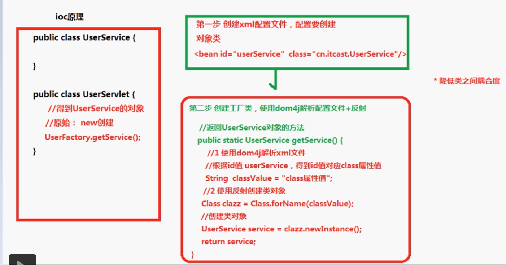
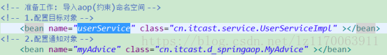
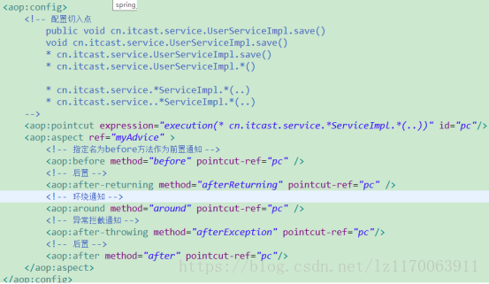
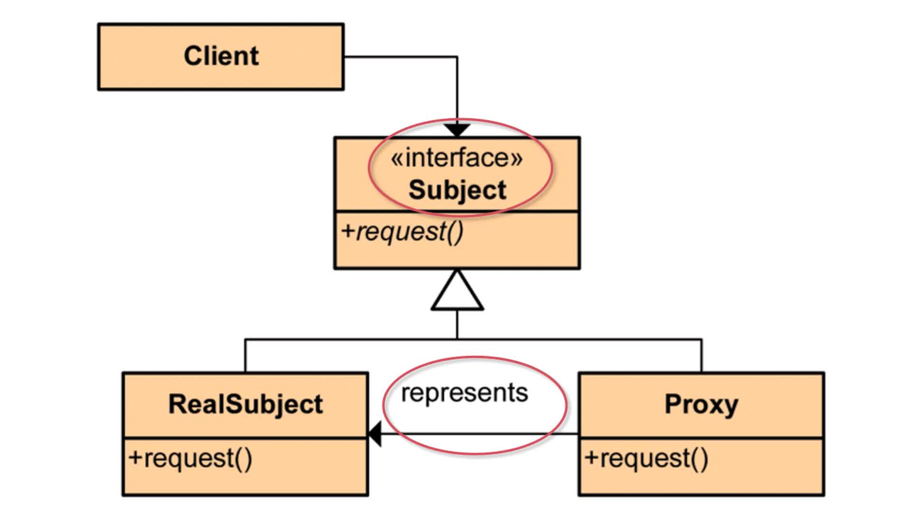
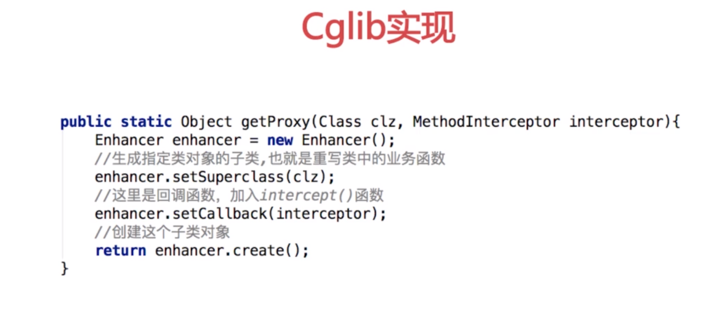
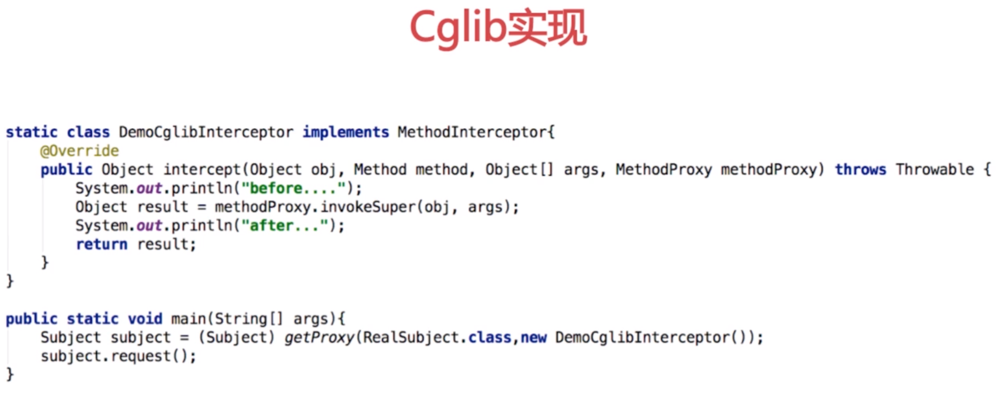

## Spring学习笔记


[TOC]


### 1.0.概述

Spring框架是一个开源的JAV平台，它最初是由Rod Johnson编写，2003年6月在Apache 2.0 许可下发布。

##### 1.1使用Spring框架的好处

- 方便解耦，简化开发
	

通过Spring提供的IoC容器，可以将对象之间的依赖关系交由Spring进行控制，避免硬编码所造成的过度程序耦合。

- AOP编程的支持

通过Spring提供的AOP功能，方便进行面向切面的编程，如性能监测、事务管理、日志记录等。
	
- 声明式事务的支持
- 方便集成各种优秀框架

##### 1.2特点

* 控制反转  IOC（Inversion of Control）

所谓的控制反转，就是指将对象的创建，对象的存储(map)，对象的管理(依赖查找,依赖注入)交给了spring容器。

* 依赖注入 DI  （Dependency Injection）

Spring 最认同的技术是控制反转的依赖注入（DI）Dependency Injection模式。控制反转（IoC）`Inversion of Control` 是一个通用的概念，它可以用许多不同的方式去表达，依赖注入仅仅是控制反转的一个具体的例子。`Spring框架通过DI实现了IoC，DI是实现手段，而IoC是实现的目标。`
依赖注入，即组件之间的依赖关系由容器在应用系统运行期来决定，也就是由容器动态地将某种依赖关系的目标对象实例注入到应用系统中的各个关联的组件之中。**简单来说，所谓的依赖注入其实就是，在创建对象的同时或之后，如何给对象的属性赋值。**

* 面向方面的程序设计（AOP）
是将纵向重复的代码，横向抽取出来。事务管理、安全检查、缓存、权限管理等

### 2.0体系结构

### 3.0创建Spring-java工程（eclipse）

创建`Maven Project`，创建时勾选`Create a simple project`，**Group Id**输入`cn.fyy.spring`，**Artifact Id**输入`SPRING-01`(本应该也是包名的一部分，但是，暂且作为项目名)，**Packaging**选择`war`(也可以是jar，后续实际使用的其实都会是war)。

创建出来的项目默认没有**web.xml**文件，作为WEB项目来说是错误的，所以，需要先生成该文件。

然后，需要添加所以依赖的框架，在**pom.xml**中添加`<dependencies>`节点，然后，在子级中添加`spring-webmvc`的依赖(其实，目前只要使用`spring-context`依赖，而`spring-webmvc`中包含该依赖，后续学习SpringMVC框架时就必须使用`spring-webmvc`)：

	<dependency>
		<groupId>org.springframework</groupId>
		<artifactId>spring-webmvc</artifactId>
		<version>4.3.8.RELEASE</version>
	</dependency>

目前，对使用的Spring的要求是**不低于4.2版本**。

当项目创建完成后，将文件**applicationContext.xml**复制到项目中的**src/main/resources**中。

假设希望通过Spring创建`java.util.Date`类的对象，则应该在**applicationContext.xml**中添加配置：

	<!-- id:当从Spring容器中获取该对象时使用的名称 -->
	<!-- class:需要创建的类 -->
	<bean id="date" class="java.util.Date"></bean>

接下来，可以通过单元测试查看配置效果，需要先添加单元测试的依赖：

	public class TestCase {
	
		@Test
		public void getDate() {
			// 1. 加载Spring配置文件，获得Spring容器
			ClassPathXmlApplicationContext ac
				= new ClassPathXmlApplicationContext(
					"applicationContext.xml");
			
			// 2. 从Spring容器中获取对象
			Date date = (Date) ac.getBean("date");
			
			// 3. 测试所获取的对象
			System.out.println(date);
			
			// 4. 关闭Spring容器，释放资源
			ac.close();
		}
		
	}

### 4.0通过Spring创建对象的方式
**(a) 类中存在无参数的构造方法（实用，掌握）**

以`java.util.Date`类为例，当Spring创建对象时，会自动调用其无参数构造方法。

在Spring的配置文件中，配置方式为：

	<bean id="date" class="java.util.Date"></bean>

如果某个类中并不存在无参数的构造方法，则不可以通过这种方式进行配置。

**(b) 类中存在静态工厂方法（不实用，了解）**

如果某个类中存在某个`static`修饰的方法，且方法的返回值类型就是当前类的类型，例如`java.util.Calendar`类就是如此：

	public abstract class Calendar {
		public static Calendar getInstance() {
			// ...
		}
	}	

符合这种条件的类，可以配置为：

	<!-- (b) 类中存在静态工厂方法 -->
	<!-- factory-method:工厂方法的名称 -->
	<bean id="calendar" 
		class="java.util.Calendar"
		factory-method="getInstance">
	</bean>

**(c) 存在实例工厂方法（更不实用，了解）**

在其他类中，存在某个工厂方法，可以创建指定的类的对象，例如：

	public class Phone {
		public Phone(String name) {
		}
	}
	
	public class PhoneFactory {
		public Phone newInstance() {
			return new Phone("HuaWei");
		}
	}

当需要Spring创建`Phone`对象时，可以让Spring先创建`PhoneFactory`的对象(实例)，然后调用该对象的`newInstance()`方法，即可获取`Phone`的对象，从而完成对象的创建过程。

具体配置为：

	<!-- (c) 存在实例工厂方法 -->
	<!-- factory-bean:配置为工厂类的bean-id -->
	<bean id="phoneFactory" 
		class="cn.fyy.spring.PhoneFactory">
	</bean>
	<bean id="phone"
		class="cn.fyy.spring.Phone"
		factory-bean="phoneFactory"
		factory-method="newInstance">
	</bean>

## Spring bean

### 什么是 bean？

简单来说，bean 代指的就是那些被 IoC 容器所管理的对象。

我们需要告诉 IoC 容器帮助我们管理哪些对象，这个是通过配置元数据来定义的。配置元数据可以是 XML 文件、注解或者 Java 配置类。

```xml
<!-- Constructor-arg with 'value' attribute -->
<bean id="..." class="...">
   <constructor-arg value="..."/>
</bean>
```

下图简单地展示了 IoC 容器如何使用配置元数据来管理对象。


`org.springframework.beans`和 `org.springframework.context` 这两个包是 IoC 实现的基础，如果想要研究 IoC 相关的源码的话，可以去看看

### bean 的作用域有哪些?

Spring 中 Bean 的作用域通常有下面几种：

- **singleton** : 唯一 bean 实例，Spring 中的 bean 默认都是单例的，对单例设计模式的应用。
- **prototype** : 每次请求都会创建一个新的 bean 实例。
- **request** : 每一次 HTTP 请求都会产生一个新的 bean，该 bean 仅在当前 HTTP request 内有效。
- **session** : 每一次来自新 session 的 HTTP 请求都会产生一个新的 bean，该 bean 仅在当前 HTTP session 内有效。
- **global-session** ： 全局 session 作用域，仅仅在基于 portlet 的 web 应用中才有意义，Spring5 已经没有了。Portlet 是能够生成语义代码(例如：HTML)片段的小型 Java Web 插件。它们基于 portlet 容器，可以像 servlet 一样处理 HTTP 请求。但是，与 servlet 不同，每个 portlet 都有不同的会话。

**如何配置 bean 的作用域呢？**

xml 方式：

```xml
<bean id="..." class="..." scope="singleton"></bean>
```

注解方式：

```java
@Bean
@Scope(value = ConfigurableBeanFactory.SCOPE_PROTOTYPE)
public Person personPrototype() {
    return new Person();
}
```

### 单例 bean 的线程安全问题了解吗？

大部分时候我们并没有在项目中使用多线程，所以很少有人会关注这个问题。单例 bean 存在线程问题，主要是因为当多个线程操作同一个对象的时候是存在资源竞争的。

常见的有两种解决办法：

1. 在 bean 中尽量避免定义可变的成员变量。
2. 在类中定义一个 `ThreadLocal` 成员变量，将需要的可变成员变量保存在 `ThreadLocal` 中（推荐的一种方式）。

不过，大部分 bean 实际都是无状态（没有实例变量）的（比如 Dao、Service），这种情况下， bean 是线程安全的。

### @Component 和 @Bean 的区别是什么？

1. `@Component` 注解作用于类，而`@Bean`注解作用于方法。
2. `@Component`通常是通过类路径扫描来自动侦测以及自动装配到 Spring 容器中（我们可以使用 `@ComponentScan` 注解定义要扫描的路径从中找出标识了需要装配的类自动装配到 Spring 的 bean 容器中）。`@Bean` 注解通常是我们在标有该注解的方法中定义产生这个 bean,`@Bean`告诉了 Spring 这是某个类的实例，当我需要用它的时候还给我。
3. `@Bean` 注解比 `@Component` 注解的自定义性更强，而且很多地方我们只能通过 `@Bean` 注解来注册 bean。比如当我们引用第三方库中的类需要装配到 `Spring`容器时，则只能通过 `@Bean`来实现。

`@Bean`注解使用示例：

```java
@Configuration
public class AppConfig {
    @Bean
    public TransferService transferService() {
        return new TransferServiceImpl();
    }

}
```

上面的代码相当于下面的 xml 配置

```xml
<beans>
    <bean id="transferService" class="com.acme.TransferServiceImpl"/>
</beans>
```

下面这个例子是通过 `@Component` 无法实现的。

```java
@Bean
public OneService getService(status) {
    case (status)  {
        when 1:
                return new serviceImpl1();
        when 2:
                return new serviceImpl2();
        when 3:
                return new serviceImpl3();
    }
}
```

### 将一个类声明为 bean 的注解有哪些?

我们一般使用 `@Autowired` 注解自动装配 bean，要想把类标识成可用于 `@Autowired` 注解自动装配的 bean 的类,采用以下注解可实现：

- `@Component` ：通用的注解，可标注任意类为 `Spring` 组件。如果一个 Bean 不知道属于哪个层，可以使用`@Component` 注解标注。
- `@Repository` : 对应持久层即 Dao 层，主要用于数据库相关操作。
- `@Service` : 对应服务层，主要涉及一些复杂的逻辑，需要用到 Dao 层。
- `@Controller` : 对应 Spring MVC 控制层，主要用户接受用户请求并调用 Service 层返回数据给前端页面。

### bean 的生命周期?

> 下面的内容整理自：<https://yemengying.com/2016/07/14/spring-bean-life-cycle/> ，除了这篇文章，再推荐一篇很不错的文章 ：<https://www.cnblogs.com/zrtqsk/p/3735273.html> 。
>
> 单点说就是：bean的实例化–>bean的初始化–>bean的使用–>bean的销毁

- Bean 容器找到配置文件中 Spring Bean 的定义。
- Bean 容器利用 Java Reflection API 创建一个 Bean 的实例。
- 如果涉及到一些属性值 利用 `set()`方法设置一些属性值。
- 如果 Bean 实现了 `BeanNameAware` 接口，调用 `setBeanName()`方法，传入 Bean 的名字。
- 如果 Bean 实现了 `BeanClassLoaderAware` 接口，调用 `setBeanClassLoader()`方法，传入 `ClassLoader`对象的实例。
- 如果 Bean 实现了 `BeanFactoryAware` 接口，调用 `setBeanFactory()`方法，传入 `BeanFactory`对象的实例。
- 与上面的类似，如果实现了其他 `*.Aware`接口，就调用相应的方法。
- 如果有和加载这个 Bean 的 Spring 容器相关的 `BeanPostProcessor` 对象，执行`postProcessBeforeInitialization()` 方法
- 如果 Bean 实现了`InitializingBean`接口，执行`afterPropertiesSet()`方法。
- 如果 Bean 在配置文件中的定义包含 init-method 属性，执行指定的方法。
- 如果有和加载这个 Bean 的 Spring 容器相关的 `BeanPostProcessor` 对象，执行`postProcessAfterInitialization()` 方法
- 当要销毁 Bean 的时候，如果 Bean 实现了 `DisposableBean` 接口，执行 `destroy()` 方法。
- 当要销毁 Bean 的时候，如果 Bean 在配置文件中的定义包含 destroy-method 属性，执行指定的方法。

图示：


与之比较类似的中文版本:


## 

### Spring MVC的工作流程

（1）用户发送请求至前端控制器DispatcherServlet； 

（2） DispatcherServlet收到请求后，调用HandlerMapping处理器映射器， 请求获取Handler； 

（3）处理器映射器根据请求url找到具体的处理器，生成处理器对象及处理器拦 截器(如果有则生成)一并返回给DispatcherServlet； 

（4）DispatcherServlet 调用 HandlerAdapter处理器适配器；

（5）HandlerAdapter 经过适配调用 具体处理器(Handler，也叫后端控制器)； 

（6）Handler执行完成返回ModelAndView； 

（7）HandlerAdapter将Handler执行结果ModelAndView返回给 DispatcherServlet； 

（8）DispatcherServlet将ModelAndView传给ViewResolver视图解析器进行 解析；

（9）ViewResolver解析后返回具体View； 

（10）DispatcherServlet对View进行渲染视图（即将模型数据填充至视图中） 

（11）DispatcherServlet响应用户。


### 5.0 由Spring管理的对象的作用域与生命周期

**(a)  由Spring管理的对象的作用域**

单例：单一实例，在某个时刻，可以获取到的同一个类的对象将有且仅有1个，如果反复获取，并不会得到多个实例。

单例是一种设计模式，其代码格式可以是：

	public class King {
		private static King king = new King();
	
		private King() {
		}
	
		public static King getInstance() {
			return king;
		}
	}

以上单例模式也称之为“饿汉式单例模式”，其工作特性为“程序运行初期就已经创建了该类的实例，随时获取实例时，都可以直接获取”，还有另外一种单例模式是“懒汉式单例模式”，其工作特性为“不到逼不得已不会创建类的对象”，其代码是：

	public class King {
		private static final Object LOCK = new Object();
	
		private static King king;
	
		private King() {
		}
	
		public static King getInstance() {
			if (king == null) {
				synchronized (LOCK) {
					if (king == null) {
						king = new King();
					}
				}
			}
			return king;
		}
	}

理论上来说，懒汉式的单例模式可能可以节省一部分性能消耗，例如整个系统运行了30分钟之后才获取对象的话，则前30分钟是不需要创建对象的！但是，这种优势只是理论上的优势，在实际应用时，2种单例模式的差异表现的并不明显！

通过以上单例模式的设计方式，可以发现单例的对象都是使用了`static`修饰的！所以，具有“唯一、常驻”的特性！

在Spring管理对象时，可以配置`lazy-init`属性，以配置是否为懒汉式的单例模式：

	<!-- lazy-init：是否懒加载，取值为true或false(默认) -->
	<bean id="user" 
		class="cn.fyy.spring.User"
		lazy-init="true">
	</bean>

在Spring管理对象时，可以配置`scope`属性，以配置类的对象是否是单例的：

	<!-- scope:是否单例，取值为singleton(默认，单例)或prototype(非单例) -->
	<bean id="user" 
		class="cn.fyy.spring.User"
		scope="prototype">
	</bean>

  Ps:

> scope属性:
>
> ​	(1)singleton   默认值   
> ​	单例对象   :被标识为单例的对象在spring容器中只会存在一个实例
> ​    (2)prototype    
> ​	多例原型:被标识为多例的对象,每次在获得才会被创建,每次创建都是新的对象
> ​    (3)request
> ​	Web环境下,对象与request生命周期一致    
> ​    (4)session
> Web环境下,对象与session生命周期一致
>
> ​	(5)global session
>
> ​	 每个全局的HTTP Session对应一个Bean实例。在典型的情况下，仅在使用portlet context的时候有效，同样只在Web应用中有效。
>
> 总结:绝大多数情况下，使用单例singleton(默认值)，但是在与struts整合时候，务必要用prototype多例，因为struts2在每次请求都会创建一个新的Action，若为单例，在多请求情况下，每个请求找找spring拿的都是同一个action。


**(b) 由Spring管理的对象的生命周期**

生命周期描述了某个对象从创建到销毁的整个历程，在这个历程中，会被调用某些方法，这些方法就是生命周期方法，学习生命周期的意义在于了解这些方法的调用特征，例如何时调用、调用次数，以至于开发功能时，可以将正确的代码重写在正确的方法中！

以Servlet为例，其生命周期方法主要有`init()`、`service()`、`destroy()`，其中，`init()`和`destroy()`都是只执行1次的方法，而`service()`在每次接收到请求时都会被调用，且`init()`方法是创建对象之后就会执行的方法，`destroy()`是销毁对象的前一刻执行的方法，所以，如果有某个流对象需要初始化，初始化的代码写在`destroy()`方法中就是不合适的！反之，如果要销毁流对象，也不能把代码写在`init()`中！

由Spring管理的单例对象也并不是开发人员完全可控的，即不知道何时创建的，何时销毁的，所以，Spring提供了“允许自定义初始化方法和销毁方法”的做法，开发人员可以自行定义2个方法分别表示初始化方法和销毁方法：

	public class User {
	
		public User() {
			super();
			System.out.println("创建User对象……");
		}
		
		public void init() {
			System.out.println("初始化方法被调用……");
		}
		
		public void destroy() {
			System.out.println("销毁方法被调用……");
		}
		
	}

配置：

	<!-- init-method：初始化方法的名称 -->
	<!-- destroy-method：销毁方法的名称 -->
	<bean id="user" 
		class="cn.fyy.spring.User"
		init-method="init"
		destroy-method="destroy">
	</bean>

注意：生命周期方法的配置是建立在“单例”基础之上的，如果对象并不是单例的，讨论生命周期就没有意义了。

### 6.0  Spring IoC

IoC：Inversion of Control，即“控制反转”，在传统的开发模式中，创建对象和管理对象都是由开发人员自行编写代码来完成的，可以理解为“开发人员拥有控制权”，在使用了Spring之后，开发人员需要做的就只是完成相关配置即可，具体的创建过程和管理方式都是由Spring框架去实现的，可以理解为“把控制权交给了框架”，所以，称之为“控制反转”。

管理对象最重要的是“配置某个对象的属性”，假设`User`类中有`public String name;`属性，甚至希望获取`User`对象的同时，`name`属性已经是有值的了，Spring在处理属性值的时候，采取了DI(Dependency Injection，依赖注入)做法。

关于DI和IoC的关系：Spring框架通过DI实现了IoC，DI是实现手段，而IoC是实现的目标。

示例：

	public class User {
		public String name;
	}

如果需要为`name`属性注入值，首先，需要为`name`属性添加SET方法：

	public class User {
	
		public String name;
	
		public void setName(String name) {
			this.name = name;
		}
	
	}

然后，在Spring的配置文件中添加配置：

	<bean id="user" 
		class="cn.fyy.spring.User"">
		<!-- name:为哪个属性注入值 -->
		<!-- value:注入的值 -->
		<property name="name" value="Java"></property>
	</bean>

其实，在配置`<property>`节点的`name`属性，取值应该是“需要注入值的属性对应的SET方法的方法名去除set字样并把首字母改为小写后得到的名称”，因为Spring在处理时，会将配置的值`name`的首字母改为大写，得到`Name`，然后在左侧拼接`set`，以得到`setName`这个名称，然后，尝试调用名为`setName`的方法！

由于Eclipse等开发工具生成SET方法的模式与Spring得到SET方法的模式是完全相同的，所以，可以粗略的理解为`<property>`节点的`name`属性值就是需要注入的属性名称！

#### 6.1 IOC原理

(1).xml配置文件

(2).dom4j 解析xml

(3).工厂设计模式

(4).反射==>Class.forName(classValue).newIntstance()




#### 6.2. 通过SET方式注入属性的值

假设存在：

	public class UserDao {
		
		public String driver; // com.mysql.jdbc.Driver
	
	}

如果需要为`driver`注入值，首先需要为该属性添加SET方法（强烈建议使用开发工具生成SET方法，不要手动编写）：

	public void setDriver(String driver) {
		this.driver = driver;
	}

然后，在Spring的配置文件中，添加`<property>`节点以进行配置：

	<bean id="userDao" class="cn.fyy.spring.UserDao">
		<property name="driver" value="com.mysql.jdbc.Driver" />
	</bean>

另外，如果某个属性的值并不是基本值（在Spring中，把基本数据类型的值和字符串统一称为基本值），例如：

	public class UserServlet {
		public UserDao userDao;
	}

以上属性的值应该是前序创建的`UserDao`类的对象，则，在配置时，可以通过`<property>`节点的`ref`属性引用那个`<bean>`的`id`：

	<bean id="userServlet" class="cn.fyy.spring.UserServlet">
		<property name="userDao" ref="userDao" />
	</bean>

综合来看，无论属性的值是什么类型，只要是通过SET方式注入属性值，首先都必须为属性添加SET方法，然后在`<bean>`节点下级通过`<property>`节点进行配置，如果属性的值是基本值，则使用`value`属性直接编写对应的值，如果属性的值不是基本值，则使用`ref`属性引用另一个`<bean>`的`id`（如果没有所说的另一个`<bean>`，就想办法配出这样一个`<bean>`）。

#### 6.3. 通过构造方法注入属性的值

假设存在：

	public class AdminDao {
		
		public String url;
	
		public AdminDao(String url) {
			super();
			this.url = url;
		}
	
	}

在配置时：

	<!-- 通过构造方法注入属性值 -->
	<bean id="adminDao" class="cn.fyy.spring.AdminDao">
		<!-- index：参数的序号，即第几个参数 -->
		<constructor-arg index="0" 
			value="jdbc:mysql://..." />
	</bean>

### 7.0. 注入集合类型的属性值

#### 7.1. List

假设存在：

	// Frank, Andy, Lucy, Kate
	public List<String> names;

如果希望通过SET方式注入属性的值，需要先生成SET方法，然后，配置为：

	<!-- 注入List类型的值：Frank, Andy, Lucy, Kate -->
	<property name="names">
		<list>
			<value>Frank</value>
			<value>Andy</value>
			<value>Lucy</value>
			<value>Kate</value>
		</list>
	</property>

Spring框架在处理时，会使用`ArrayList`封装`List`类型的属性的值。

#### 7.2. Set

假设存在：

	// Beijing, Shanghai, Guangzhou, Shenzhen
	public Set<String> cities;

则配置为：

	<!-- 注入Set类型的值：Beijing, Shanghai, Guangzhou, Shenzhen -->
	<property name="cities">
		<set>
			<value>Beijing</value>
			<value>Shanghai</value>
			<value>Guangzhou</value>
			<value>Shenzhen</value>
		</set>
	</property>

Spring框架在处理时，会使用`LinkedHashSet`封装`Set`类型的属性的值。

#### 7.3. 数组

假设存在：

	// { 9, 5, 2, 7 } 
	public int[] numbers;

则配置为：

	<!-- 注入数组类型的值：{ 9, 5, 2, 7 } -->
	<property name="numbers">
		<array>
			<value>9</value>
			<value>5</value>
			<value>2</value>
			<value>7</value>
		</array>
	</property>

其实，在Spring框架中，注入`List`集合类型的值和数组类型的值时，使用`<list>`节点或者`<array>`节点都是可以的，即：数据是`List`类型的，使用`<array>`来配置，或者数据是数组类型的，使用`<list>`来配置，都是正确的。但是，在实际应用时，还是应该注意区分。

#### 7.4. Map

假设存在：

	// username=root, password=1234, from=Hangzhou, age=26
	public Map<String, String> session;

则配置为：

	<!-- 注入Map类型的值：username=root, password=1234, from=Hangzhou, age=26 -->
	<property name="session">
		<map>
			<entry key="username" value="root" />
			<entry key="password" value="1234" />
			<entry key="from" value="Hangzhou" />
			<entry key="age" value="26" />
		</map>
	</property>

#### 7.5. Properties

在配置`Properties`类型的属性值时，其配置的节点结构是：

	<!-- 注入Properties类型的值 -->
	<property name="config">
		<props>
			<prop key="username">root</prop>
			<prop key="password">1234</prop>
		</props>
	</property>

另外，也可以准备专门的**.properties**文件，例如在**src/main/resources**下创建**db.properties**文件：

	url=jdbc:mysql://localhost:3306/db_name?useUnicode=true&characterEncoding=utf-8&serverTimezone=Asia/Shanghai
	driver=com.mysql.jdbc.Driver
	username=root
	password=1234

然后，在Spring的配置文件中，使用`<util:properties>`节点就可以直接读取**.properties**文件：

	<util:properties id="config" 
		location="classpath:db.properties" />

以上`<util:properties>`节点也是一种`<bean>`节点，所以，注入值时，可以通过`ref`引用这个节点：

	<!-- 注入Properties类型的值 -->
	<property name="config" ref="config" />

### 8. Spring表达式

Spring表达式是使用占位符的方式定义在Spring的配置文件中的，作用是用于获取其他`<bean>`中的属性的值！

假设存在：

	public class ValueBean {
		
		// 值是SampleBean中的names中的第2个
		public String name;
		
	}

首先，需要确定注入值的方式，可以是通过SET方式注入，也可以通过构造方法注入，如果选择通过SET方式注入，需要先生成SET方法：

	public void setName(String name) {
		this.name = name;
	}

然后，在Spring的配置文件中进行配置：

	<!-- 使用Spring表达式 -->
	<bean id="valueBean" class="cn.fyy.spring.ValueBean">
		<!-- 值是SampleBean中的names中的第2个 -->
		<property name="name"
			value="#{sampleBean.names[1]}" />
	</bean>

可以发现，Spring表达式的基本格式是使用`#{}`进行占位，其内部语法是：

	#{bean的id.属性}

如果属性的类型是`List`集合、`Set`集合或者数组，则在属性右侧使用`[]`写出索引或者下标：

	#{bean的id.属性[索引或者下标]}

如果属性的类型是`Map`集合或者`Properties`，可以使用的语法：

	#{bean的id.属性.key}
	
	#{bean的id.属性['key']}

### 9. 自动装配(autowire)

自动装配：不需要在Spring的配置文件中进行属性值的注入，只需要配置允许自动装配，Spring就会自动的完成属性值的注入。

假设存在`StudentServlet`依赖于`StudentDao`：

	public class StudentServlet {
		
		public StudentDao studentDao;
		
		public void setStudentDao(StudentDao studentDao) {
			this.studentDao = studentDao;
		}
	
		public void reg() {
			System.out.println("StudentServlet.reg()");
			studentDao.reg();
		}
	
	}
	
	public class StudentDao {
		
		public void reg() {
			System.out.println("StudentDao.reg()");
		}
	
	}

就可以配置为：

	<bean id="studentDao"
		class="cn.fyy.spring.StudentDao" />
	<bean id="studentServlet" 
		class="cn.fyy.spring.StudentServlet"
		autowire="byName">
	</bean>

以上配置中，`autowire`属性就是用于配置自动装配的。

当取值是`byName`时，表示“按照名称自动装配”，在这个过程中，Spring会先检测到在`StudentServlet`中有名为`studentDao`的属性，会根据该属性得到`setStudentDao`这个方法名称，然后，尝试找到与SET方法名称对应的bean的id，即查找某个id为`studentDao`的`<bean>`，如果找到，则自动调用`setStudentDao`方法来完成自动装配，如果没有找到匹配的bean-id，则不会尝试自动装配。简单的来说，就是**SET方法的名称需要与bean-id相对应**，属性的名称可以和bean-id不对应。自动装配是一种“尝试性”的操作，能装就装，装不上也不会报错！

另外，还可以取值为`byType`，表示“按照类型自动装配”，在这个过程，Spring会检测`StudentServlet`中以`set`作为前缀的方法，并尝试调用这些方法，调用时，**会在Spring容器中查找与参数类型相符合的bean，如果没有匹配的对象，则不自动装配，如果找到1个，则执行该方法，以完成自动装配，如果找到2个或者更多，则直接报错错误**。

还有其它装配模式，一般不必了解。

**在实际开发时，并不会使用这种方式来实现自动装配**，因为这种做法存在的问题：属性是否被装配了，表现的不明显，如果不详细的阅读完整的源代码，根本无法确定类中的哪些属性被装配了值，而哪些属性没有被装配值！

目前，主要理解自动装配的思想，及`byName`和`byType`这2种装配模式的特性即可。

### ----------------------------

### 附1：List与Set

List中的元素是可以重复的，例如在同一个List中存储2个`string-1`，而Set中的元素是不可以重复的，例如在同一个Set中添加2个`string-1`，实际只会存储第1次添加的`string-1`，第2次添加的是相同的数据，则不会被存储下来！判断“元素是否相同”的标准是：调用`equals()`对比的结果是`true`，并且2个元素的`hashCode()`返回值相同。

List是序列的集合，典型的实现类有`ArrayList`和`LinkedList`，其中，`ArrayList`查询效率高，但是修改效率低，而`LinkedList`查询效率低，但是修改效率高。

Set是散列的集合，从实际表现来看，并不能说Set是无序的，例如`TreeSet`会把元素按照字典排序法进行排序，如果元素是自定义的数据类型，需要该类型实现`Comparable`接口，重写其中的`int compareTo(T other)`方法，实际上`TreeSet`会调用各元素的`compareTo()`方法实现排序，这个排序过程是运行时执行的，从数据存储的角度来看，数据在内存中依然是散列的，另外，还有`LinkedHashSet`是通过链表的形式将各个元素“链”起来的，所以，输出显示这种Set时，输出结果与添加元素的顺序是保持一致的！

所有Set都是只有key没有value的Map。

### 附2：内存溢出/内存泄漏/Leak

内存溢出并不是“使用的内存超出了限制”，如果是使用的内存超出了限制，会直接出现`OutOfMemoryError`。

内存溢出通常是因为程序意外崩溃，而某些资源并没有被释放！例如：尝试读取硬盘上的某个文件，假设使用了`FileInputStream fis`变量，在读取过程中，出现了`IOException`导致程序崩溃，则`fis`变量就不再可用，变量对应的流对象可能还处于与硬盘上的文件是连接的状态，所以就会出现“作为程序员来说，已经无法控制这个对象了，但是，由于对象仍然处于连接状态，JVM中的垃圾回收机制并不会把它当做垃圾进行回收”，这样的数据如果越来越多，就会无谓的浪费更多的内存，导致可用内存越来越少，最终，继续积累的话，就会导致“溢出”。

所以，少量的内存溢出其实是没有明显的危害的！但是，仍然应该尽可能的处理掉所有可能存在的内存溢出问题！最简单的解决方案就是“随时用完随时关闭”。


### 10. SpringIOC注解

#### 10.1. 通用注解

使用注解的方式来管理对象时，就不必在Spring的配置文件中使用`<bean>`节点进行配置了，但是，需要先配置一项“组件扫描”，使得Spring框架知道需要管理的类在哪里：

	<!-- 配置组件扫描的根包 -->
	<context:component-scan base-package="cn.fyy.spring" />

然后，为需要创建对象的类添加`@Component`注解即可：

	@Component
	public class UserDao {
	
	}

也就是说，“组件扫描 + 注解”就可以实现Spring创建对象！

在配置组件扫描时，`base-package`表示“根包”，假设类都在`cn.fyy.spring`包中，可以直接配置为这个包，也可以配置为`cn.fyy`，甚至配置为`cn`都是可以的！一般不推荐使用过于简单的根包，例如实际使用的是`cn.fyy.spring.dao`、`cn.fyy.spring.servlet`等，可以把根包设置为`cn.fyy.spring`，却不建议设置为`cn`或者`cn.fyy`！

关于使用的注解，可以是：

- `@Component`：通用注解

- `@Controller`：添加在控制器之前的注解

- `@Service`：添加在业务类之前的注解

- `@Repository`：添加在处理持久层的类之前的注解

在配置Spring创建和管理对象时，在类之前添加以上4个注解中的任意1个即可，以上4个注解的作用相同，使用方式相同，语义不同。

在使用以上注解后，由Spring创建的对象的bean-id默认就是类名首字母改为小写的名称，例如`UserDao`类的默认bean-id就是`userDao`，如果需要自定义bean-id，可以对注解进行配置，例如：

	@Component("dao")
	public class UserDao {
	
	}

#### 10.2. 关于作用域与生命周期的注解

使用`@Scope`注解可以配置某类的对象是否是单例的，可以在该注解中配置属性为`singleton`或`prototype`，当配置为`@Scope("prototype")`时表示非单例的，如果希望是单例，则不需要配置该注解，默认就是单例的。

在单例的前提下，默认是饿汉式的单例，如果希望是懒汉式的单例模式，可以在类之前添加`@Lazy`注解，在该注解中还可以配置`true`或`false`，例如`@Lazy(false)`，但是，没有必要这样配置，如果希望是饿汉式的，根本就不需要添加该注解，如果希望是懒汉式的，只需要配置`@Lazy`即可，而不需要写成`@Lazy(true)`。

在被Spring管理的类中，可以自定义方法，作为初始化方法和销毁时调用的方法，需要添加`@PostConstruct`和`@PreDestroy`注解，例如：

	@Component
	public class UserDao {
	
		public UserDao() {
			System.out.println("创建UserDao的对象！");
		}
		
		@PostConstruct
		public void init() {
			System.out.println("UserDao.init()");
		}
		
		@PreDestroy
		public void destroy() {
			System.out.println("UserDao.destroy()");
		}
		
	}

以上2个注解是`javax`包中的注解，使用时，需要为项目添加Tomcat运行环境，以使用Java EE相关的jar包，才可以识别以上2个注解！

### 11. 自动装配

假设存在：

	@Repositor
	public class UserDao {
		
		public void reg() {
			System.out.println("UserDao.reg()");
		}
	
	}

如果存在`UserServlet`需要依赖于以上`UserDao`，则在`UserServlet`中的属性之前添加`@Autowired`注解即可，例如：

	@Controller
	public class UserServlet {
		
		@Autowired
		public UserDao userDao;
		
		public void reg() {
			System.out.println("UserServlet.reg()");
			userDao.reg();
		}
	
	}

当然，以上2个类都必须是被Spring所管理的，即：都在组件扫描的包下，且都添加了`@Component`或等同功能的注解。

通过注解实现自动装配时，并不需要属性有SET方法！Spring框架就是将值直接赋值过去的！

使用`@Resource`注解也可以实现自动装配，它是Java EE中的注解，它的装配模式是：优先`byName`实现装配，如果装配失败，会尝试`byType`实现装配，且，如果`byType`装配，要求匹配类型的对象必须有且仅有1个，无论是0个还是超过1个，都会报告错误！

使用`@Resource`时还可以配置需要注入的bean的id，例如：

	@Resource(name="ud1")

使用`@Autowired`时，会优先`byType`，如果找到1个匹配类型的对象，则直接装配，如果没有匹配类型的对象，则直接报告错误，如果找到多个匹配类型的对象，则会尝试`byName`，如果`byName`装配失败，则报告错误！**@AutoWired默认以类型进行查找，@Resource默认以名称进行查找**

### 12. SpringAop 

#### 12.1 原理是什么

AOP思想的实现一般都是基于 **代理模式** ，在JAVA中一般采用JDK动态代理模式，但是我们都知道，**JDK动态代理模式只能代理接口而不能代理类**。因此，Spring AOP 会这样子来进行切换，因为Spring AOP 同时支持 CGLIB、ASPECTJ、JDK动态代理。Cglib可以对任何类生成代理对象，它的原理是对目标对象进行继承代理，如果目标对象被final修饰，那么该类无法被cglib代理。

- 如果目标对象的实现类实现了接口，Spring AOP 将会采用 JDK 动态代理来生成 AOP 代理类；
- 如果目标对象的实现类没有实现接口，Spring AOP 将会采用 CGLIB 来生成 AOP 代理类——不过这个选择过程对开发者完全透明、开发者也无需关心。

#### 12.2 aop名词有什么

Aspect（切面）：通知和切入点的结合。在SpringAOP中，切面通过带有@Aspect注解的类实现。

Joinpoint（连接点）：目标对象中，所有可以增强的方法

Pointcut（切入点）：目标对象中，已经增强的方法。

Advice（通知/增强）：增强的代码

Target（目标对象）：被代理对象

Weaving（织入）：将通知应用到切入点的过程

Proxy（代理）：将通知织入目标对象之后，形成代理对象


#### 12.3 Spring切面可以应用5种类型的通知Advice

- 前置通知（Before）：在目标方法被调用之前调用通知功能；
- 后置通知（After）：在目标方法完成之后调用通知，此时不会关心方法的输出是什么；
- 返回通知（After-returning）：在目标方法成功执行之后调用通知；
- 异常通知（After-throwing）：在目标方法抛出异常后调用通知；
- 环绕通知（Around）：通知包裹了被通知的方法，在被通知的方法调用之前和调用之后执行自定义的行为。

#### 12.4 配置aop






.png)

.png)


#### 12.5  aop机制，实现，具体怎样使用，具体到标签？

 AOP，面向切面编程，是将纵向重复的代码，横向抽取出来。最明显的体现就是过滤器和拦截器的使用。

        Spring实现AOP的本质是动态代理，Spring采用两种动态代理的方式，分别是JDK动态代理和cglib动态代理。JDK动态代理的被代理对象必须实现接口，而cglib动态代理的被代理对象原则上可以是任何类，cglib实现动态代理的原理是对被代理对象进行继承，重写被代理对象中所有的方法，所以被代理对象不能被final修饰。
    
        Spring操作AOP，具体可分为4步。
        1.导包；
        2，准备目标对象；
        3.准备通知；
        4，将通知织入目标对象。
        其中2（准备目标对象）和3（准备通知）由java代码实现，4（将通知织入目标对象）有两种实现方式，一种是xml配置，一种是注解配置。其中，xml配置用的标签有<aop:config>、<aop:pointcut>、<aop:aspect>、<aop:before>、<aop:after-returning>、<aop:around>、<aop:after-throwing>、<aop:after>。注解配置用到的注解有：@Aspect、@Pointcut、@Before、@AfterReturning、@Around、@AfterThrowing、@After。

#### 12.6 代理模式

##### 12.6.1静态代理


```
public interface Subject {
    void request();
    void hello();
}
```

目标对象:

```java
public class RealSubject implements Subject{
    @Override
    public void request() {
        System.out.println("real subject execute request");
    }

    @Override
    public void hello() {
        System.out.println("hello");
    }
}
```

代理对象:

```iava
public class Proxy implements Subject{

    private RealSubject realSubject;

    public Proxy(RealSubject realSubject) {
        this.realSubject = realSubject;
    }

    @Override
    public void request() {
        System.out.println("before");
        try{
            realSubject.request();
        }catch (Exception e){
            System.out.println("ex:"+e.getMessage());
            throw e;
        }finally {
            System.out.println("after");
        }
    }

    @Override
    public void hello() {
   		System.out.println("before");
        realSubject.hello();
        System.out.println("after");
    }
}
```

```java
public class Client {
    public static void main(String[] args){
        Subject subject = new Proxy(new RealSubject());
        subject.request();
    }
}
```

目标对象和代理对象共同作为接口的实现类，代理对象把真正的方法委托给目标对象来执行，自己就执行额外的也就是AOP要织入的逻辑，即客户端调用代理的方法，同时给代理类传入目标对象，在代理类里面代理类通过目标对象来调用目标类的方法，在执行方法前后加上代理类的逻辑。




##### 12.6.2JDK动态代理

1. 类 java.long.reflect.Proxy
2. 接口： InvocationHandler
3. 只能基于接口进行动态代理

jdk运行期动态代理源码解析：其实就是真实类实现一个接口，我们再写一个类似于切面的类，实现invocationhandler接口且实现invoke方法，同时要保存真实类对象，初始化时赋值对象，invoke方法中**反射方式调用真实对象方法**，在方法前后可以加上定制的逻辑，这个方法其实是动态代理对象调用的，动态代理对象是客户端通过动态代理类实例化的，而动态代理类是真实对象方法执行前的运行期生成的.class类，这个类实现了和真实对象一样的接口，所以也有真实对象的方法，调用代理对象方法时也就可以传入参数，然后代理对象再将方法和参数传递给invocationhandler的实例对象。

##### 12.6.3cglib动态代理





(1) 生成指定类对象的子类，也就是重写类中的业务函数。

(2) 执行回调函数，加入intercept()函数。 

(3) 创建这个类的子类对象。

*反射技术实现，调用目标对象的方法*


可以强制使用cglib代理

```
@EnableAspectJAutoProxy(ProxyTargetClass = true)
```


##### 12.6.4JDK和cglib代理的区别

1. JDK只能针对有接口的类的接口方法进行代理 *ps: 接口的方法默认修饰为 public abstract*
2. cglib基于继承来实现代理，无法对 static、final修饰的类代理，以及对private、static修饰的方法代理


### 13. spring 事务

#### 13.1 事务特性(ACID)

**原子性：** 事务是最小的执行单位，不允许分割。事务的原子性确保动作要么全部完成，要么完全不起作用；

**一致性：** 执行事务前后，数据保持一致；

**隔离性：** 并发访问数据库时，一个用户的事物不被其他事物所干扰，各并发事务之间数据库是独立的；

**持久性:**  一个事务被提交之后。它对数据库中数据的改变是持久的，即使数据库发生故障也不应该对其有任何影响。

#### 13.2 Spring事务管理方式

 (1) **编程式事务管理**

通过Transaction Template手动管理事务，实际应用中很少使用，

(2) **声明式事务**

推荐使用（代码侵入性最小），实际是通过AOP实现

#### 13.3 事务实现方式(声明式)

**基于 TransactionInterceptor 的声明式事务:** Spring 声明式事务的基础，通常也不建议使用这种方式，但是与前面一样，了解这种方式对理解 Spring 声明式事务有很大作用。

**基于 TransactionProxyFactoryBean 的声明式事务:** 第一种方式的改进版本，简化的配置文件的书写，这是 Spring 早期推荐的声明式事务管理方式，但是在 Spring 2.0 中已经不推荐了。

**基于<  tx> 和< aop>命名空间的声明式事务管理：** 目前推荐的方式，其最大特点是与 Spring AOP 结合紧密，可以充分利用切点表达式的强大支持，使得管理事务更加灵活。

**基于 @Transactional 的全注解方式：** 将声明式事务管理简化到了极致。开发人员只需在配置文件中加上一行启用相关后处理 Bean 的配置，然后在需要实施事务管理的方法或者类上使用 @Transactional 指定事务规则即可实现事务管理，而且功能也不必其他方式逊色。

#### 13.4 演示

**SQL:**

```
create table `account` (
	`username` varchar (99),
	`salary` int (11)
); 
insert into `account` (`username`, `salary`) values('小王','3000');
insert into `account` (`username`, `salary`) values('小马','3000');

```

##### （1）编程式事务管理

**注意：** 通过添加/删除accountMoney() 方法中int i = 10 / 0这个语句便可验证事务管理是否配置正确。

**OrdersDao.java(Dao层)**

```java
package cn.itcast.dao;

import org.springframework.jdbc.core.JdbcTemplate;

public class OrdersDao {
	// 注入jdbcTemplate模板对象
	private JdbcTemplate jdbcTemplate;

	public void setJdbcTemplate(JdbcTemplate jdbcTemplate) {
		this.jdbcTemplate = jdbcTemplate;
	}

	// 对数据操作的方法不包含业务操作
	/**
	 * 小王少钱的方法
	 */
	public void reduceMoney() {
		String sql = "update account set salary=salary-? where username=?";
		jdbcTemplate.update(sql, 1000, "小王");
	}

	/**
	 * 小马多钱的方法
	 */
	public void addMoney() {
		String sql = "update account set salary=salary+? where username=?";
		jdbcTemplate.update(sql, 1000, "小马");
	}
}
```

**OrdersService.java（业务逻辑层）**

```java
package cn.itcast.service;

import org.springframework.transaction.TransactionStatus;
import org.springframework.transaction.support.TransactionCallback;
import org.springframework.transaction.support.TransactionTemplate;

import cn.itcast.dao.OrdersDao;

public class OrdersService {
	// 注入Dao层对象
	private OrdersDao ordersDao;

	public void setOrdersDao(OrdersDao ordersDao) {
		this.ordersDao = ordersDao;
	}

	// 注入TransactionTemplate对象
	private TransactionTemplate transactionTemplate;

	public void setTransactionTemplate(TransactionTemplate transactionTemplate) {
		this.transactionTemplate = transactionTemplate;
	}

	// 调用dao的方法
	// 业务逻辑，写转账业务
	public void accountMoney() {
		transactionTemplate.execute(new TransactionCallback<Object>() {

			@Override
			public Object doInTransaction(TransactionStatus status) {
				Object result = null;
				try {
					// 小马多1000
					ordersDao.addMoney();
					// 加入出现异常如下面int
					// i=10/0（银行中可能为突然停电等。。。）；结果：小马账户多了1000而小王账户没有少钱
					// 解决办法是出现异常后进行事务回滚
					int i = 10 / 0;// 事务管理配置后异常已经解决
					// 小王 少1000
					ordersDao.reduceMoney();
				} catch (Exception e) {
					status.setRollbackOnly();
					result = false;
					System.out.println("Transfer Error!");
				}

				return result;
			}
		});

	}
}
```

**TestService.java（测试方法）**

```java
package cn.itcast.service;

import org.junit.Test;
import org.springframework.context.ApplicationContext;
import org.springframework.context.support.ClassPathXmlApplicationContext;

public class TestService {
	@Test
	public void testAdd() {
		ApplicationContext context = new ClassPathXmlApplicationContext(
				"beans.xml");
		OrdersService userService = (OrdersService) context
				.getBean("ordersService");
		userService.accountMoney();
	}
}
```

**配置文件：**

```java
<?xml version="1.0" encoding="UTF-8"?>
<beans xmlns="http://www.springframework.org/schema/beans"
	xmlns:xsi="http://www.w3.org/2001/XMLSchema-instance" xmlns:context="http://www.springframework.org/schema/context"
	xmlns:aop="http://www.springframework.org/schema/aop" xmlns:tx="http://www.springframework.org/schema/tx"
	xsi:schemaLocation="http://www.springframework.org/schema/beans http://www.springframework.org/schema/beans/spring-beans-2.5.xsd  
http://www.springframework.org/schema/context http://www.springframework.org/schema/context/spring-context-2.5.xsd  
http://www.springframework.org/schema/aop http://www.springframework.org/schema/aop/spring-aop-2.5.xsd  
http://www.springframework.org/schema/tx http://www.springframework.org/schema/tx/spring-tx-2.5.xsd">
	<!-- 配置c3po连接池 -->
	<bean id="dataSource" class="com.mchange.v2.c3p0.ComboPooledDataSource">
		<!-- 注入属性值 -->
		<property name="driverClass" value="com.mysql.jdbc.Driver"></property>
		<property name="jdbcUrl" value="jdbc:mysql://localhost:3306/wangyiyun"></property>
		<property name="user" value="root"></property>
		<property name="password" value="153963"></property>
	</bean>
	<!-- 编程式事务管理 -->
	<!-- 配置事务管理器 -->
	<bean id="dataSourceTransactionManager"
		class="org.springframework.jdbc.datasource.DataSourceTransactionManager">
		<!-- 注入dataSource -->
		<property name="dataSource" ref="dataSource"></property>
	</bean>

	<!-- 配置事务管理器模板 -->
	<bean id="transactionTemplate"
		class="org.springframework.transaction.support.TransactionTemplate">
		<!-- 注入真正进行事务管理的事务管理器,name必须为 transactionManager否则无法注入 -->
		<property name="transactionManager" ref="dataSourceTransactionManager"></property>
	</bean>

	<!-- 对象生成及属性注入 -->
	<bean id="ordersService" class="cn.itcast.service.OrdersService">
		<property name="ordersDao" ref="ordersDao"></property>
		<!-- 注入事务管理的模板 -->
		<property name="transactionTemplate" ref="transactionTemplate"></property>
	</bean>

	<bean id="ordersDao" class="cn.itcast.dao.OrdersDao">
		<property name="jdbcTemplate" ref="jdbcTemplate"></property>
	</bean>
	<!-- JDBC模板对象 -->
	<bean id="jdbcTemplate" class="org.springframework.jdbc.core.JdbcTemplate">
		<property name="dataSource" ref="dataSource"></property>
	</bean>
</beans> 
```

##### （2）基于AspectJ的声明式事务管理

**OrdersService.java（业务逻辑层）**

```java
package cn.itcast.service;

import cn.itcast.dao.OrdersDao;

public class OrdersService {
	private OrdersDao ordersDao;

	public void setOrdersDao(OrdersDao ordersDao) {
		this.ordersDao = ordersDao;
	}

	// 调用dao的方法
	// 业务逻辑，写转账业务
	public void accountMoney() {
		// 小马多1000
		ordersDao.addMoney();
		// 加入出现异常如下面int i=10/0（银行中可能为突然停电等。。。）；结果：小马账户多了1000而小王账户没有少钱
		// 解决办法是出现异常后进行事务回滚
		int i = 10 / 0;// 事务管理配置后异常已经解决
		// 小王 少1000
		ordersDao.reduceMoney();
	}
}
```

**配置文件：**

```java
	<!-- 配置c3po连接池 -->
	<bean id="dataSource" class="com.mchange.v2.c3p0.ComboPooledDataSource">
		<!-- 注入属性值 -->
		<property name="driverClass" value="com.mysql.jdbc.Driver"></property>
		<property name="jdbcUrl" value="jdbc:mysql://localhost:3306/wangyiyun"></property>
		<property name="user" value="root"></property>
		<property name="password" value="153963"></property>
	</bean>
	<!-- 第一步：配置事务管理器 -->
	<bean id="dataSourceTransactionManager"
		class="org.springframework.jdbc.datasource.DataSourceTransactionManager">
		<!-- 注入dataSource -->
		<property name="dataSource" ref="dataSource"></property>
	</bean>

	<!-- 第二步：配置事务增强 -->
	<tx:advice id="txadvice" transaction-manager="dataSourceTransactionManager">
		<!-- 做事务操作 -->
		<tx:attributes>
			<!-- 设置进行事务操作的方法匹配规则 -->
			<!-- account开头的所有方法 -->
	        <!--
	          propagation:事务传播行为； 
	          isolation：事务隔离级别；
	          read-only：是否只读；
	          rollback-for：发生那些异常时回滚 
	          timeout:事务过期时间
	         -->
			<tx:method name="account*" propagation="REQUIRED"
				isolation="DEFAULT" read-only="false" rollback-for="" timeout="-1" />
		</tx:attributes>
	</tx:advice>

	<!-- 第三步：配置切面 切面即把增强用在方法的过程 -->
	<aop:config>
		<!-- 切入点 -->
		<aop:pointcut expression="execution(* cn.itcast.service.OrdersService.*(..))"
			id="pointcut1" />
		<!-- 切面 -->
		<aop:advisor advice-ref="txadvice" pointcut-ref="pointcut1" />
	</aop:config>


	<!-- 对象生成及属性注入 -->
	<bean id="ordersService" class="cn.itcast.service.OrdersService">
		<property name="ordersDao" ref="ordersDao"></property>
	</bean>
	<bean id="ordersDao" class="cn.itcast.dao.OrdersDao">
		<property name="jdbcTemplate" ref="jdbcTemplate"></property>
	</bean>
	<bean id="jdbcTemplate" class="org.springframework.jdbc.core.JdbcTemplate">
		<property name="dataSource" ref="dataSource"></property>
	</bean>
```

##### （3）基于注解的方式

**OrdersService.java（业务逻辑层）**

```java
package cn.itcast.service;

import org.springframework.transaction.annotation.Isolation;
import org.springframework.transaction.annotation.Propagation;
import org.springframework.transaction.annotation.Transactional;

import cn.itcast.dao.OrdersDao;

@Transactional(propagation = Propagation.REQUIRED, isolation = Isolation.DEFAULT, readOnly = false, timeout = -1)
public class OrdersService {
	private OrdersDao ordersDao;

	public void setOrdersDao(OrdersDao ordersDao) {
		this.ordersDao = ordersDao;
	}

	// 调用dao的方法
	// 业务逻辑，写转账业务
	public void accountMoney() {
		// 小马多1000
		ordersDao.addMoney();
		// 加入出现异常如下面int i=10/0（银行中可能为突然停电等。。。）；结果：小马账户多了1000而小王账户没有少钱
		// 解决办法是出现异常后进行事务回滚
		// int i = 10 / 0;// 事务管理配置后异常已经解决
		// 小王 少1000
		ordersDao.reduceMoney();
	}
}
```

**配置文件：**

```java
	<!-- 配置c3po连接池 -->
	<bean id="dataSource" class="com.mchange.v2.c3p0.ComboPooledDataSource">
		<!-- 注入属性值 -->
		<property name="driverClass" value="com.mysql.jdbc.Driver"></property>
		<property name="jdbcUrl" value="jdbc:mysql://localhost:3306/wangyiyun"></property>
		<property name="user" value="root"></property>
		<property name="password" value="153963"></property>
	</bean>
	<!-- 第一步：配置事务管理器 (和配置文件方式一样)-->
	<bean id="dataSourceTransactionManager"
		class="org.springframework.jdbc.datasource.DataSourceTransactionManager">
		<!-- 注入dataSource -->
		<property name="dataSource" ref="dataSource"></property>
	</bean>
	<!-- 第二步： 开启事务注解 -->
	<tx:annotation-driven transaction-manager="dataSourceTransactionManager" />
	<!-- 第三步 在方法所在类上加注解 -->
	
	
	<!-- 对象生成及属性注入 -->
	<bean id="ordersService" class="cn.itcast.service.OrdersService">
		<property name="ordersDao" ref="ordersDao"></property>
	</bean>
	<bean id="ordersDao" class="cn.itcast.dao.OrdersDao">
		<property name="jdbcTemplate" ref="jdbcTemplate"></property>
	</bean>
	<bean id="jdbcTemplate" class="org.springframework.jdbc.core.JdbcTemplate">
		<property name="dataSource" ref="dataSource"></property>
	</bean>
```


#### 13.5 事务属性

##### （1）事务隔离级别（定义了一个事务可能受其他并发事务影响的程度）：

我们先来看一下 **并发事务带来的问题** ，然后再来介绍一下 **TransactionDefinition 接口** 中定义了五个表示隔离级别的常量。

> 并发事务带来的问题

在典型的应用程序中，多个事务并发运行，经常会操作相同的数据来完成各自的任务（多个用户对统一数据进行操作）。并发虽然是必须的，但可能会导致一下的问题。

- **脏读（Dirty read）:** 当一个事务正在访问数据并且对数据进行了修改，而这种修改还没有提交到数据库中，这时另外一个事务也访问了这个数据，然后使用了这个数据。因为这个数据是还没有提交的数据，那么另外一个事务读到的这个数据是“脏数据”，依据“脏数据”所做的操作可能是不正确的。

- **丢失修改（Lost to modify）:** 指在一个事务读取一个数据时，另外一个事务也访问了该数据，那么在第一个事务中修改了这个数据后，第二个事务也修改了这个数据。这样第一个事务内的修改结果就被丢失，因此称为丢失修改。

  例如：事务1读取某表中的数据A=20，事务2也读取A=20，事务1修改A=A-1，事务2也修改A=A-1，最终结果A=19，事务1的修改被丢失。

- **不可重复读（Unrepeatableread）:** 指在一个事务内多次读同一数据。在这个事务还没有结束时，另一个事务也访问该数据。那么，在第一个事务中的两次读数据之间，由于第二个事务的修改导致第一个事务两次读取的数据可能不太一样。这就发生了在一个事务内两次读到的数据是不一样的情况，因此称为不可重复读。

- **幻读（Phantom read）:** 幻读与不可重复读类似。它发生在一个事务（T1）读取了几行数据，接着另一个并发事务（T2）插入了一些数据时。在随后的查询中，第一个事务（T1）就会发现多了一些原本不存在的记录，就好像发生了幻觉一样，所以称为幻读。

**不可重复度和幻读区别：**

不可重复读的重点是修改，幻读的重点在于新增或者删除。

例1（同样的条件, 你读取过的数据, 再次读取出来发现值不一样了 ）：事务1中的A先生读取自己的工资为     1000的操作还没完成，事务2中的B先生就修改了A的工资为2000，导        致A再读自己的工资时工资变为  2000；这就是不可重复读。

例2（同样的条件, 第1次和第2次读出来的记录数不一样 ）：假某工资单表中工资大于3000的有4人，事务1读取了所有工资大于3000的人，共查到4条记录，这时事务2 又插入了一条工资大于3000的记录，事务1再次读取时查到的记录就变为了5条，这样就导致了幻读。

>  隔离级别

TransactionDefinition 接口中定义了五个表示隔离级别的常量：

- **TransactionDefinition.ISOLATION_DEFAULT:**	使用后端数据库默认的隔离级别，Mysql 默认采用的 REPEATABLE_READ隔离级别 Oracle 默认采用的 READ_COMMITTED隔离级别.
- **TransactionDefinition.ISOLATION_READ_UNCOMMITTED:** 最低的隔离级别，允许读取尚未提交的数据变更，**可能会导致脏读、幻读或不可重复读**
- **TransactionDefinition.ISOLATION_READ_COMMITTED:** 	允许读取并发事务已经提交的数据，**可以阻止脏读，但是幻读或不可重复读仍有可能发生**
- **TransactionDefinition.ISOLATION_REPEATABLE_READ:** 	对同一字段的多次读取结果都是一致的，除非数据是被本身事务自己所修改，**可以阻止脏读和不可重复读，但幻读仍有可能发生。**
- **TransactionDefinition.ISOLATION_SERIALIZABLE:** 	最高的隔离级别，完全服从ACID的隔离级别。所有的事务依次逐个执行，这样事务之间就完全不可能产生干扰，也就是说，**该级别可以防止脏读、不可重复读以及幻读**。但是这将严重影响程序的性能。通常情况下也不会用到该级别。

##### （2）事务传播行为（为了解决业务层方法之间互相调用的事务问题）：

当事务方法被另一个事务方法调用时，必须指定事务应该如何传播。例如：方法可能继续在现有事务中运行，也可能开启一个新事务，并在自己的事务中运行。在TransactionDefinition定义中包括了如下几个表示传播行为的常量：

**支持当前事务的情况：**

- **TransactionDefinition.PROPAGATION_REQUIRED：** 如果当前存在事务，则加入该事务；如果当前没有事务，则创建一个新的事务。
- **TransactionDefinition.PROPAGATION_SUPPORTS：** 如果当前存在事务，则加入该事务；如果当前没有事务，则以非事务的方式继续运行。
- **TransactionDefinition.PROPAGATION_MANDATORY：** 如果当前存在事务，则加入该事务；如果当前没有事务，则抛出异常。（mandatory：强制性）

**不支持当前事务的情况：**

- **TransactionDefinition.PROPAGATION_REQUIRES_NEW：** 创建一个新的事务，如果当前存在事务，则把当前事务挂起。
- **TransactionDefinition.PROPAGATION_NOT_SUPPORTED：** 以非事务方式运行，如果当前存在事务，则把当前事务挂起。
- **TransactionDefinition.PROPAGATION_NEVER：** 以非事务方式运行，如果当前存在事务，则抛出异常。

**其他情况：**

- **TransactionDefinition.PROPAGATION_NESTED：** 如果当前存在事务，则创建一个事务作为当前事务的嵌套事务来运行；如果当前没有事务，则该取值等价于TransactionDefinition.PROPAGATION_REQUIRED。

这里需要指出的是，前面的六种事务传播行为是 Spring 从 EJB 中引入的，他们共享相同的概念。而 **PROPAGATION_NESTED** 是 Spring 所特有的。以 PROPAGATION_NESTED 启动的事务内嵌于外部事务中（如果存在外部事务的话），此时，内嵌事务并不是一个独立的事务，它依赖于外部事务的存在，只有通过外部的事务提交，才能引起内部事务的提交，嵌套的子事务不能单独提交。如果熟悉 JDBC 中的保存点（SavePoint）的概念，那嵌套事务就很容易理解了，其实嵌套的子事务就是保存点的一个应用，一个事务中可以包括多个保存点，每一个嵌套子事务。另外，外部事务的回滚也会导致嵌套子事务的回滚。

##### (3) 事务超时属性(一个事务允许执行的最长时间)

所谓事务超时，就是指一个事务所允许执行的最长时间，如果超过该时间限制但事务还没有完成，则自动回滚事务。在 TransactionDefinition 中以 int 的值来表示超时时间，其单位是秒。

##### (4) 事务只读属性（对事物资源是否执行只读操作）

事务的只读属性是指，对事务性资源进行只读操作或者是读写操作。所谓事务性资源就是指那些被事务管理的资源，比如数据源、 JMS 资源，以及自定义的事务性资源等等。如果确定只对事务性资源进行只读操作，那么我们可以将事务标志为只读的，以提高事务处理的性能。在 TransactionDefinition 中以 boolean 类型来表示该事务是否只读。

##### (5) 回滚规则（定义事务回滚规则）

这些规则定义了哪些异常会导致事务回滚而哪些不会。默认情况下，事务只有遇到运行期异常时才会回滚，而在遇到检查型异常时不会回滚（这一行为与EJB的回滚行为是一致的）。 但是你可以声明事务在遇到特定的检查型异常时像遇到运行期异常那样回滚。同样，你还可以声明事务遇到特定的异常不回滚，即使这些异常是运行期异常。

