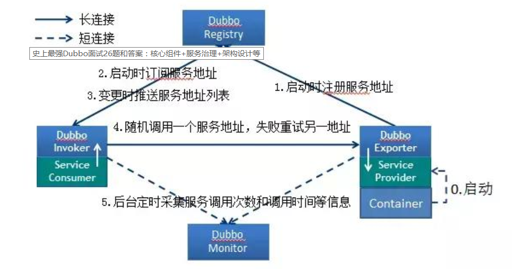

## 架构模式

(1) 单体应用架构

特点：
　　1.all in one(所有模块在一起，技术也不分层)，
　　2.servlet(jsp)

缺点：
　　1.并发量差
　　2.容错性差(不具有高可用性)
(2)  集群应用架构

特点：
　　1.项目采用多台服务器集群部署
　　2.mysql数据库采用多台服务器集群部署

优势：
　　1.并发量提高(1000+)
　　2.容错性提高(具有高可用性)

(3)  面向服务的分布式架构(SOA) 

SOA就是一种思想，就是把项目拆成组件，每个组件暴露出服务，“你调我，我调你”，大家一起把活干完。强调的是服务的相互调用。

webservice是实现SOA

特点：

1. service层与web层分离成独立的项目，远程调用

优点：

1. 并发量
2. 高可用性	

基于SOA的解决方案，努力使经营目标而建立企业的质量体系。SOA架构是五层水平：

1. **用户界面层**–这些GUI的最终用户或应用程序访问的应用程序/服务接口。

2. **业务流程层**–这些精心设计的代表在应用方面的业务用例服务。

3. **服务层**–服务合并在一起，为整个企业提供实时服务。

4. **服务组件层**–用来建造服务的组件，如功能库和技术库，技术接口等。

5. **操作系统**–这层包含数据模型，企业数据仓库，技术平台等。


webservice的实现方式：

REST：Representational State transfer 表征状态转变 (基于HTTP协议-应用层协议）**面向资源** [RESTful API 设计指南](http://www.ruanyifeng.com/blog/2014/05/restful_api.html)
RPC：Remote Procedure Cal 远程过程调用协议 （已经慢慢被SOAP取代）RPC(跨越了传输层和应用层，基于HTTP和TCP协议 socket通信) **面向方法**
SOAP：简单对象访问协议 (基于任何传输协议，TCP,HTTP,SMTP,MSMQ) SOAP广泛使用的是基于HTTP和xml协议的实现（SOAP=RPC+HTTP+XML） **面向消息**


(4 )  服务是架构设计方式，分布式是系统部署方式

**微服务重在解耦合，使每个模块都独立。分布式重在资源共享与加快计算机计算速度。**


**dubbo就是一种RPC框架。他的通讯协议是RPC协议**

它是由alibaba得工程师为java开发的一个RPC，有很高的性能以及简单的使用方法：

1、被远程调用的接口，需要在zookeeper中进行注册；

2、需要远程调用的服务在zookeeper中声明自己需要的接口；

3、zookeeper将已经注册的接口通知给需要的服务；

当服务器启动时service会把所有的对象通过dubbo注册给zookeeper，而以后每次需要请求获取对象时，就可以直接从dubbo中异步获取，不需要再去访问service层，这样就解决了服务层**网络抖动**(`*当有大量用户访问时，可能会出现service层的延迟现象，而web层因为长期得不到响应，则会抛出时间超出异常`)和服务层进程繁忙的弊端。

**Spring Cloud也是一种RPC框架，他的通讯协议是http restful 协议**；REST协议，它基于HTTP的协议，是一种明确构建在客户端/服务端体系结构上的一种风格 

HTTP Restful本身轻量，易用，适用性强，可以很容易的跨语言，跨平台，或者与已有系统交互，毕竟HTTP现在没有不支持的。
Spring可以整合其他的RPC方案，比如各种MQ，Hessian，Thrift，都可以。 


## dubbo：[官网文档](http://dubbo.apache.org/zh-cn/docs/user/preface/architecture.html)

### 组件关系(流程图)：


### Dubbo 服务注册与发现的流程 





流程说明：

- Provider(提供者)绑定指定端口并启动服务
- 指供者连接注册中心，并发本机 IP、端口、应用信息和提供服务信息
  发送至注册中心存储
- Consumer(消费者），连接注册中心 ，并发送应用信息、所求服务信
  息至注册中心
- 注册中心根据 **消费者** 所求服务信息匹配对应的**提供者**列表发送至
  Consumer 应用缓存。
- Consumer 在发起远程调用时基于缓存的消费者列表择其一发起调
  用。
- Provider 状态变更会实时通知注册中心、在由注册中心实时推送至
  Consumer 


### 节点角色说明

| 节点        | 角色说明                               |
| ----------- | -------------------------------------- |
| `Provider`  | 暴露服务的服务提供方                   |
| `Consumer`  | 调用远程服务的服务消费方               |
| `Registry`  | 服务注册与发现的注册中心               |
| `Monitor`   | 统计服务的调用次数和调用时间的监控中心 |
| `Container` | 服务运行容器                           |

### 调用关系说明

1. 服务容器负责启动，加载，运行服务提供者。

2. 服务提供者在启动时，向注册中心注册自己提供的服务。

3. 服务消费者在启动时，向注册中心订阅自己所需的服务。

4. 注册中心返回服务提供者地址列表给消费者，如果有变更，注册中心将基于**长连接**推送变更数据给消费者。

5. 服务消费者，从提供者地址列表中，基于**软负载均衡算法**，选一台提供者进行调用，如果调用失败，再选另一台调用。

6. 服务消费者和提供者，在内存中累计调用次数和调用时间，定时每分钟发送一次统计数据到监控中心。

7. **客户端面向接口写调用，服务端面向接口写实现，中间的网络通信交给框架去实现**


1) 暴露服务到本地

2) 暴露服务到远程

3) 启动netty服务

4) 连接zookeeper

5) 注册服务到zookeeper

6) 监听zookeeper中消费服务


### 特点

#### 连通性

- 注册中心负责服务地址的注册与查找，相当于目录服务，服务提供者和消费者只在启动时与注册中心交互，**注册中心不转发请求**，压力较小
- 监控中心负责统计各服务调用次数，调用时间等，**统计先在内存汇总后每分钟一次发送到监控中心服务器**，并以报表展示
- 服务提供者向注册中心注册其提供的服务，并汇报调用时间到监控中心，此时间不包含网络开销
- 服务消费者向注册中心获取服务提供者地址列表，并根据负载算法直接调用提供者，同时汇报调用时间到监控中心，此时间包含网络开销
- 注册中心，服务提供者，服务消费者三者之间均为**长连接**，监控中心除外
- 注册中心通过长连接感知服务提供者的存在，服务提供者宕机，注册中心将立即推送事件通知消费者
- 注册中心和监控中心全部宕机，不影响已运行的提供者和消费者，**消费者在本地缓存了提供者列表**
- 注册中心和监控中心都是可选的，服务消费者可以直连服务提供者

#### 健壮性

- 监控中心宕掉不影响使用，**只是丢失部分采样数据**
- 数据库宕掉后，注册中心仍能**通过缓存提供服务**列表查询，但不能注册新服务
- 注册中心对等集群，任意一台宕掉后，将自动切换到另一台
- 注册中心全部宕掉后，**服务提供者和服务消费者仍能通过本地缓存通讯**
- 服务提供者无状态，任意一台宕掉后，不影响使用
- 服务提供者全部宕掉后，服务消费者应用将无法使用，并无限次重连等待服务提供者恢复

#### 伸缩性

- 注册中心为对等集群，可动态增加机器部署实例，所有客户端将自动发现新的注册中心
- 服务提供者无状态，可动态增加机器部署实例，注册中心将推送新的服务提供者信息给消费者


### Dubbo内置了哪几种服务容器？

Spring Container

Jetty Container

Log4j Container

Dubbo 的服务容器只是一个简单的 Main 方法，并加载一个简单的 Spring 容器，用于暴露服务。


### Dubbo支持的协议主要有：

dubbo:// (默认)

Dubbo 缺省协议是dubbo协议，采用单一长连接和 NIO 异步通讯，适合于小数据量大并发的服务调用，以及服务消费者机器数远大于服务提供者机器数的情况。

反之，Dubbo 缺省协议不适合传送大数据量的服务，比如传文件，传视频等，除非请求量很低。

- 连接个数：单连接
- 连接方式：长连接
- 传输协议：TCP
- 传输方式：NIO 异步传输
- 序列化：Hessian 二进制序列化
- 适用范围：传入传出参数数据包较小（建议小于100K），消费者比提供者个数多，单一消费者无法压满提供者，**尽量不要用 dubbo 协议传输大文件或超大字符串**。
- 适用场景：常规远程服务方法调用

Dubbo 缺省协议采用单一长连接，底层实现是 Netty 的 NIO 异步通讯机制

Dubbo通信层（利用**Netty**）的实现过程

Netty是一个高性能、异步事件驱动的NIO框架，基于JAVA NIO提供的API实现。它提供了对TCP、UDP和文件传输的支持

作为一个异步NIO框架，Netty的所有IO操作都是异步非阻塞的，通过Future-Listener机制，用户可以方便的主动获取或者通过通知机制获得IO操作结果。


### Dubbo核心配置有哪些？

provider.xml

```xml
<beans xmlns:xsi="http://www.w3.org/2001/XMLSchema-instance"
       xmlns:dubbo="http://dubbo.apache.org/schema/dubbo"
       xmlns="http://www.springframework.org/schema/beans"
       xsi:schemaLocation="http://www.springframework.org/schema/beans http://www.springframework.org/schema/beans/spring-beans.xsd
       http://dubbo.apache.org/schema/dubbo http://dubbo.apache.org/schema/dubbo/dubbo.xsd">
    <!--用于配置当前应用信息-->
    <dubbo:application name="demo-provider"/>
    <!--用于配置连接注册中心相关信息-->
    <dubbo:registry address="zookeeper://127.0.0.1:2181"/>
    <!--用于配置提供服务的协议信息，协议由提供方指定，消费方被动接受-->
    <dubbo:protocol name="dubbo" port="20890"/>
    <bean id="demoService" class="org.apache.dubbo.samples.basic.impl.DemoServiceImpl"/>
    <!--用于暴露一个服务，定义服务的元信息一个服务可以用多个协议暴露，一个服务也可以注册到多个注册中心-->
    <dubbo:service interface="org.apache.dubbo.samples.basic.api.DemoService" ref="demoService"/>
</beans>
```


consumer.xml

```xml
<beans xmlns:xsi="http://www.w3.org/2001/XMLSchema-instance"
       xmlns:dubbo="http://dubbo.apache.org/schema/dubbo"
       xmlns="http://www.springframework.org/schema/beans"
       xsi:schemaLocation="http://www.springframework.org/schema/beans http://www.springframework.org/schema/beans/spring-beans.xsd
       http://dubbo.apache.org/schema/dubbo http://dubbo.apache.org/schema/dubbo/dubbo.xsd">
    <dubbo:application name="demo-consumer"/>
    <dubbo:registry group="aaa" address="zookeeper://127.0.0.1:2181"/>
    <!--用于创建一个远程服务代理，一个引用可以指向多个注册中心-->
    <dubbo:reference id="demoService" check="false" interface="org.apache.dubbo.samples.basic.api.DemoService"/>
</beans>
```

**服务之间的关系**


| 标签                   | 用途         | 解释                                                         |
| ---------------------- | ------------ | ------------------------------------------------------------ |
| `<dubbo:service/>`     | 服务配置     | 用于暴露一个服务，定义服务的元信息，一个服务可以用多个协议暴露，一个服务也可以注册到多个注册中心 |
| `<dubbo:reference/>`    | 引用配置     | 用于创建一个远程服务代理，一个引用可以指向多个注册中心       |
| `<dubbo:protocol/>`    | 协议配置     | 用于配置提供服务的协议信息，协议由提供方指定，消费方被动接受 |
| `<dubbo:application/>` | 应用配置     | 用于配置当前应用信息，不管该应用是提供者还是消费者           |
| `<dubbo:module/>`      | 模块配置     | 用于配置当前模块信息，可选                                   |
| `<dubbo:registry/>`    | 注册中心配置 | 用于配置连接注册中心相关信息                                 |
| `<dubbo:monitor/>`     | 监控中心配置 | 用于配置连接监控中心相关信息，可选                           |
| `<dubbo:provider/>`    | 提供方配置   | 当 ProtocolConfig 和 ServiceConfig 某属性没有配置时，采用此缺省值，可选 |
| `<dubbo:consumer/>`    | 消费方配置   | 当 ReferenceConfig 某属性没有配置时，采用此缺省值，可选      |
| `<dubbo:method/>`      | 方法配置     | 用于 ServiceConfig 和 ReferenceConfig 指定方法级的配置信息   |
| `<dubbo:argument/>`    | 参数配置     | 用于指定方法参数配置                                         |


服务调用超时设置


上图中以timeout为例，显示了配置的查找顺序，其它retries, loadbalance, actives也类似。
方法级优先，接口级次之，全局配置再次之。
如果级别一样，则消费方优先，提供方次之。

其中，服务提供方配置，通过URL经由注册中心传递给消费方。
建议由服务提供方设置超时，因为一个方法需要执行多长时间，服务提供方更清楚，如果一个消费方同时引用多个服务，就不需要关心每个服务的超时设置。
理论上ReferenceConfig的非服务标识配置，在ConsumerConfig，ServiceConfig, ProviderConfig均可以缺省配置。


### zookeeper 注册中心

Zookeeper是 Apacahe Hadoop 的子项目，是一个树型的目录服务，支持变更推送，适合作为 Dubbo 服务的注册中心，工业强度较高，可用于生产环境，并推荐使用 

流程说明：

- 服务提供者启动时: 向 `/dubbo/com.foo.BarService/providers` 目录下写入自己的 URL 地址
- 服务消费者启动时: 订阅 `/dubbo/com.foo.BarService/providers` 目录下的提供者 URL 地址。并向 `/dubbo/com.foo.BarService/consumers` 目录下写入自己的 URL 地址
- 监控中心启动时: 订阅 `/dubbo/com.foo.BarService` 目录下的所有提供者和消费者 URL 地址。

支持以下功能：

- 当提供者出现断电等异常停机时，注册中心能自动删除提供者信息
- 当注册中心重启时，能自动恢复注册数据，以及订阅请求
- 当会话过期时，能自动恢复注册数据，以及订阅请求
- 当设置 `<dubbo:registry check="false" />` 时，记录失败注册和订阅请求，后台定时重试
- 可通过 `<dubbo:registry username="admin" password="1234" />` 设置 zookeeper 登录信息
- 可通过 `<dubbo:registry group="dubbo" />` 设置 zookeeper 的根节点，不配置将使用默认的根节点。
- 支持 `*` 号通配符 `<dubbo:reference group="*" version="*" />`，可订阅服务的所有分组和所有版本的提供者

主要作用如下：

- 动态载入服务。服务提供者通过注册中心，把自己暴露给消费者，无须消费者逐个更新配置文件。
- 动态发现服务。消费者动态感知新的配置，路由规则和新的服务提供者。
- 参数动态调整。支持参数的动态调整，新参数自动更新到所有服务节点。
- 服务统一配置。统一连接到注册中心的服务配置。
- 外部化配置。启动配置的集中式存储 （简单理解为dubbo.properties的外部化存储）。
- 服务治理。服务治理规则的存储与通知。


### 启动时检查

Dubbo缺省会在启动时检查依赖的服务是否可用，不可用时会抛出异常，阻止Spring初始化完成，以便上线时，能及早发现问题，默认check=true。

如果你的Spring容器是懒加载的，或者通过API编程延迟引用服务，请关闭check，否则服务临时不可用时，会抛出异常，拿到null引用，如果check=false，总是会返回引用，当服务恢复时，能自动连上。

可以通过check="false"关闭检查，比如，测试时，有些服务不关心，或者出现了循环依赖，必须有一方先启动

```xml
1、关闭某个服务的启动时检查：(没有提供者时报错)
<dubbo:reference interface="com.foo.BarService" check="false" />

2、关闭所有服务的启动时检查：(没有提供者时报错)  写在定义服务消费者一方
<dubbo:consumer check="false" />

3、关闭注册中心启动时检查：(注册订阅失败时报错)
<dubbo:registry check="false" />
```

引用缺省是延迟初始化的，只有引用被注入到其它Bean，或被getBean()获取，才会初始化。
如果需要饥饿加载，即没有人引用也立即生成动态代理，可以配置：

```xml
<dubbo:reference interface="com.foo.BarService" init="true" />
```


### 负载均衡：

Dubbo 提供了多种均衡策略：缺省为 random 随机调用，轮询，最少活跃调用数，一致性 Hash.

**Random LoadBalance**

- **随机**，按权重设置随机概率。
- 在一个截面上碰撞的概率高，但调用量越大分布越均匀，而且按概率使用权重后也比较均匀，有利于动态调整提供者权重。

**RoundRobin LoadBalance**

- **轮询**，按公约后的权重设置轮询比率。
- 存在慢的提供者累积请求的问题，比如：第二台机器很慢，但没挂，当请求调到第二台时就卡在那，久而久之，所有请求都卡在调到第二台上。

 **LeastActive LoadBalance**

- **最少活跃调用数**，相同活跃数的随机，活跃数指调用前后计数差。
- 使慢的提供者收到更少请求，因为越慢的提供者的调用前后计数差会越大。

 **ConsistentHash LoadBalance**

- **一致性 Hash**，相同参数的请求总是发到同一提供者。
- 当某一台提供者挂时，原本发往该提供者的请求，基于虚拟节点，平摊到其它提供者，不会引起剧烈变动。
- 算法参见：http://en.wikipedia.org/wiki/Consistent_hashing
- 缺省只对第一个参数 Hash，如果要修改，请配置 `<dubbo:parameter key="hash.arguments" value="0,1" />`
- 缺省用 160 份虚拟节点，如果要修改，请配置 `<dubbo:parameter key="hash.nodes" value="320" />`


### 集群容错：

**场景**

【1】**通信链路故障**：这里的链路指的是消费者和服务提供者之间的链路（通常为长连接），可能导致链路中断的原因有
         1）、通信过程中，对方突然宕机导致链路中断。
         2）、通信过程中，对方因为解码失败等原因Rest掉连接，导致链路中断。
         3）、通信过程中，消费者write SocketChannel发生IOException导致链路中断。
         4）、通信过程中，消费者read SocketChannel发生IOException异常导致链路中断。
         5）、通信双方因为检测心跳超时，主动close SocketChannel导致链路中断。
         6）、通信过程中，网络出现闪断故障。
         7）、通信过程中，交换机异常导致链路中断。
         8）、通信过程中，消费者或者服务提供者因为长时间Full GC导致链路中断。


【2】**服务端超时**：当服务端无法再指定的时间内返回应答给客户端，就会发生超时，导致超时的原因主要有：
         1）、服务端 I/O线程没有及时从网络中读取客户端请求消息，导致该问题的原因通常是 I/O线程被意外阻塞或者执行长周 期操作。
         2）、服务端业务处理缓慢，或者长时间阻塞，例如查询数据库，由于没索引导致全表查询，耗时较长。
         3）、服务端发生长时间 Full GC，导致所有业务线程暂停运行，无法及时返回应答给客户端。


【3】**服务端调用失败**：有时会发生服务端调用失败，导致服务端调用失败的原因主要有如下几种：
         1）、服务端解码失败，会返回消息解码失败异常。
         2）、服务端发生动态流控，返回流控异常。
         3）、服务消息队列积压率超过最大阈值，返回系统拥塞异常。
         4）、访问权限校验失败，返回权限相关异常。
         5）、违反 SLA(Service-Level Agreement:服务等级协议)策略，返回SLA控制相关异常。
         6）、其他系统异常。

在集群调用失败时，Dubbo 提供了多种容错方案，缺省为 failover 重试。 

  

**Failover Cluster**(推荐读操作)

**失败自动切换**，当出现失败，重试其它服务器。通常用于读操作，但重试会带来更长延迟。可通过 retries="2" 来设置重试次数(不含第一次)。

重试次数配置如下：

```xml
<dubbo:service retries="2" />
或
<dubbo:reference retries="2" />
或
<dubbo:reference>
<dubbo:method name="findFoo" retries="2" />
</dubbo:reference>
```

服务发布，可以指定服务的集群容错策略。**消费者可以覆盖服务提供者的通用配置，实现个性化的容错策略。**


**Failfast Cluster**(推荐写操作)

**快速失败**，只发起一次调用，失败立即报错，消费者能够获取到服务调用失败的具体信息，通过对失败错误码等异常信息的判断，决定后续的执行策略。通常用于非幂等性的写操作，比如新增记录。

**Failsafe Cluster**

失败安全，出现异常时，直接忽略。通常用于写入审计日志等操作。

**Failback Cluster**

失败自动恢复，后台记录失败请求，定时重发。通常用于消息通知操作。

**Forking Cluster**

并行调用多个服务器，只要一个成功即返回。通常用于实时性要求较高的读操作，但需要浪费更多服务资源。可通过 forks="2" 来设置最大并行数。

**Broadcast Cluster**

广播调用所有提供者，逐个调用，任意一台报错则报错 [2]。通常用于通知所有提供者更新缓存或日志等本地资源信息。

集群模式配置

按照以下示例在服务提供方和消费方配置集群模式

```xml
<dubbo:service cluster="failsafe" />
或
<dubbo:reference cluster="failsafe" />
```


### 服务熔断降级

hystrix结合dubbo框架实现服务熔断降级, 保证后台服务稳定性

1 服务出现异常, 超时, 能够自动走降级逻辑;

2 当服务的失败率达到阈值时, 能够自动进行熔断;

3 在服务熔断期间, 所有对该服务的请求, 全部走降级.

4 当服务恢复时, 后续的请求能够正常访问到该服务.

整合hystrix，服务熔断与降级处理：

服务降级：
     当服务器压力剧增的情况下，根据实际业务情况及流量，对一些服务和页面有策略的不处理或换种简单的方式处理，从而释放服务器资源以保证核心交易正常运作或高效运作。可以通过服务降级功能临时屏蔽某个出错的非关键服务，并定义降级后的返回策略。


向注册中心写入动态配置覆盖规则： 

```java
RegistryFactory registryFactory=ExtensionLoader.getExtensionLoader(RegistryFactory.class).getAdaptiveExtension();
Registry registry = registryFactory.getRegistry(URL.valueOf("zookeeper://10.20.153.10:2181"));
registry.register(URL.valueOf("override://0.0.0.0/com.xxx.UserService?category=configurators&dynamic=false&application=foo&mock=force:return+null"));
```


其中：

mock=force:return+null 表示消费方对该服务的方法调用都直接返回 null 值，不发起远程调用。用来屏蔽不重要服务不可用时对调用方的影响。
还可以改为 mock=fail:return+null 表示消费方对该服务的方法调用在失败后，再返回 null 值，不抛异常。用来容忍不重要服务不稳定时对调用方的影响。

