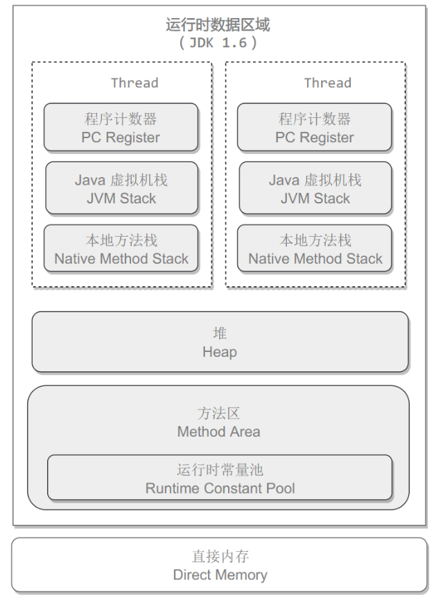

# 自动内存管理机制

## 运行时数据区域(内存模型)

JVM在执行java程序时，会把它管理的内存划分为若干区域，可以分为两大部分，



### 线程私有区

#### 程序计数器

> 程序计数器是一块较小的内存空间，可以看作是**当前线程所执行的字节码的行号指示器**。字节码解释器工作时通过改变这个计数器的值来选取下一条需要执行的字节码指令，分支、循环、跳转、异常处理、线程恢复等功能都需要依赖这个计数器来完成。

> 由于Java虚拟机的多线程是通过线程轮流切换并分配处理器执行时间的方式来实现的，在任何一个确定的时刻， 一个处理器（ 对于多核处理器来说是一个内核） 都只会执行一条线程中的指令。 因此， 为了线程切换后能恢复到正确的执行位置， 每条线程都需要有一个独立的程序计数器， 各条线程之间计数器互不影响， 独立存储， 我们称这类内存区域为“线程私有”的内存 
>
> 如果执行的是JAVA方法，计数器记录正在执行的java字节码地址，如果执行的是native方法，则计数器为空。
>
> 程序计数器是唯一一个不会出现 OutOfMemoryError 的内存区域，它的生命周期随着线程的创建而创建，随着线程的结束而死亡。

1. 字节码解释器通过改变程序计数器来依次读取指令，从而实现代码的流程控制，如：顺序执行、选择、循环、异常处理。

2. 在多线程的情况下，**程序计数器用于记录当前线程执行的位置**，从而线程切换后能恢复到正确的执行位置。
   

#### 虚拟机栈

虚拟机栈描述的是**Java方法执行**的动态内存模型。是线程私有的，每个线程都有各自的 Java 虚拟机栈，而且随着线程的创建而创建，随着线程的死亡而死亡。

**栈帧**： 每个方法执行都要创建一个栈帧，方法执行完毕，栈帧销毁。用于存储局部变量表，操作数栈，动态链接，方法出口等。**每个方法的调用到执行完成的过程，就对应着一个栈帧在虚拟机栈中入栈到出栈。**

**局部变量表**：存放编译期可知的各种基本**数据类型**（boolean、byte、char、short、int、float、long、double）、**对象引用**（reference 类型，它不同于对象本身，可能是一个指向对象起始地址的引用指针，也可能是指向一个代表对象的句柄或其他与此对象相关的位置），局部变量表的大小在编译期便已经可以确定，在运行时期不会发生改变。

其中64位长度的long和double类型的数据会占用2个局部变量空间(Slot)。

**栈的大小**：若 Java 虚拟机栈的内存大小不允许动态扩展，如果栈满了，StackOverFlowError，递归调用很常见。

若 Java 虚拟机栈的内存大小允许动态扩展，且当线程请求栈时内存用完了，无法再动态扩展了，此时抛出 OutOfMemoryError 错误。	

```
可以通过 -Xss 这个虚拟机参数来指定每个线程的 Java 虚拟机栈内存大小，在 JDK 1.5+ 默认为 1M：

java -Xss2M HackTheJava
```


#### 本地方法栈

和虚拟机栈所发挥的作用非常相似，区别是： **虚拟机栈为虚拟机执行 Java 方法 （也就是字节码）服务，而本地方法栈则为虚拟机使用到的 Native 方法服务。** 在 HotSpot 虚拟机中和 Java 虚拟机栈合二为一。

本地方法被执行的时候，在本地方法栈也会创建一个栈帧，用于存放该本地方法的局部变量表、操作数栈、动态链接、出口信息。

方法执行完毕后相应的栈帧也会出栈并释放内存空间，也会出现 StackOverFlowError 和 OutOfMemoryError 两种错误。

### 线程共享区

#### java堆

Java 虚拟机所管理的内存中最大的一块，Java 堆是所有线程共享的一块内存区域，在虚拟机启动时创建。**此内存区域的唯一目的就是存放对象实例，几乎所有的对象实例以及数组都在这里分配内存。**

Java 堆是垃圾收集器管理的主要区域，因此也被称作**GC 堆（Garbage Collected Heap）**.从垃圾回收的角度，由于现在收集器基本都采用分代垃圾收集算法，所以 Java 堆还可以细分为：新生代和老年代：再细致一点有：Eden 空间、From Survivor、To Survivor 空间等。**进一步划分的目的是更好地回收内存，或者更快地分配内存。**

在 JDK 7 版本及JDK 7 版本之前，堆内存被通常被分为下面三部分：

1. 新生代内存(Young Generation)
2. 老生代(Old Generation)
3. 永生代(Permanent Generation)

JDK 8 版本之后方法区（HotSpot 的永久代）被彻底移除了（JDK1.7 就已经开始了），取而代之是元空间，元空间使用的是直接内存。

如果在堆中没有内存完成实例分配，且堆也无法再扩展时，将会抛出 OutOfMemoryError 异常。

可以通过 -Xms 和 -Xmx 这两个虚拟机参数来指定一个程序的堆内存大小，第一个参数设置初始值，第二个参数设置最大值。

```java
java -Xms1M -Xmx2M HackTheJava
```

#### 方法区

方法区与 Java 堆一样，是各个线程共享的内存区域，它用于存储**已被虚拟机加载的类信息、常量、静态变量、即时编译器编译后的代码等数据**。虽然 Java 虚拟机规范把方法区描述为堆的一个逻辑部分，但是它却有一个别名叫做 Non-Heap（非堆），目的应该是与 Java 堆区分开来。

方法区也被称为永久代。很多人都会分不清方法区和永久代的关系，为此我也查阅了文献。

**方法区和永久代的关系**

> 《Java 虚拟机规范》只是规定了有方法区这么个概念和它的作用，并没有规定如何去实现它。那么，在不同的 JVM 上方法区的实现肯定是不同的了。 **方法区和永久代的关系很像 Java 中接口和类的关系，类实现了接口，而永久代就是 HotSpot 虚拟机对虚拟机规范中方法区的一种实现方式。** 也就是说，永久代是 HotSpot 的概念，方法区是 Java 虚拟机规范中的定义，是一种规范，而永久代是一种实现，一个是标准一个是实现，其他的虚拟机实现并没有永久代这一说法。

 **常用参数**

JDK 1.8 之前永久代还没被彻底移除的时候通常通过下面这些参数来调节方法区大小

```
-XX:PermSize=N //方法区 (永久代) 初始大小
-XX:MaxPermSize=N //方法区 (永久代) 最大大小,超过这个值将会抛出 OutOfMemoryError 异常:java.lang.OutOfMemoryError: PermGen
```

相对而言，垃圾收集行为在这个区域是比较少出现的，但并非数据进入方法区后就“永久存在”了。

JDK 1.8 的时候，方法区（HotSpot 的永久代）被彻底移除了（JDK1.7 就已经开始了），取而代之是**元空间**，元空间使用的是直接内存。

下面是一些常用参数：

```
-XX:MetaspaceSize=N //设置 Metaspace 的初始（和最小大小）
-XX:MaxMetaspaceSize=N //设置 Metaspace 的最大大小
```

与永久代很大的不同就是，如果不指定大小的话，随着更多类的创建，虚拟机会耗尽所有可用的系统内存。

**为什么要将永久代 (PermGen) 替换为元空间 (MetaSpace) 呢?**

1. 整个永久代有一个 **JVM 本身设置固定大小上限**，无法进行调整，而元空间使用的是**直接内存**(本地内存)，受本机可用内存的限制，虽然元空间仍旧可能溢出，但是比原来出现的几率会更小。

> 当你元空间溢出时会得到如下错误： `java.lang.OutOfMemoryError: MetaSpace`

你可以使用 `-XX：MaxMetaspaceSize` 标志设置最大元空间大小，默认值为 unlimited，这意味着它只受系统内存的限制。`-XX：MetaspaceSize` 调整标志定义元空间的初始大小如果未指定此标志，则 Metaspace 将根据运行时的应用程序需求动态地重新调整大小。

1. 元空间里面存放的是类的元数据，这样加载多少类的元数据就不由 `MaxPermSize` 控制了, 而由系统的实际可用空间来控制，这样能加载的类就更多了。
2. 在 JDK8，合并 HotSpot 和 JRockit 的代码时, JRockit 从来没有一个叫永久代的东西, 合并之后就没有必要额外的设置这么一个永久代的地方了。

**运行时常量池**

运行时常量池是方法区的一部分。Class 文件中除了有类的版本、字段、方法、接口等描述信息外，还有常量池信息（**用于存放编译期生成的各种字面量和符号引用**）

既然运行时常量池是方法区的一部分，自然受到方法区内存的限制，当常量池无法再申请到内存时会抛出 OutOfMemoryError 错误。

**JDK1.7 及之后版本的 JVM 已经将运行时常量池从方法区中移了出来，在 Java 堆（Heap）中开辟了一块区域存放运行时常量池。**

### 直接内存

**直接内存并不是虚拟机运行时数据区的一部分，也不是虚拟机规范中定义的内存区域，但是这部分内存也被频繁地使用。而且也可能导致 OutOfMemoryError 错误出现。**

JDK1.4 中新加入的 **NIO(New Input/Output) 类**，引入了一种基于**通道（Channel）** 与**缓存区（Buffer）** 的 I/O 方式，它可以直接使用 Native 函数库直接分配堆外内存，然后通过一个存储在 Java 堆中的 DirectByteBuffer 对象作为这块内存的引用进行操作。这样就能在一些场景中显著提高性能，因为**避免了在 Java 堆和 Native 堆之间来回复制数据**。

本机直接内存的分配不会受到 Java 堆的限制，但是，既然是内存就会受到本机总内存大小以及处理器寻址空间的限制。

## 对象探秘

### 对象的创建

**一 、类加载检查** 

**首先**将去检查这个指令的参数是否能在**常量池**中定位到一个类的符号引用， **并且**检查这个符号**引用**代表的类是已被加载、 解析和初始化过。 如果没有， 那必须先执行相应的类加载过程 

**二 、分配内存** 

虚拟机将为新生对象分配内存 ，对象所需内存的大小在类加载完成后便可完全确定 ，为对象分配空间的任务等同于把一块确定大小的内存从Java堆中划分出来 。

分配方式有 **“指针碰撞”** 和 **“空闲列表”** 两种，选择那种分配方式由 **Java 堆是否规整决定**，而 Java 堆是否规整又由所采用的**垃圾收集器是否带有压缩整理功能**决定。


**存在并发问题**

在创建对象的时候有一个很重要的问题，就是线程安全，因为在实际开发过程中，创建对象是很频繁的事情，作为虚拟机来说，必须要保证线程是安全的，通常来讲，虚拟机采用两种方式来保证线程安全：

- **CAS+失败重试：** CAS 是乐观锁的一种实现方式。所谓乐观锁就是，每次不加锁而是假设没有冲突而去完成某项操作，如果因为冲突失败就重试，直到成功为止。**虚拟机采用 CAS 配上失败重试的方式保证更新操作的原子性。**
- **TLAB：**(本地线程分配缓冲 ) 为每一个线程预先在 Eden 区分配一块儿内存，JVM 在给线程中的对象分配内存时，首先在 TLAB 分配，当对象大于 TLAB 中的剩余内存或 TLAB 的内存已用尽时，再采用上述的 CAS 进行内存分配。哪个线程要分配内存， 就在哪个线程的TLAB上分配， 只有TLAB用完并分配新的TLAB时， 才需要同步锁定。
  虚拟机是否使用TLAB， 可以通过`-XX： +/-UseTLAB`参数来设定。 

**三 、 初始化为零值 (不包括对象头 )**

内存分配完成后，虚拟机需要将分配到的内存空间都初始化为零值（不包括对象头），这一步操作保证了对象的实例字段在 Java 代码中可以不赋初始值就直接使用，程序能访问到这些字段的数据类型所对应的零值。

**四、 设置对象头**

接下来， 虚拟机要对对象进行必要的设置， 例如这个对象是哪个类的实例、 如何才能找到类的元数据信息、 对象的哈希码、 对象的GC分代年龄等信息。 这些信息存放在对象的对象头（ Object Header） 之中。 根据虚拟机当前的运行状态的不同， 如是否启用偏向锁等， 对象头会有不同的设置方式。 关于对象头的具体内容， 稍后再做详细介绍。 

**五、 执行 <init> 方法**

在上面工作都完成之后， 从虚拟机的视角来看， 一个新的对象已经产生了， 但从Java程序的视角来看， 对象创建才刚刚开始――＜ init＞ 方法还没有执行， 所有的字段都还为零。 所以一般来说，执行 new 指令之后会接着执行 `<init>` 方法，把对象按照程序员的意愿进行初始化，这样一个真正可用的对象才算完全产生出来。

### 对象的内存布局

在HotSpot虚拟机中， 对象在内存中存储的布局可以分为3块区域： 对象头（ Header） 、实例数据（ Instance Data） 和对齐填充（ Padding） 。 

 **对象头（ Header）**

对象头包括两部分信息， 第一部分用于存储对象自身的**运行时数据** ，如哈希码（ HashCode） 、 GC分代年龄、锁状态标志、 线程持有的锁、 偏向线程ID、 偏向时间戳等 ；另外一部分是**类型指针** ，即对象指向它的类元数据的指针， 虚拟机通过这个指针来确定这个对象是哪个类的实例。 

**实例数据（ Instance Data）**

是对象真正存储的有效信息 ，也是在程序代码中所定义的各种类型的字段内容。 

这部分的存储顺序会受到虚拟机**分配策略参数**（ FieldsAllocationStyle） 和**字段在Java源码中定义顺序**的影响。 HotSpot虚拟机默认的分配策略为longs/doubles、 ints、 shorts/chars、bytes/booleans、 oops（ Ordinary Object Pointers） ， 从分配策略中可以看出， **相同宽度的字段总是被分配到一起**。 在满足这个前提条件的情况下， 在父类中定义的变量会出现在子类之前。 如果CompactFields参数值为true（ 默认为true） ， 那么子类之较窄的变量也可能会插入到父类变量的空隙之中。 

**对齐填充（ Padding）**

第三部分对齐填充并不是必然存在的， 也没有特别的含义， 它仅仅起着占位符的作用。由于HotSpot VM的自动内存管理系统要求对象起始地址必须是8字节的整数倍， 换句话说，就是对象的大小必须是8字节的整数倍。 而对象头部分正好是8字节的倍数（ 1倍或者2倍） ，因此， 当对象实例数据部分没有对齐时， 就需要通过对齐填充来补全。 

### 对象的访问定位

建立对象就是为了使用对象，我们的 Java 程序通过**栈**上的 **reference 数据**来操作堆上的具体对象。对象的访问方式由虚拟机实现而定，目前主流的访问方式有**使用句柄**和**直接指针**两种：

如果使用**句柄访问**的话， 那么Java堆中将会划分出一块内存来作为句柄池， reference中存储的就是对象的句柄地址， 而句柄中包含了对象实例数据与类型数据各自的具体地址信息 。


如果使用**直接指针访问**， 那么Java堆对象的布局中就必须考虑如何放置访问类型数据的相关信息， 而reference中存储的直接就是对象地址 


这两种对象访问方式各有优势， 使用句柄来访问的最大好处就是reference中存储的是**稳定的**句柄地址， 在对象被移动（ 垃圾收集时移动对象是非常普遍的行为） 时只会改变句柄中的实例数据指针， 而reference本身不需要修改。
**使用直接指针访问方式的最大好处就是速度更快**， 它节省了一次指针定位的时间开销，由于对象的访问在Java中非常频繁， 因此这类开销积少成多后也是一项非常可观的执行成本。


## 总结

介绍下 Java 内存区域（运行时数据区）

Java 对象的创建过程（五步，建议能默写出来并且要知道每一步虚拟机做了什么）

对象的访问定位的两种方式（句柄和直接指针两种方式）

## 垃圾收集器与内存分配策略

### 对象已死吗

#### 引用计数算法 

给对象中添加一个引用计数器， 每当有一个地方引用它时， 计数器值就加1； 当引用失效时， 计数器值就减1； 任何时刻计数器为0的对象就是不可能再被使用的。

这个方法实现简单，效率高，但是目前主流的虚拟机中并没有选择这个算法来管理内存，其最主要的原因是它很难解决**对象之间相互循环引用的问题。**

#### 可达性分析算法 

这个算法的基本思路就是通过一系列的称为“GC Roots”的对象作为起始点， 从这些节点开始向下搜索， 搜索所走过的路径称为**引用链**（ Reference Chain） ， 当一个对象到GC Roots没有任何引用链相连（ 用图论的话来说， 就是从GC Roots到这个对象不可达） 时， 则证明此对象是不可用的。


#### 再谈引用

无论是通过引用计数法判断对象引用数量，还是通过可达性分析法判断对象的引用链是否可达，判定对象的存活都与“引用”有关。

JDK1.2 之前，Java 中引用的定义很传统：如果 reference 类型的数据存储的数值代表的是另一块内存的起始地址，就称这块内存代表一个引用。

JDK1.2 以后，Java 对引用的概念进行了扩充，将引用分为强引用、软引用、弱引用、虚引用四种（引用强度逐渐减弱）

**1．强引用（StrongReference）**

就是指在程序代码之中普遍存在的， 类似“Object obj=**new** Object（ ） ”这类的引用， 只要强引用还存在， 垃圾收集器永远**不会回收掉被引用的对象**。 

**2．软引用（SoftReference）**

如果一个对象只具有软引用**，还有用但并非必需** 的对象 。如果内存空间足够，垃圾回收器就不会回收它，如果内存空间不足了，就会回收这些对象的内存。只要垃圾回收器没有回收它，该对象就可以被程序使用。软引用可用来实现内存敏感的高速缓存。

软引用可以和一个引用队列（ReferenceQueue）联合使用，如果软引用所引用的对象被垃圾回收，JAVA 虚拟机就会把这个软引用加入到与之关联的引用队列中。

**3．弱引用（WeakReference）**

用来描述**非必需的对象**。弱引用与软引用的区别在于：只具有弱引用的对象拥有更短暂的生命周期。在垃圾回收器线程扫描它所管辖的内存区域的过程中，**一旦发现了只具有弱引用的对象，不管当前内存空间足够与否，都会回收它的内存**。不过，由于垃圾回收器是一个优先级很低的线程， 因此不一定会很快发现那些只具有弱引用的对象。

弱引用可以和一个引用队列（ReferenceQueue）联合使用，如果弱引用所引用的对象被垃圾回收，Java 虚拟机就会把这个弱引用加入到与之关联的引用队列中。

**4．虚引用（PhantomReference）**

"虚引用"顾名思义，就是形同虚设，与其他几种引用都不同，虚引用并不会决定对象的生命周期。如果一个对象仅持有虚引用，那么它就和没有任何引用一样，在任何时候都可能被垃圾回收。

**虚引用主要用来跟踪对象被垃圾回收的活动**。

**虚引用与软引用和弱引用的一个区别在于：** 虚引用必须和引用队列（ReferenceQueue）联合使用。当垃圾回收器准备回收一个对象时，如果发现它还有虚引用，就会在回收对象的内存之前，把这个虚引用加入到与之关联的引用队列中。程序可以通过判断引用队列中是否已经加入了虚引用，来了解被引用的对象是否将要被垃圾回收。程序如果发现某个虚引用已经被加入到引用队列，那么就可以在所引用的对象的内存被回收之前采取必要的行动。

特别注意，在程序设计中一般很少使用弱引用与虚引用，使用软引用的情况较多，这是因为**软引用可以加速 JVM 对垃圾内存的回收速度，可以维护系统的运行安全，防止内存溢出（OutOfMemory）等问题的产生**。

#### 生存还是死亡

**对象是否死亡， 至少要经历两次标记过程**： 如果对象在进行可达性分析后发现没有与GC Roots相连接的引用链， 那它将会被第一次标记并且进行一次筛选，筛选的条件是此对象是否有必要执行finalize（ ） 方法。 当对象没有覆盖finalize（ ） 方法， 或者finalize（ ） 方法已经被虚拟机调用过， 虚拟机将这两种情况都视为“没有必要执行”。 如果这个对象被判定为有必要执行finalize（ ） 方法， 那么这个对象将会放置在一个叫做F-Queue的队列之中， 并在稍后由一个由虚拟机自动建立的、 低优先级的Finalizer线程去执行它。 

#### 回收方法区

永久代(方法区)的垃圾收集主要回收两部分内容 


**运行时常量池**主要回收的是**废弃的常量**。

假如在常量池中存在字符串 "abc"，如果当前没有任何 String 对象引用该字符串常量的话，就说明常量 "abc" 就是废弃常量，如果这时发生内存回收的话而且有必要的话，"abc" 就会被系统清理出常量池。


**方法区**主要回收的是**无用的类**

判定一个常量是否是“废弃常量”比较简单，而要判定一个类是否是“无用的类”的条件则相对苛刻许多。类需要同时满足下面 3 个条件才能算是 **“无用的类”** ：

- 该类所有的实例都已经被回收，也就是 Java 堆中不存在该类的任何实例。
- 加载该类的 ClassLoader 已经被回收。
- 该类对应的 java.lang.Class 对象没有在任何地方被引用，无法在任何地方通过反射访问该类的方法。

虚拟机可以对满足上述 3 个条件的无用类进行回收，这里说的仅仅是“可以”，而并不是和对象一样不使用了就会必然被回收。