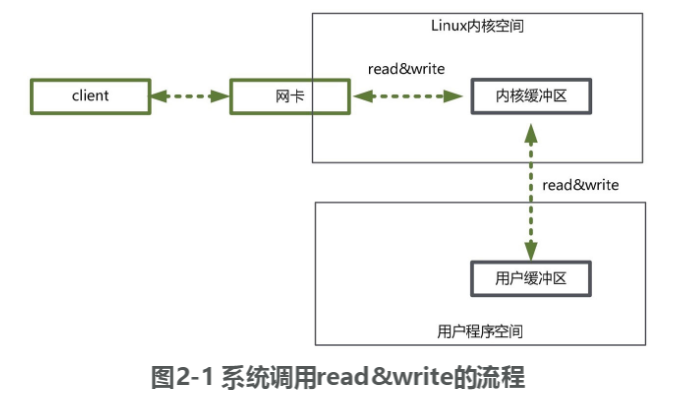
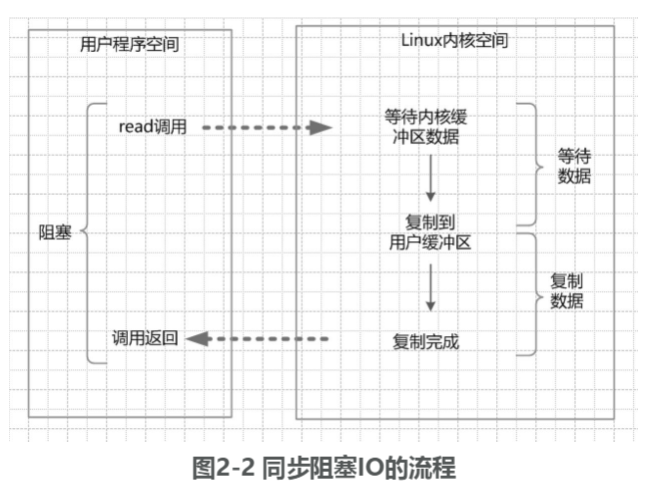
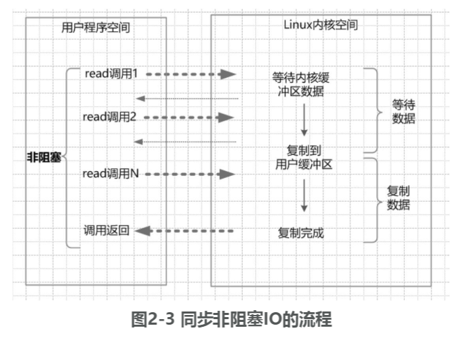
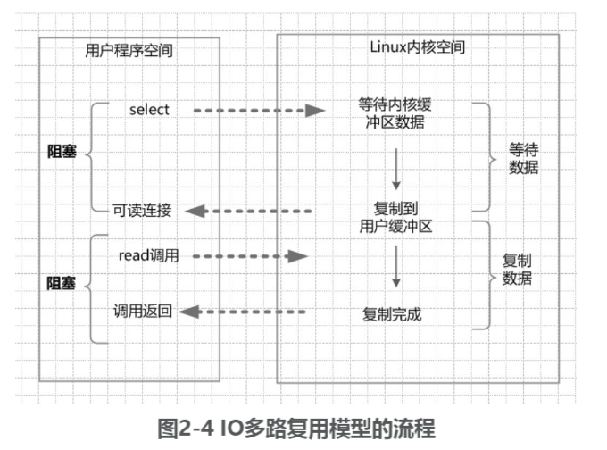
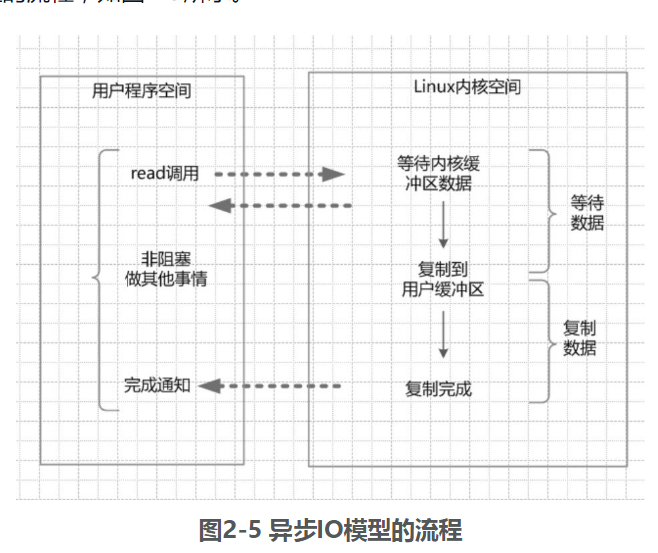

netty、redis、zookeeper高并发实战

## 高并发IO底层原理

### IO读写的基础原理

用户程序的IO读写，依赖于底层的IO读写，read/write。
上层程序的IO操作，实际上不是物理设备级别的读写，而是**缓存的复制**。

> 上层应用使用read系统调用时，仅仅把数据从内核缓冲区复制到上层应用的缓冲区（进程缓冲区）；上层应用使用write系统调用时，仅仅把数据从进程缓冲区复制到内核缓冲区中。底层操作会对内核缓冲区进行监控，等待缓冲区达到一定数量的时候，再进行IO设备的中断处理，集中执行物理设备的实际IO操作，这种机制提升了系统的性能。至于什么时候中断（读中断、写中断），由操作系统的内核来决定，用户程序则不需要关心

**进程缓冲区**：每个用户程序（进程），有自己独立的缓冲区。
**缓冲区的目的**，是为了减少频繁地与设备之间的物理交换。
内核缓冲区和物理设备（如磁盘）之间的交换，由操作系统内核（Kernel）来完成的。

- 客户端请求：Linux通过**网卡**读取客户端的请求数据，将数据读取到**内核缓冲区**。
- 获取请求数据：Java服务器通过read系统调用，从Linux**内核缓冲区**读取数据，再送入**Java进程缓冲区**。
- 服务器端业务处理：Java服务器在自己的用户空间中处理客户端的请求。
- 服务器端返回数据：Java服务器完成处理后，构建好的响应数据，将这些数据从**用户缓冲区**写入**内核缓冲区**。这里用到的是**write**系统调用。
- 发送给客户端：Linux内核通过网络IO，将**内核缓冲区**中的数据写入网卡，网卡通过底层的通信协议，会将数据发送给目标客户端。

### 四种主要的IO模型

**阻塞与非阻塞**

> 阻塞IO，指的是需要内核IO操作彻底完成后，才返回到用户空间执行用户的操作。**阻塞指的是用户空间程序的执行状态**。传统的IO模型都是同步阻塞IO
> 非阻塞IO，指的是用户空间的程序不需要等待内核IO操作彻底完成，可以立即返回用户空间执行用户的操作，即处于非阻塞的状态，与此**同时内核会立即返回给用户一个状态值**。

**同步与异步**

> 同步IO是指**用户空间的线程是主动发起IO请求的一方，内核空间是被动接受方**。异步IO则反过来，是指系统内核是主动发起IO请求的一方，用户空间的线程是被动接受方。

#### 同步阻塞IO（Blocking IO）

默认的

阻塞IO的特点：在内核进行IO执行的两个阶段，用户线程都被阻塞了。在阻塞期间，用户线程基本不会占用CPU资源。

阻塞IO的优点是：应用的程序开发非常简单；在阻塞等待数据期间，用户线程挂起。在阻塞期间，用户线程基本不会占用CPU资源。

阻塞IO的缺点是：当在高并发的应用场景下，需要大量的线程来维护大量的网络连接，内存、线程切换开销会非常巨大。

- 从Java启动IO读的read系统调用开始，用户线程就进入阻塞状态。
- 当系统内核收到read系统调用，就开始准备数据。一开始，数据可能还没有到达内核缓冲区（例如，还没有收到一个完整的socket数据包），这个时候内核就要等待。
- 内核一直等到完整的数据到达，就会将数据从内核缓冲区复制到用户缓冲区（用户空间的内存），然后内核返回结果（例如返回复制到用户缓冲区中的字节数）。
- 直到内核返回后，用户线程才会解除阻塞的状态，重新运行起来。

#### 同步非阻塞NIO（Non-blocking IO）

socket连接默认是**阻塞**模式，在Linux系统下，可以通过设置将socket变成为非阻塞的模式（Non-Blocking）

**同步非阻塞IO的特点**：应用程序的线程需要不断地进行IO系统调用，**轮询**数据是否已经准备好，如果没有准备好，就继续轮询，直到完成IO系统调用为止。

**同步非阻塞IO的优点**：每次发起的IO系统调用，在内核等待数据过程中可以立即返回。用户线程不会阻塞，实时性较好。

**同步非阻塞IO的缺点**：不断地轮询内核，这将占用大量的CPU时间，效率低下。

- 在内核数据没有准备好的阶段，用户线程发起IO请求时，立即返回。所以，为了读取到最终的数据，**用户线程需要不断地发起IO系统调用**。
- 内核数据到达后，用户线程发起系统调用，用户线程阻塞。内核开始复制数据，它会将数据从内核缓冲区复制到用户缓冲区（用户空间的内存），然后内核返回结果（例如返回复制到的用户缓冲区的字节数）。
- 用户线程读到数据后，才会解除阻塞状态，重新运行起来。也就是说，用户进程需要经过多次的尝试，才能保证最终真正读到数据，而后继续执行。

#### IO多路复用（IO Multiplexing）

通过该系统调用，**一个进程可以监视**多个文件描述符，**一旦**某个**描述符就绪**（一般是内核缓冲区可读/可写），内核能够将就绪的状态**返回给应用程序**。随后，应用程序根据就绪的状态，**进行相应的IO系统调用**。

在IO多路复用模型中，引入了一种新的系统调用，**查询IO的就绪状态**。在Linux系统中，对应的系统调用为**select/epoll系统调用**。select系统调用，几乎在所有的操作系统上都有支持，具有良好的跨平台特性。epoll是在Linux 2.6内核中提出的，是select系统调用的Linux增强版本。

**IO多路复用模型的特点**：IO多路复用模型的IO涉及两种系统调用（System Call），另一种是select/epoll（就绪查询），一种是IO操作。**IO多路复用模型建立在操作系统的基础设施之上，即操作系统的内核必须能够提供多路分离的系统调用select/epoll。**

**IO多路复用模型的优点**：与一个线程维护一个连接的阻塞IO模式相比，使用select/epoll的最大优势在于，**一个选择器查询线程可以同时处理成千上万个连接**（Connection）。系统不必创建大量的线程，也不必维护这些线程，从而大大减小了系统的开销。

**IO多路复用模型的缺点**：本质上，select/epoll系统调用是阻塞式的，属于同步IO。都需要在读写事件就绪后，由系统调用本身负责进行读写，也就是说这个读写过程是阻塞的。

- 选择器注册。在这种模式中，首先，将需要read操作的目标socket网络连接，**提前注册到select/epoll选择器中**，Java中对应的选择器类是Selector类。然后，才可以开启整个IO多路复用模型的轮询流程。
- 就绪状态的**轮询**。和NIO模型相似，多路复用IO也需要轮询。负责select/epoll状态查询调用的线程，需要不断地进行select/epoll轮询，查找出达到IO操作就绪的socket连接。通过查询的系统调用，内核会返回一个就绪的socket列表。当任何一个注册过的socket中的数据准备好了，内核缓冲区有数据（就绪）了，内核就将该socket加入到就绪的列表中。**当用户进程调用了select查询方法，那么整个线程会被阻塞掉**。
- 用户线程获得了就绪状态的列表后，根据其中的socket连接，发起read系统调用，**用户线程阻塞**。内核开始复制数据，将数据从内核缓冲区复制到用户缓冲区。
- 复制完成后，内核返回结果，用户线程才会解除阻塞的状态，用户线程读取到了数据，继续执行。

#### 异步IO（Asynchronous IO）

AIO的基本流程是：用户线程通过系统调用，向内核注册某个IO操作。内核在整个IO操作（包括数据准备、数据复制）完成后，通知用户程序，用户执行后续的业务操作。

**异步IO模型的特点**：在内核等待数据和复制数据的两个阶段，用户线程都不是阻塞的。用户线程需要接收内核的IO操作完成的事件，或者用户线程需要注册一个IO操作完成的回调函数。正因为如此，异步IO有的时候也被称为**信号驱动IO**。

**异步IO异步模型的缺点**：应用程序仅需要进行事件的注册与接收，其余的工作都留给了操作系统，也就是说，需要底层内核提供支持。

- 当用户线程发起了read系统调用，立刻就可以开始去做其他的事，用户线程不阻塞。
- 内核就开始了IO的第一个阶段：准备数据。等到数据准备好了，内核就会将数据从内核缓冲区复制到用户缓冲区（用户空间的内存）。
- 内核会给用户线程发送一个信号（Signal），或者回调用户线程注册的回调接口，告诉用户线程read操作完成了。
- 用户线程读取用户缓冲区的数据，完成后续的业务操作。

**NIO与NIO**

Java的NIO（New IO），对应的不是四种基础IO模型中的NIO（None Blocking IO）同步非阻塞模型，而是另外的一种模型，叫作**IO多路复用模型**（IO Multiplexing）。

 