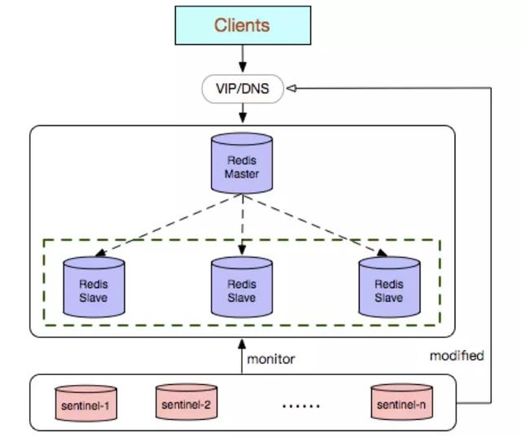
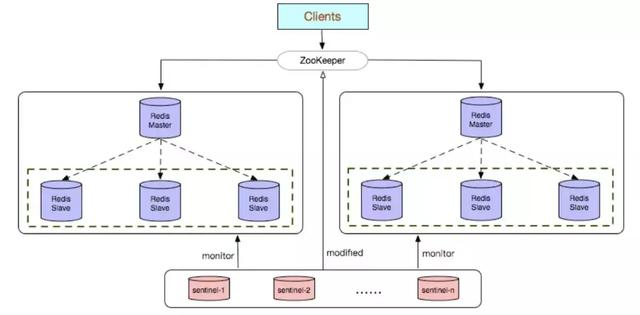
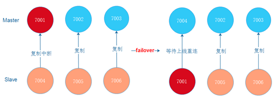
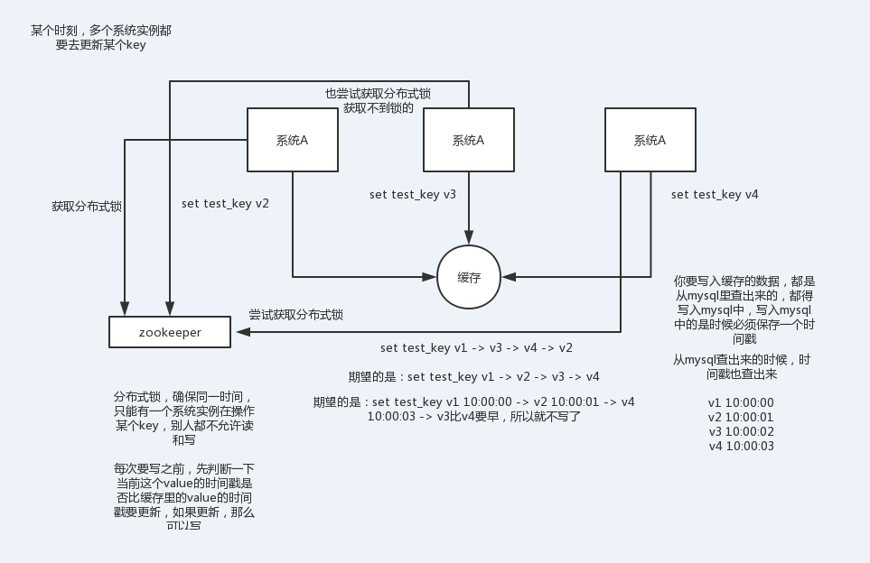
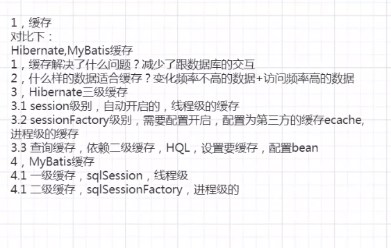

redis

[TOC]


### 一、redis是什么

Redis：REmote DIctionary Server（远程字典服务器）

是完全开源免费的，用C语言编写的，遵守BSD协议，是一个高性能的（key/value）分布式内存数据库，基于内存运行并支持持久化的NoSQL数据库，被称为数据结构数据库。redis 被广泛应用于缓存方向。另外，redis 也经常用来做分布式锁。redis 提供了多种数据类型来支持不同的业务场景。除此之外，redis 支持事务 、持久化、LUA脚本、LRU驱动事件、多种集群方案。

### 二、为什么要用redis

主要从“高性能”和“高并发”这两点来看待这个问题。

因为传统的关系型数据库如Mysql已经不能适用所有的场景了，比如秒杀的库存扣减，APP首页的访问流量高峰等等，都很容易把数据库打崩，所以引入了缓存中间件。

#### 为什么不用本地缓存？与memcached 比较？

缓存分为本地缓存和分布式缓存。以 Java 为例，使用自带的 map 或者 guava 实现的是本地缓存，最主要的特点是轻量以及快速，生命周期随着 jvm 的销毁而结束，并且在多实例的情况下，每个实例都需要各自保存一份缓存，缓存不具有一致性。

Redis与Memcached的区别？

1. memcache数据结构单一
   redis丰富一些，list，set，hash等数据结构的存储。

2. redis支持（RDB、AOF）：依赖快照进行持久化，aof增强了可靠性的同时，对性能有所影响

   memcache不支持，通常用在做缓存,提升性能

3. redis事务支持比较弱，没有原子性

   Memcache 在并发场景下，用cas保证一致性

### 三、五大数据结构

#### **String(单值单value)：**

**String** 类型是 **Redis** 中最常使用的类型，内部的实现是通过 **SDS**（Simple Dynamic String ）来存储的。SDS 类似于 **Java** 中的 **ArrayList**，可以通过预分配冗余空间的方式来减少内存的频繁分配。

这是最简单的类型，就是普通的 set 和 get，做简单的 KV 缓存。

**String**的实际应用场景比较广泛的有：

- **缓存功能：String**字符串是最常用的数据类型，不仅仅是**Redis**，各个语言都是最基本类型，因此，利用**Redis**作为缓存，配合其它数据库作为存储层，利用**Redis**支持高并发的特点，可以大大加快系统的读写速度、以及降低后端数据库的压力。
- **计数器：**许多系统都会使用**Redis**作为系统的实时计数器，可以快速实现计数和查询的功能。而且最终的数据结果可以按照特定的时间落地到数据库或者其它存储介质当中进行永久保存。
- **共享用户Session：**用户重新刷新一次界面，可能需要访问一下数据进行重新登录，或者访问页面缓存**Cookie**，但是可以利用**Redis**将用户的**Session**集中管理，在这种模式只需要保证**Redis**的高可用，每次用户**Session**的更新和获取都可以快速完成。大大提高效率。

#### **Hash(KV模式不变，但V是一个键值对)：**

这个是类似 **Map** 的一种结构，这个一般就是可以将结构化的数据，比如一个对象（前提是**这个对象没嵌套其他的对象**）给缓存在 **Redis** 里，然后每次读写缓存的时候，可以就操作 **Hash** 里的**某个字段**。

但是这个的场景其实还是多少单一了一些，因为现在很多对象都是比较复杂的，比如你的商品对象可能里面就包含了很多属性，其中也有对象。我自己使用的场景用得不是那么多。

#### **List(单值多value)：**

**List** 是有序列表，Redis list 的实现为一个双向链表，即可以支持反向查找和遍历，更方便操作，不过带来了部分额外的内存开销。

比如可以通过 **List** 存储一些列表型的数据结构，类似粉丝列表、文章的评论列表之类的东西。

比如可以通过 **lrange** 命令，读取某个闭区间内的元素，可以基于 **List** 实现分页查询，这个是很棒的一个功能，基于 **Redis** 实现简单的高性能分页，可以做类似微博那种下拉不断分页的东西，性能高，就一页一页走。

比如可以搞个简单的消息队列，从 **List** 头怼进去，从 **List** 屁股那里弄出来。 

**List**本身就是我们在开发过程中比较常用的数据结构了，热点数据更不用说了。

- **消息队列：Redis**的链表结构，可以轻松实现阻塞队列，可以使用左进右出的命令组成来完成队列的设计。比如：数据的生产者可以通过**Lpush**命令从左边插入数据，多个数据消费者，可以使用**BRpop**命令阻塞的“抢”列表尾部的数据。

- 文章列表或者数据分页展示的应用。

  比如，我们常用的博客网站的文章列表，当用户量越来越多时，而且每一个用户都有自己的文章列表，而且当文章多时，都需要分页展示，这时可以考虑使用**Redis**的列表，列表不但有序同时还支持按照范围内获取元素，可以完美解决分页查询功能。大大提高查询效率。

#### **Set(单值多value)：**

**Set** 是无序集合，会自动去重的那种。

直接基于 **Set** 将系统里需要去重的数据扔进去，自动就给去重了，如果你需要对一些数据进行快速的全局去重，你当然也可以基于 **JVM** 内存里的 **HashSet** 进行去重，但是如果你的某个系统部署在多台机器上呢？得基于**Redis**进行全局的 **Set** 去重。

可以基于 **Set** 玩儿交集、并集、差集的操作，比如交集吧，我们可以把两个人的好友列表整一个交集，看看俩人的共同好友是谁？对吧。

反正这些场景比较多，因为对比很快，操作也简单，两个查询一个**Set**搞定。

#### **Sorted Set()：**

**Sorted set** 是排序的 **Set**，去重但可以排序，写进去的时候给一个分数，自动根据分数排序。

有序集合的使用场景与集合类似，但是set集合不是自动有序的，而**Sorted set**可以利用分数进行成员间的排序，而且是插入时就排序好。所以当你需要一个有序且不重复的集合列表时，就可以选择**Sorted set**数据结构作为选择方案。

- 排行榜：有序集合经典使用场景。例如视频网站需要对用户上传的视频做排行榜，榜单维护可能是多方面：按照时间、按照播放量、按照获得的赞数等。

- 用**Sorted Sets**来做带权重的队列，比如普通消息的score为1，重要消息的score为2，然后工作线程可以选择按score的倒序来获取工作任务。让重要的任务优先执行。

  微博热搜榜，就是有个后面的热度值，前面就是名称

### 四、配置文件

[redis配置文件中常用配置详解](https://blog.csdn.net/suprezheng/article/details/90679790)

### 五、key失效机制

定期+惰性+内存淘汰

#### 过期机制

expire key 秒钟：为给定的key设置过期时间

redis采用的是**定期删除**+**惰性删除**策略

- 定期删除+惰性删除是如何工作的呢？

​        定期删除，redis默认**每个100ms检查**，是否有过期的key,有过期key则删除。需要说明的是，redis不是每个100ms将所有key检查一次，而是**随机抽取进行检查**(如果每隔100ms,全部key进行检查，redis岂不是卡死)。因此，如果只采用定期删除策略，会导致很多key到时间没有删除。于是，惰性删除派上用场。也就是说**在你获取某个key的时候，redis会检查一下，这个key如果设置了过期时间那么是否过期了**？如果过期了此时就会删除。

- 采用定期删除+惰性删除就没其他问题了么?

​        不是的，如果定期删除没删除key。然后你也没即时去请求key，也就是说惰性删除也没生效。这样，redis的内存会越来越高。那么就应该采用内存淘汰机制。

#### 内存淘汰机制

在redis.conf中有一行配置: # maxmemory-policy volatile-lru (常用)

**redis 提供 6种数据淘汰策略：**

1. **volatile-lru**：从已设置过期时间的数据集（server.db[i].expires）中挑选最近最少使用的数据淘汰
2. **volatile-ttl**：从已设置过期时间的数据集（server.db[i].expires）中挑选将要过期的数据淘汰
3. **volatile-random**：从已设置过期时间的数据集（server.db[i].expires）中任意选择数据淘汰
4. **allkeys-lru**：当内存不足以容纳新写入数据时，在键空间中，移除最近最少使用的key（这个是最常用的）
5. **allkeys-random**：从数据集（server.db[i].dict）中任意选择数据淘汰
6. **no-eviction**：禁止驱逐数据，也就是说当内存不足以容纳新写入数据时，新写入操作会报错。这个应该没人使用吧！

4.0版本后增加以下两种：

1. **volatile-lfu**：从已设置过期时间的数据集(server.db[i].expires)中挑选最不经常使用的数据淘汰
2. **allkeys-lfu**：当内存不足以容纳新写入数据时，在键空间中，移除最不经常使用的key

### 六、持久化机制

#### RDB(Redis DataBase)快照(冷备)(默认)

1. 是什么：

   在指定的时间间隔内将内存中的数据集快照写入磁盘，它恢复时将快照文件直接读到内存里。

   Redis会单独创建（Fork）一个子进程来进行持久化，会先将数据写入到一个临时文件中，待持久化过程都结束了，再用这个临时文件替换上次持久化好的文件。 整个过程中，主进程是不进行任何IO操作的，这就确保了极高的性能 如果需要进行大规模数据的恢复，且对于数据恢复的完整性不是非常敏感，那RDB方式要比AOF方式更加的高效。RDB的缺点是最后一次持久化后的数据可能丢失。

   Fork的作用是复制一个与当前进程一样的进程。新进程的所有数据（变量、环境变量‘程序计数器等）数值都和原进程一致，但是是一个全新的进程，并作为原进程的子进程。

2. RDB保存的是dump.rdb文件 ，redis-check-dump 初始化dump.rdb文件格式

3. 手动触发

   SAVE：阻塞Redis的服务器进程，知道RDB文件被创建完毕

   BGSAVE：Fork出一个子进程来创建RDB文件，不阻塞服务器进程 `lastsave` 指令可以查看最近的备份时间

4. 自动触发

   根据redis.conf配置里的save m n定时触发（用的是BGSAVE）

   主从复制时，主节点自动触发

   执行Debug Relaod

   执行Shutdown且没有开启AOF持久化

```cmd
# 在几秒内改动了多少数据就触发持久化
# 想禁用的话不设置save   或者save ""
save 900 1    #在900秒(15分钟)之后，如果至少有1个key发生变化，Redis就会自动触发BGSAVE命令创建快照。
save 300 10   #在300秒(5分钟)之后，如果至少有10个key发生变化，Redis就会自动触发BGSAVE命令创建快照。
save 60 10000#在60秒(1分钟)之后，如果至少有10000个key发生变化，Redis就会自动触发BGSAVE命令创建快照。
# 备份进程出错主进程停止写入操作
stop-writes-on-bgsave-error yes
# 是否压缩rdb文件 推荐no 相对于硬盘成本cpu更值钱
rdbcompression yes
```

5. 如何恢复 

   将备份文件（dump.rdb）移动到redis安装目录并启动服务即可

6. 优势

   RDB对redis性能影响小，创建子线程进行持久化

   适合大规模的数据恢复、对数据完整性和一致性要求不高

7. 劣势

   在一定间隔时间做一次备份，所以如果redis意外down掉的话，就会丢失最后一次快照后的所有修改。

   Fork的时候，内存中的数据被克隆了一份，大约2倍的膨胀性需要考虑。

#### AOF(Append Only File)(热备)

1. 是什么

   以日志的形式来记录每个写操作，将Redis执行过的所有写指令记录下来（读操作不记录），只许追加文件但不可以改写文件，redis启动之初会读取该文件重新构建数据，换言之，redis重启的话根据日志文件的内容将写指令从前到后执行一次已完成数据的恢复工作。

2. AOF保存的是appendonly.aof文件、默认情况下Redis没有开启AOF  `appendonly yes`  redis-check-aof --fix修复文件

3. 在Redis的配置文件中存在三种不同的 AOF 持久化方式，它们分别是：

   ```cmd
   appendfsync always    #每次有数据修改发生时都会写入AOF文件,这样会严重降低Redis的速度
   appendfsync everysec  #每秒钟同步一次，显示地将多个写命令同步到硬盘(常用)
   appendfsync no        #让操作系统决定何时进行同步
   ```

4. AOFRewrite(AOF 重写)

   是什么：AOF采用文件追加方式，文件会越来越大，为避免出现此种情况，新增了重写机制，当AOF文件的大小超过所设定的阈值时，Redis就会启动AOF文件的内容压缩，只保留可以恢复数据的最小指令集。可以使用命令gbrewriteaof

   原理：AOF文件持续增长而过大时，会fork出一条新进程来将文件重写（也是先写临时文件最后在rename），遍历新进程的内存中数据，每条记录有一条的Set语句。重写aof文件的操作，并没有读取旧的aof文件，而是将整个内存中的数据库内容用命令的方式重写了一个新的aof文件，这点和快照有点类似。

   触发机制：Redis会记录上次重写时的AOF大小，默认配置是当AOF文件大小是上次rewrite后大小的一倍且文件大于64M时触发。

   ```cmd
   # 当AOF文件大小的增长率大于该配置项时自动开启重写（这里指超过原大小的100%）。
   auto-aof-rewrite-percentage 100
   # 当AOF文件大小大于该配置项时自动开启重写
   auto-aof-rewrite-min-size 64mb
   ```

5. 优势

   AOF文件时一个只进行追加的日志文件
   Redis可以在AOF文件体积变得过大时，自动地在后台对AOF进行重写
   AOF文件有序地保存了对数据执行的所有写入操作，这些写入操作以Redis协议的格式保存，因此AOF文件的内容非常容易被人读懂，对文件进行分析也很轻松。

6. 劣势

   相同数据集的数据而言aof文件要远大于rdb文件，恢复速度慢于rdb
   AOF运行效率要慢于rdb，每秒同步策略效率较好，不同步效率和rdb相同。

#### 持久化优化， RDB 和 AOF 的混合持久化

默认关闭，可以通过配置项 `aof-use-rdb-preamble` 开启

RDB和AOF可以共存，但是恢复的时候找的是AOF，如果AOF文件异常，可以通过check-aof进行AOF修复。

快速加载同时避免丢失过多的数据

### 七、事务

一个事务从开始到执行会经历以下三个阶段：

- 开始事务。以MULTI开始一个事务
- 命令入队。将多个命令入队到事务中，接到这些命令并不会立即执行，而是放到等待执行的事务队列里面。
- 执行事务。由EXEC命令触发事务

命令：

```cmd
[DISCARD] #取消事务，放弃执行事务块内的所有命令。                           
[EXEC] #执行所有事务块内的命令。
[MULTI]  #标记一个事务块的开始。 
[UNWATCH] #取消 WATCH 命令对所有 key 的监视。
[WATCH key [key ...]] #监视一个(或多个) key ，如果在事务执行之前这个(或这些) key 被其他命令所改动，那么事务将被打断。
```

Redis 事务有以下三个特性：

- 没有隔离级别的概念：队列中的命令没有提交之前都不会实际的被执行，因为事务提交前任何指令都不会被实际执行，也就不存在“事务内的查询要看到事务里的更新，在事务外查询不能看到”这个让人万分头痛的问题。
- 不保证原子性。收到 EXEC 命令后进入事务执行，事务中任意命令执行失败，其余的命令依然被执行。
- 单独的隔离操作：事务中的所有命令都会被序列化、按顺序地执行。事务在执行的构成中，不会被其他客户端发送来的命令请求所打断。

Watch指令，类似乐观锁，事务提交时，如果Key的值已经被别的客户端改变，比如某个list已经被别的客户端push/pop过了，整个事务队列都不会被执行。

通过WATCH命令在事务执行之前监控了多个keys，倘若在WATCH之后有任何key的值的变化，EXEC命令执行的事务都将被放弃，同时返回Nullmulti-bulk应答以通知调用者事务执行失败。

### 八、redis集群

#### 8.1 主从模式

8.1.1 是什么

就是我们所说的主从复制，主机数据更新后根据配置和策略，自动同步到备机的master/slver机制，Master以写为主，Slave以读为主。

8.1.2 有什么作用

读写分离、容灾恢复

8.1.3 怎么用

1. 配从（库）不配主（库）

2. 从库配置：slaveof 主库IP 主库端口 `成为某个实例的从服务器`

   每次与master断开之后，都需要重新连接，除非你配置进redis.conf文件

   Info replication `打印主从复制的相关信息`

3. 修改配置文件细节操作

   (1) 拷贝多个redis.conf文件 include

   (2) 开启daemonize yes

   (3) Pid文件名字 pidfile

   (4) 指定端口 port

   (5) Log文件名字

   (6) Dump.rdb名字

   (7) Appendonly 关掉后者换名字

   ```cmd
   bind 192.168.30.xxx
   daemonize yes
   logfile "/usr/local/redis/redis.log"
   dir /data/redis
   replicaof 192.168.30.xxx 6379
   appendonly yes
   ```

4. 复制原理

   每次从机联通后，都会给主机发送sync指令

   主机立刻进行存盘操作，发送RDB文件给从机

   从机收到后，进行全盘加载

   之后每次主机的写操作，都会立刻发送给从机，执行相同命令

5. 常用模式

   (1) 一主二奴 ： Y型

   (2) 新火相传 : 上一个Slave可以是下一个slave的Master，slave同样可以接受其他slaves的连接和同步请求，那么该slave作为链条中下一个的master，可以有效减轻master的写压力。 ->去中心化

   SLAVEOF no one：使当前数据库通知与其他数据库的同步，转成主数据库(主机宕机时，从机反从为主)

#### 8.2 Sentinel哨兵模式 (自动反从为主)

其部署架构主要包括两部分：Redis Sentinel 集群和 Redis 数据集群

Redis Sentinel 集群是由若干 Sentinel 节点组成的分布式集群，可以实现故障发现、故障自动转移、配置中心和客户端通知


sentinel模式是建立在主从模式的基础上，如果只有一个Redis节点，sentinel就没有任何意义

当master挂了以后，sentinel会在slave中选择一个做为master，并修改它们的配置文件，其他slave的配置文件也会被修改，比如slaveof属性会指向新的master

当master重新启动后，它将不再是master而是做为slave接收新的master的同步数据

sentinel因为也是一个进程有挂掉的可能，所以sentinel也会启动多个形成一个sentinel集群

多sentinel配置的时候，sentinel之间也会自动监控

当主从模式配置密码时，sentinel也会同步将配置信息修改到配置文件中，不需要担心

一个sentinel或sentinel集群可以管理多个主从Redis，多个sentinel也可以监控同一个redis

sentinel最好不要和Redis部署在同一台机器，不然Redis的服务器挂了以后，sentinel也挂了

Sentinel 的节点数量要满足 2n+1(n>=1)的奇数个(一主二从三哨兵)

**缺陷**：

在哨兵模式中，仍然只有一个Master节点。当**并发写请求**较大时，哨兵模式并不能缓解写压力。

 







哨兵选择从机的条件(依次判断)**：

(1) 优先级 `redis.conf中slave-priority 100`

(2) 偏移量 `指获取主机数据最多的从机`

(3) runid最小 `每个redis实例启动都会生成一个40位的runid`


**工作机制**：

* 每个sentinel以每秒钟一次的频率向它所知的master，slave以及其他sentinel实例发送一个 PING 命令 

* 如果一个实例距离最后一次有效回复 PING 命令的时间超过 down-after-milliseconds 选项所指定的值， 则这个实例会被sentinel标记为主观下线。 

* 如果一个master被标记为主观下线，则正在监视这个master的所有sentinel要以每秒一次的频率确认master的确进入了主观下线状态

* 当有足够数量的sentinel（大于等于配置文件指定的值）在指定的时间范围内确认master的确进入了主观下线状态， 则master会被标记为客观下线 

* 在一般情况下， 每个sentinel会以每 10 秒一次的频率向它已知的所有master，slave发送 INFO 命令 

* 当master被sentinel标记为客观下线时，sentinel向下线的master的所有slave发送 INFO 命令的频率会从 10 秒一次改为 1 秒一次 

* 若没有足够数量的sentinel同意master已经下线，master的客观下线状态就会被移除；
  若master重新向sentinel的 PING 命令返回有效回复，master的主观下线状态就会被移除


  Redis-sentinel /myredis/sentinel.conf

```cmd
# vim /usr/local/redis/sentinel.conf

daemonize yes
logfile "/usr/local/redis/sentinel.log"
dir "/usr/local/redis/sentinel"                 #sentinel工作目录
sentinel monitor xxx <主机地址> <端口> <哨兵同意迁移数量(2)>  #判断master失效至少需要2个sentinel同意，建议设置为n/2+1，n为sentinel个数
sentinel auth-pass mymaster 123456
sentinel down-after-milliseconds mymaster 30000  #判断master主观下线时间，默认30s

```


#### 8.3 Cluster模式 集群

扩容、并发分摊、去中心化

**cluster集群特点**：

- **集群节点复制** 主节点可以添加从节点（也可以是一主多从），其中从不提供服务，仅作为备用
- Redis-cluster**分片策略**，是用来解决key存储位置的。集群将整个数据库分为16384个槽位slot
- 主节点内置了类似Sentinel的**节点故障检测**和**自动故障转移功能**，当集群中的某个主节点下线时，集群中的其他在线主节点会注意到这一点，并对已下线的主节点进行故障转移。

* 多个redis节点网络互联，数据共享
* 不支持同时处理多个key（如MSET/MGET），因为redis需要把key均匀分布在各个节点上，
  并发量很高的情况下同时创建key-value会降低性能并导致不可预测的行为
* 支持在线增加、删除节点
* 客户端可以连接任何一个主节点进行读写




**配置文件**：

```cmd
# vim /usr/local/redis/cluster/redis_7001.conf

bind 192.168.30.xxx
port 7001
daemonize yes
pidfile "/var/run/redis_7001.pid"
logfile "/usr/local/redis/cluster/redis_7001.log"
dir "/data/redis/cluster/redis_7001"
#replicaof 192.168.30.xxx 6379  # 主从配置
appendonly yes
cluster-enabled yes # 打开集群模式
cluster-config-file nodes_7001.conf # 设置节点配置文件名
cluster-node-timeout 15000 # 设置节点失联时间，(毫秒),超时自动进行主从切换
```

**创建集群**：

```cmd
redis-cli -a 123456 --cluster create 192.168.30.xxx:7001 192.168.30.xxx:7002 192.168.30.xxx:7003 192.168.30.xxx:7004 192.168.30.xxx:7005 192.168.30.xxx:7006 --cluster-replicas 1
```

`ps:`
`一个集群至少有三个节点`
`--replicas 1 表示每个主节点有一个 从节点`

命令：

```cmd
redis-cli -c -h 192.168.30.128 -p 7001 -a 123456  # -c，使用集群方式登录 实现了自动重定向
CLUSTER INFO     #集群状态
CLUSTER NODES    #列出节点信息
```


### 九、使用问题

#### 9.1 redis为什么这么快

(一)纯内存操作
(二)单线程操作，避免了频繁的上下文切换
(三)采用了非阻塞I/O多路复用机制

Redis采用的是基于内存的采用的是单进程单线程模型的 KV 数据库，由C语言编写，官方提供的数据是可以达到100000+的QPS（每秒内查询次数）。

完全基于内存，绝大部分请求是纯粹的内存操作，非常快速。它的，数据存在内存中，类似于HashMap，HashMap的优势就是查找和操作的时间复杂度都是O(1)；

数据结构简单，对数据操作也简单，Redis中的数据结构是专门进行设计的；

采用单线程，避免了不必要的上下文切换和竞争条件，也不存在多进程或者多线程导致的切换而消耗 CPU，不用去考虑各种锁的问题，不存在加锁释放锁操作，没有因为可能出现死锁而导致的性能消耗；

使用多路I/O复用模型，非阻塞IO；

使用底层模型不同，它们之间底层实现方式以及与客户端之间通信的应用协议不一样，Redis直接自己构建了VM 机制 ，因为一般的系统调用系统函数的话，会浪费一定的时间去移动和请求；

#### 9.2 如果你多个系统同时操作Redis带来的数据问题（并发竞争 Key）

某个时刻，多个系统实例都去更新某个 key。

**第一种方案：分布式锁+时间戳**

适合分布式环境，不用关心 redis 是否为分片集群模式。

可以基于 Zookeeper 实现分布式锁。每个系统通过 Zookeeper 获取分布式锁，确保同一时间，只能有一个系统实例在操作某个 Key，别人都不允许读和写。

你要写入缓存的数据，都是从 MySQL 里查出来的，都得写入 MySQL 中，写入 MySQL 中的时候必须保存一个时间戳，从 MySQL 查出来的时候，时间戳也查出来。

每次要写之前，先判断一下当前这个 Value 的时间戳是否比缓存里的 Value 的时间戳要新。如果是的话，那么可以写，否则，就不能用旧的数据覆盖新的数据。





**第二种方案：利用消息队列**

在并发量过大的情况下,可以通过消息中间件进行处理,把并行读写进行串行化。

把Redis.set操作放在队列中使其串行化,必须的一个一个执行。

这种方式在一些高并发的场景中算是一种通用的解决方案。


**第三种方案：乐观锁**

乐观锁适用于大家一起抢着改同一个key，对修改顺序没有要求的场景。

`watch` 命令可以方便的实现乐观锁。

> 需要注意的是，如果你的 [redis](https://cloud.tencent.com/product/crs?from=10680) 使用了数据分片的方式，那么这个方法就不适用了。

`watch` 命令会监视给定的每一个key，当 `exec` 时如果监视的任一个key自从调用watch后发生过变化，则整个事务会回滚，不执行任何动作。


#### 9.3 分布式锁 方式 

(1) 基于数据库的分布式锁


(2) 基于redis缓存的分布式锁

​	redis分布式锁主要用到的redis函数是setnx()

​	redis官方的分布式锁组件redisson,方案。每获得一个锁时，只设置一个很短的超时时间，同时起一个线程在每次快要到超时时间时去刷新锁的超时时间。在释放锁的同时结束这个线程。

(3) 基于zookeeper的分布式锁

基于zookeeper**临时有序节点**可以实现的分布式锁。

大致思想即为：每个客户端对某个方法加锁时，在zookeeper上的与该方法对应的指定节点的目录下，生成一个唯一的瞬时有序节点。 判断是否获取锁的方式很简单，只需要判断有序节点中序号最小的一个。 当释放锁的时候，只需将这个瞬时节点删除即可。同时，其可以避免服务宕机导致的锁无法释放，而产生的死锁问题。

[三种实现分布式锁的方式](https://blog.csdn.net/wuzhiwei549/article/details/80692278)


#### 9.4 redis和数据库双写一致性问题

- 读的时候，先读缓存，缓存没有的话，就读数据库，然后取出数据后放入缓存，同时返回响应。
- 更新的时候，**先删除缓存，然后再更新数据库，延时再删除缓存**。

#### 9.5 缓存雪崩

 缓存雪崩，即缓存同一时间大面积的失效，这个时候又来了一波请求，结果请求都怼到数据库上，从而导致数据库连接异常。

(一)给缓存的失效时间，加上一个**随机值**，避免集体失效。

(二)集群部署，数据均匀分布

(三)设置永不过期

#### 9.6 缓存穿透

缓存穿透，即**请求缓存中不存在**的数据，导致所有的请求都怼到数据库上，从而数据库连接异常。

(一)增强参数校验

(二)从网关层，Nginx增加配置项，对单个IP访问次数超出阈值的ip拉黑

(三)提供一个能迅速判断请求是否有效的**拦截机制**，比如，利用**布隆过滤器**(Bloom Filter 防止缓存穿透的数据结构)。把已存在数据的key存在布隆过滤器中，当有新的请求时，先到布隆过滤器中查询是否存在，如果不存在该条数据直接返回；如果存在该条数据再查询缓存查询数据库。

`布隆过滤器相对于Set、Map 等数据结构来说，它可以更高效地插入和查询，并且占用空间更少，它也有缺点，就是判断某种东西是否存在时，可能会被误判。但是只要参数设置的合理，它的精确度也可以控制的相对精确，只会有小小的误判概率。`


> 向布隆过滤器中添加元素时，会使用多个**无偏哈希函数**对元素进行哈希，算出一个整数索引值，然后对**位数组**长度进行取模运算得到一个位置，每个无偏哈希函数都会得到一个不同的位置。再把位数组的这几个位置都设置为1，这就完成了`bf.add`命令的操作。


> 向布隆过滤器查询元素是否存在时`bf.exists`，和添加元素一样，也会把哈希的几个位置算出来，然后看看位数组中对应的几个位置是否都为1，只要有一个位为0，那么就说明布隆过滤器里不存在这个元素。如果这几个位置都为1，并不能完全说明这个元素就一定存在其中，有可能这些位置为1是因为其他元素的存在，这就是布隆过滤器会出现误判的原因。


> Bit-map就是用一个bit位来标记某个元素对应的Value，通过Bit为单位来存储数据，可以大大节省存储空间.

[详细解析Redis中的布隆过滤器及其应用](https://www.cnblogs.com/heihaozi/p/12174478.html)

方案:

1. Google提供的布隆过滤器，只需要配置误判率，单机版控制

2. Ridis 引入插件，添加布隆过滤器的支持，配置误判率

   Springboot RedisTemplate不支持布隆的操作指令，需要lua脚本来扩展

#### 9.7 缓存击穿

`缓存击穿`是指一个Key非常热点，在不停的扛着大并发，大并发集中对这一个点进行访问，当这个Key在失效的瞬间，持续的大并发就穿破缓存，直接请求数据库，就像在一个完好无损的桶上凿开了一个洞。

(一) 设置热点数据永远不过期

(二) 加上互斥锁就能搞定了

#### 9.8 redis消息队列

发布者: publish channel1 "xxxx"

消费者: subscribe channel1

#### 9.9 java操作redis

1. 官方推荐的jedis，支持集群

   [java中使用Jedis操作Redis实例](https://blog.csdn.net/lovelichao12/article/details/75333035/)

2. spring data redis，它是由spring集成的，不支持集群  (RedisTempate)    默认对key/value做序列化

    [java之redis篇(spring-data-redis整合](https://www.cnblogs.com/tankaixiong/p/3660075.html)

#### 9.10 redis通过pipeline提升吞吐量

[redis通过pipeline提升吞吐量](https://www.cnblogs.com/littleatp/p/8419796.html)

普通的请求模型是同步的，每次请求对应一次IO操作等待；
而Pipeline 化之后所有的请求合并为一次IO，除了时延可以降低之外，还能大幅度提升系统吞吐量。

pipeline机制可以优化吞吐量，但无法提供原子性/事务保障，而这个可以通过Redis-Multi等命令实现。


#### 缓存配置思路

- 事前：`Redis` 高可用，主从+哨兵，`Redis cluster`，避免全盘崩溃。
- 事中：本地 `ehcache` 缓存 + `Hystrix` 限流+降级，避免`MySQL` 被打死。
- 事后：`Redis` 持久化 `RDB`+`AOF`，一旦重启，自动从磁盘上加载数据，快速恢复缓存数据。


### 十、Hibernate/MyBatis三级缓存





**MyBatis一级缓存**

一级缓存是SqlSession级别的缓存。在操作数据库时需要构造sqlSession对象，在对象中有一个数据结构用于存储缓存数据。不同的sqlSession之间的缓存数据区域是互相不影响的。修改、添加、删除时，清空缓存，session commit之后缓存就失效

**MyBatis二级缓存**

> 既然有了一级缓存，那么为什么要提供二级缓存呢？

> 二级缓存是mapper级别的缓存，多个SqlSession去操作同一个Mapper的sql语句，多个SqlSession可以共用二级缓存，二级缓存是跨SqlSession的。二级缓存的作用范围更大。

> 还有一个原因，实际开发中，MyBatis通常和Spring进行整合开发。Spring将事务放到Service中管理，对于每一个service中的sqlsession是不同的，这是通过mybatis-spring中的org.mybatis.spring.mapper.MapperScannerConfigurer创建sqlsession自动注入到service中的。 每次查询之后都要进行关闭sqlSession，关闭之后数据被清空。所以spring整合之后，如果没有事务，一级缓存是没有意义的。

> 那么如果开启二级缓存，关闭sqlsession后，会把该sqlsession一级缓存中的数据添加到namespace的二级缓存中。这样，缓存在sqlsession关闭之后依然存在。

SqlSessionFactory层面上的二级缓存默认是**不开启**的，该缓存是以namespace为单位的（也就是一个Mapper.xml文件），实现二级缓存的时候，**MyBatis要求返回的POJO必须是可序列化的。 也就是要求实现Serializable接口**，配置方法很简单，只需要在映射XML文件配置就可以开启缓存了<cache/>，如果我们配置了二级缓存就意味着：

- 映射语句文件中的所有select语句将会被缓存。
- 映射语句文件中的所欲insert、update和delete语句会刷新缓存。
- 缓存会使用默认的Least Recently Used（**LRU**，最近最少使用的）算法来收回。
- 根据时间表，比如No Flush Interval,（CNFI没有刷新间隔），缓存不会以任何时间顺序来刷新。
- 缓存会存储列表集合或对象(无论查询方法返回什么)的1024个引用
- 缓存会被视为是read/write(可读/可写)的缓存，意味着对象检索不是共享的，而且可以安全的被调用者修改，不干扰其他调用者或线程所做的潜在修改。

弊端：

例如在UserMapper.xml中有大多数针对user表的操作。但是在另一个XXXMapper.xml中，还有针对user单表的操作。这会导致user在两个命名空间下的数据不一致。如果在UserMapper.xml中做了刷新缓存的操作，在XXXMapper.xml中缓存仍然有效，如果有针对user的单表查询，使用缓存的结果可能会不正确，读到脏数据。

在 mybatis-config.xml中开启二级缓存

```xml
<configuration>
    <settings>
        <!--这个配置使全局的映射器(二级缓存)启用或禁用缓存-->
        <setting name="cacheEnabled" value="true" />
    </settings>
</configuration>
```

在映射文件中开启二级缓存

```
<mapper namespace="com.yihaomen.mybatis.dao.StudentMapper">
    <!--开启本mapper的namespace下的二级缓存-->
    <!--
        eviction:代表的是缓存回收策略，目前MyBatis提供以下策略。
        (1) LRU,最近最少使用的，一处最长时间不用的对象
        (2) FIFO,先进先出，按对象进入缓存的顺序来移除他们
        (3) SOFT,软引用，移除基于垃圾回收器状态和软引用规则的对象
        (4) WEAK,弱引用，更积极的移除基于垃圾收集器状态和弱引用规则的对象。这里采用的是LRU，
                移除最长时间不用的对形象

        flushInterval:刷新间隔时间，单位为毫秒，这里配置的是100秒刷新，如果你不配置它，那么当
        SQL被执行的时候才会去刷新缓存。

        size:引用数目，一个正整数，代表缓存最多可以存储多少个对象，不宜设置过大。设置过大会导致内存溢出。
        这里配置的是1024个对象

        readOnly:只读，意味着缓存数据只能读取而不能修改，这样设置的好处是我们可以快速读取缓存，缺点是我们没有
        办法修改缓存，他的默认值是false，不允许我们修改
    -->
    <cache eviction="LRU" flushInterval="100000" readOnly="true" size="1024"/>
</mapper>
```

[MyBatis缓存](https://www.cnblogs.com/happyflyingpig/p/7739749.html)